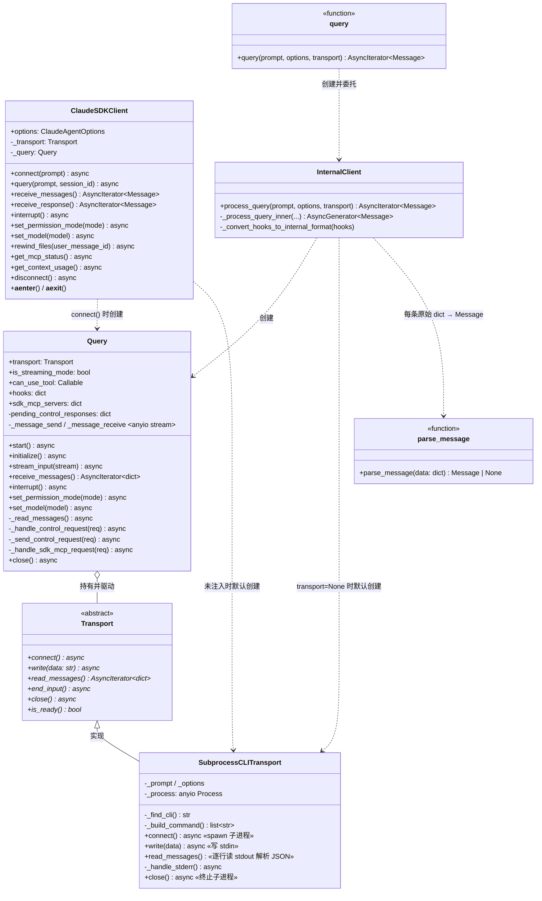
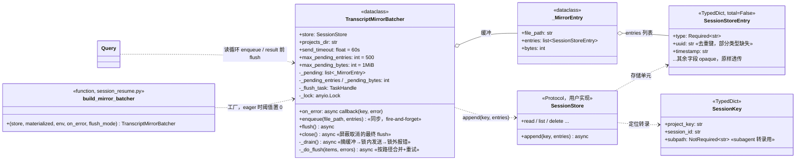
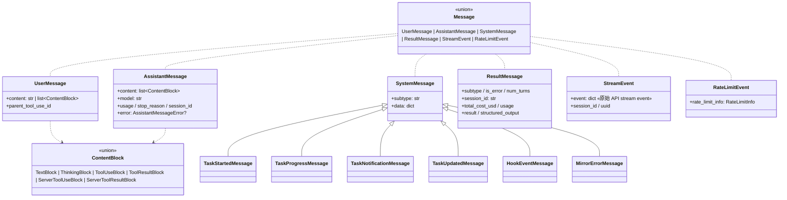
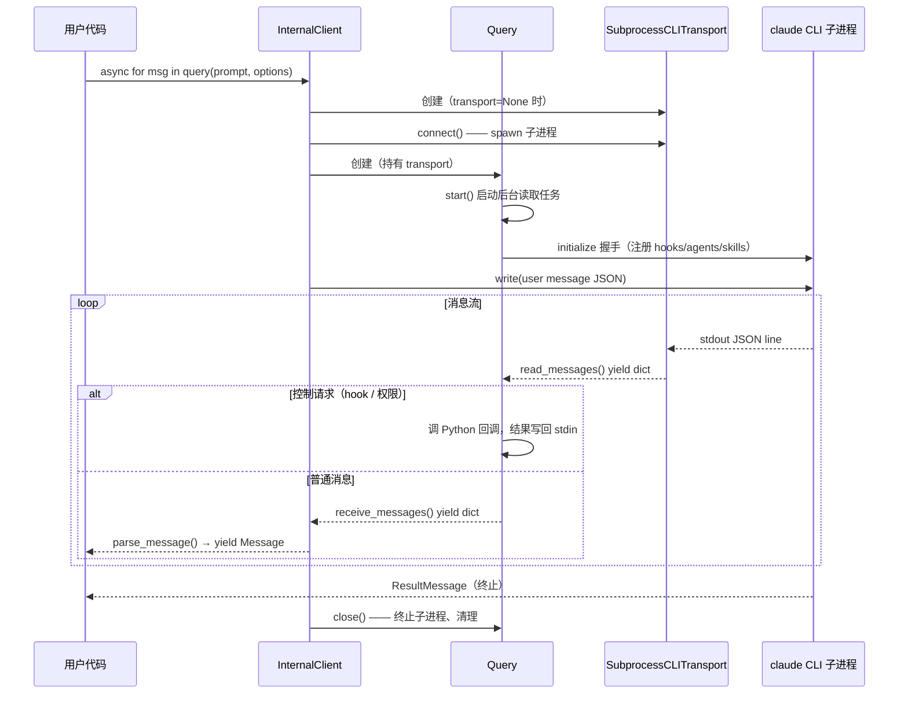

# Claude Agent SDK (Python) 核心类图

> 源码：`claude-agent-sdk-python/src/claude_agent_sdk/`，阅读版本 2026-07。
> SDK 本质：包一层 `claude` CLI 子进程，通过 stdin/stdout 的 JSON 行协议双向通信；Python 侧负责协议路由、消息解析、回调分发。

## 分层总览

```
用户 API 层    query() 函数            ClaudeSDKClient
                  │ 一次性/单向             │ 有状态/双向（interrupt、多轮）
编排层         InternalClient ──────────────┤
                  │ 组装下面两层、处理 session resume
协议层         Query（控制协议：initialize/hooks/权限回调/消息路由）
                  │
传输层         Transport(ABC) ←─ SubprocessCLITransport（默认：spawn claude CLI）
                  │
              claude CLI 子进程（stdin/stdout JSON lines）
```

## 核心类图



要点：

- **两个入口共享同一套底层**。`query()`（一次性）内部走 `InternalClient.process_query`；`ClaudeSDKClient`（双向多轮）自己直接组装 `Query` + `Transport`。两者最终都是 `Query` 驱动 `Transport`。
- **`Transport` 是官方留的扩展缝**（`_internal/transport/__init__.py` 有 WARNING 注释）：抽象了"消息从哪来到哪去"，`SubprocessCLITransport` 只是默认实现（本地 spawn CLI）。测试 mock、远程连接都可以自己实现注入，`query()` 和 `ClaudeSDKClient` 构造函数都接受 `transport` 参数。
- **`Query` 是协议层核心**：在 Transport 的原始字节流之上实现控制协议——initialize 握手、控制请求/响应配对（`pending_control_responses`）、hook 回调分发、`can_use_tool` 权限回调、SDK 内嵌 MCP server 的请求代理。消息流用 anyio memory stream 解耦读取任务和消费者。
- **流式贯穿始终**：`Transport.read_messages()` → `Query.receive_messages()` → `InternalClient.process_query()` 全是 async generator（`yield`），一条消息从子进程 stdout 到用户 `async for` 全程无囤积。

## Query 类方法详解

> 源码：`_internal/query.py`（~900 行）。Query 是协议层核心：在 Transport 的原始 dict 流之上实现**控制协议**（双向 RPC）+ **消息路由**。方法按职责分 6 组。

### 1. 生命周期

| 方法 | 功能 |
|---|---|
| `__init__(transport, is_streaming_mode, can_use_tool, hooks, sdk_mcp_servers, ...)` | 保存 transport 和各类回调；创建 anyio memory stream（缓冲 100 条）作为内部消息队列；初始化控制协议状态（pending 请求表、回调注册表） |
| `start()` | 启动后台读取任务 `_read_messages()`（spawn 成独立协程，不阻塞调用方）。幂等：已启动则跳过 |
| `initialize()` | 控制协议握手：给每个 hook 回调分配 `hook_N` 的 callback_id 注册到 `hook_callbacks` 表，连同 agents / skills 配置打包成 `initialize` 控制请求发给 CLI，等待响应（默认超时 60s，MCP server 启动慢所以可配）。非流式模式直接返回 None |
| `close()` | 收尾：置 `_closed` 标志 → flush SessionStore 镜像 → cancel 所有子任务和读取任务 → 关消息队列发送端 → `transport.close()` 终止子进程。**刻意不关接收端**——消费者可能还在排空缓冲的消息 |
| `close_receive_stream()` | 由消费者在迭代完之后调用，关闭消息队列接收端（不关会有 anyio ResourceWarning）。和 `close()` 分开是为了"生产者关闭"与"消费者排空"解耦 |

### 2. 后台读取循环（核心引擎）

| 方法 | 功能 |
|---|---|
| `_read_messages()` | **整个类的心脏**，常驻后台协程。`async for` 消费 `transport.read_messages()`，按 `type` 字段路由每条消息：`control_response` → 配对唤醒等待中的出站请求；`control_request` → spawn 处理任务（不阻塞读循环）；`control_cancel_request` → cancel 对应在途处理任务；`transcript_mirror` → 剥离给 SessionStore batcher（不进消息流）；其余普通消息 → 送入内部队列供 `receive_messages()` 消费。异常时唤醒所有 pending 控制请求（fail fast），并把错误包装成 `{"type": "error"}` 消息入队；finally 里保证发 `{"type": "end"}` 哨兵，消费者才能正常退出循环 |
| `spawn_task(coro)` | 起一个受管子任务，登记进 `_child_tasks`，`close()` 时统一 cancel。输入流写入、控制请求处理都走它 |
| `_spawn_control_request_handler(request)` | `spawn_task` 的特化：额外按 request_id 登记进 `_inflight_requests`，使 CLI 发来的 cancel 请求能定点取消 |

### 3. 控制协议——出站（SDK → CLI 的 RPC）

| 方法 | 功能 |
|---|---|
| `_send_control_request(request, timeout)` | 出站 RPC 的通用实现：生成唯一 request_id → 创建 `anyio.Event` 登记到 `pending_control_responses` → 写 transport → `await event.wait()`（带超时）→ 从 `pending_control_results` 取回结果。响应由 `_read_messages()` 收到 `control_response` 时配对填充并 set event——**典型的"请求响应配对"异步模式**（Java 里 Netty + `CompletableFuture` 表就是同款） |

以下便捷方法全是 `_send_control_request` 的一行封装，对应 CLI 支持的控制指令：

| 方法 | 发送的 subtype | 功能 |
|---|---|---|
| `interrupt()` | `interrupt` | 中断当前对话轮 |
| `set_permission_mode(mode)` | `set_permission_mode` | 运行中切换权限模式（如 plan → acceptEdits） |
| `set_model(model)` | `set_model` | 运行中切换模型 |
| `rewind_files(user_message_id)` | `rewind_files` | 把文件回滚到某条用户消息时的检查点（需开 file checkpointing） |
| `get_mcp_status()` | `mcp_status` | 查询 MCP server 连接状态 |
| `get_context_usage()` | `get_context_usage` | 查询上下文窗口占用分类明细 |
| `reconnect_mcp_server(name)` | `mcp_reconnect` | 重连断开的 MCP server |
| `toggle_mcp_server(name, enabled)` | `mcp_toggle` | 启停 MCP server |
| `stop_task(task_id)` | `stop_task` | 停止一个后台任务（subagent） |

### 4. 控制协议——入站（CLI → SDK 的反向 RPC）

| 方法 | 功能 |
|---|---|
| `_handle_control_request(request)` | 处理 CLI 主动发来的控制请求，按 subtype 分三类：**`can_use_tool`** → 组装 `ToolPermissionContext` 调用用户的权限回调，把 `PermissionResultAllow/Deny` 转成 wire 格式回写；**`hook_callback`** → 按 callback_id 查 `initialize()` 时注册的回调表并调用；**`mcp_message`** → 转交 `_handle_sdk_mcp_request`。成功/异常都会回写 `control_response`（被 cancel 则不回写，CLI 已放弃该请求） |
| `_handle_sdk_mcp_request(server_name, message)` | SDK 内嵌 MCP server 的 JSONRPC 桥：把 CLI 发来的 `initialize` / `tools/list` / `tools/call` 手工路由到进程内 MCP server 实例并转换结果格式。手工路由是因为 Python MCP SDK 还没有 TypeScript 那样的 Transport 抽象（源码注释里明说的临时方案） |

### 5. 输入流（发送用户消息）

| 方法 | 功能 |
|---|---|
| `stream_input(stream)` | 消费用户提供的 AsyncIterable，逐条 JSON 序列化写入 transport；流耗尽后走 `wait_for_result_and_end_input()` 收尾。通常被 `spawn_task` 在后台跑 |
| `wait_for_result_and_end_input()` | 关 stdin 前的守门逻辑：若注册了 SDK MCP server 或 hooks，必须等到第一条 result 消息才能 `transport.end_input()`——因为控制协议的反向调用要走 stdin，过早关闭会掐断 hook/权限回调通道 |

### 6. 消息消费 + 迭代器协议

| 方法 | 功能 |
|---|---|
| `receive_messages()` | 消费端出口：从内部队列 `async for` 取消息 yield 给上层；遇 `{"type": "end"}` 哨兵正常结束，遇 `{"type": "error"}` 抛异常。上层 `InternalClient` / `ClaudeSDKClient` 都从这里拿消息 |
| `__aiter__()` / `__anext__()` | 实现异步迭代器协议（dunder），让 Query 实例本身可以直接 `async for msg in query_obj`——等价于调 `receive_messages()`，纯便利性 |

### 7. SessionStore 镜像（可选路径）

| 方法 | 功能 |
|---|---|
| `set_transcript_mirror_batcher(batcher)` | 注入 batcher 后，读循环把 `transcript_mirror` 帧剥离出消息流交给它攒批，每条 result 前 flush——保证消费者看到 result 时 SessionStore 已是本轮最新 |
| `report_mirror_error(key, error)` | batcher 写失败时把错误包装成 `system/mirror_error` 消息注入消息流（at-most-once，不重试；非阻塞，队列满则丢弃并打日志） |

### 设计要点小结

- **单读者多路分发**：只有 `_read_messages()` 一个协程碰 transport 读端，所有消息类型在这里分流——控制面（RPC 配对/回调分发）与数据面（消息队列）彻底分离。
- **请求-响应配对**：出站 RPC 用 `request_id + anyio.Event + 结果表` 三件套实现"发出去、挂起等、被读循环唤醒"，双向全双工互不阻塞。
- **哨兵消息**：流的结束（`end`）和错误（`error`）都编码成队列里的特殊消息，而不是靠异常跨协程传播——消费者只需处理队列这一个来源。
- **关闭分两半**：发送端归生产者（`close()`），接收端归消费者（`close_receive_stream()`），避免关早了丢缓冲消息。

## TranscriptMirrorBatcher（SessionStore 镜像的攒批层）

> 源码：`_internal/transcript_mirror_batcher.py`（~220 行）。职责：CLI 会在 stdout 里穿插 `{"type": "transcript_mirror", "filePath": ..., "entries": [...]}` 帧（会话转录的增量镜像），Query 的读循环把这些帧剥离出消息流交给本类；本类**攒批**后写入用户提供的 `SessionStore` 适配器——把适配器（可能是慢速网络存储）的延迟移出模型流式输出的热路径。

### 数据源头：`--session-mirror` 开关（整条链路的核心）

镜像数据不是 SDK 构造的，是 CLI 生产的。开关在 `subprocess_cli.py` 的 `_build_command()`：

```python
if self._options.session_store is not None:
    cmd.append("--session-mirror")
```

设了 `options.session_store`，SDK 拼命令时就带上 `--session-mirror`；CLI 收到这个 flag 后，**每次把新转录行追加进本地 `~/.claude/projects/.../{session_id}.jsonl` 时，同步把这批行复读一份到 stdout**：

```json
{"type": "transcript_mirror",
 "filePath": "/home/poul/.claude/projects/xxx/{session_id}.jsonl",
 "entries": [ {"type": "user", "uuid": "...", ...}, {"type": "assistant", ...} ]}
```

**要转录的就是 `entries` 这个 list**——每个元素是本地 `.jsonl` 的一行（即 `SessionStoreEntry`），用户消息、assistant 回复、attachment、簿记行都在其中。SDK 侧全链路（剥离 → 攒批 → 换 key → `store.append(key, entries)`）只是搬运工，不生产、不修改、不过滤这些行；"镜像（mirror）"一词的确切含义即在于此：CLI 写本地文件是主本，stdout 复读的这份是镜像副本。没有这个 flag，后面整条链路无数据可搬。



### 方法与触发时机

| 方法 | 调用方与时机 | 功能 |
|---|---|---|
| `build_mirror_batcher(store, materialized, env, on_error, flush_mode)` | `InternalClient` / `ClaudeSDKClient` 组装 Query 时（工厂函数，在 `session_resume.py`） | 构造 Batcher：解析 `projects_dir`（resume 物化时指向临时 CLAUDE_CONFIG_DIR，否则标准 projects 目录）；**落实 flush_mode**——`"eager"` 把两个阈值置 0（每帧 enqueue 都触发后台 flush，近实时落库），`"batched"`（默认）保持 500 条 / 1 MiB |
| `enqueue(file_path, entries)` | `Query._read_messages()` 每收到一帧 `transcript_mirror` | **同步方法，只做内存追加**（热路径零 IO）：帧存入 `_pending`，累加条数/字节数；超过阈值就 `spawn_detached(_drain())` 在后台急切 flush——batched 模式下长对话轮没有 result 时内存也不会无限涨；eager 模式下阈值为 0，等于每帧必触发 |
| `flush()` | `Query._read_messages()` 在 yield 每条 `result` 前 | 显式排空：保证消费者看到 result 时，SessionStore 已包含本轮全部转录（batched 模式的主落库时机） |
| `close()` | `Query.close()` 收尾时 | 最终 flush，包在 `CancelScope(shield=True)` 里——即使 Ctrl+C / 客户端断开触发的取消风暴中，最后一批也要落库；任何异常只记日志不上抛 |
| `_drain()` | flush/close/急切 flush 的共同实现 | 三步走：①**先摘缓冲再拿锁**（`_pending` 换成新列表），enqueue 可以立刻往新缓冲写，不被在途 flush 阻塞；②锁内调 `_do_flush`（锁串行化多个 flush，保证 append 顺序）；③**锁释放后**才调 `on_error` 回调——慢回调不能拖住后续 drain |
| `_do_flush(items, errors)` | `_drain()` 锁内 | ①按 `file_path` 合并同文件的帧（一个文件一次 append，而非一帧一次）；②`file_path → SessionKey` 换算，不在 `projects_dir` 下的帧丢弃并告警；③每个文件带重试地 `store.append(key, entries)`：最多 3 次、退避 0.2s/0.8s、单次 60s 超时；**超时不重试**（在途调用可能仍会落地，重试会产生并发重复写）；最终失败则丢弃该批并记入 errors |

### 设计要点

- **永不上抛**：类的错误契约是"失败只丢批、只报告，绝不打断会话"——本地磁盘转录本来就 durable，镜像失败不值得让对话崩溃。`_drain` / `close` / `on_error` 调用处层层兜底。
- **at-most-once + 适配器去重**：批次失败即丢弃不补发；但重试可能与部分成功的前次写入重叠，所以文档要求 SessionStore 实现方按 `entry["uuid"]` 去重。
- **背压与内存上界**：`enqueue` 是同步 fire-and-forget（不给读循环加延迟），靠"条数/字节双阈值 + 后台急切 flush"保内存平坦——这是"热路径不等 IO、冷路径保证送达"的经典攒批取舍。
- **锁的粒度刻意最小**：锁只护"发送顺序"这一件事；缓冲摘取在锁外（换引用，原子），错误回调在锁外，最坏锁持有时长 ≈ 单次 send_timeout。

### 一条消息落库的完整时间线

以用户输入为例，从说出口到进入 SessionStore 经过 4 个时点：

```
T0  SDK 把用户消息写入 CLI stdin
T1  CLI 处理本轮，把 user 行写进本地 ~/.claude/projects/.../xxx.jsonl（第一份持久化，权威副本）
    └─ 开了 --session-mirror（options.session_store 非 None 时 SDK 自动加此 flag）：
       同一行打包成 transcript_mirror 帧写 stdout
T2  Query 读循环收到帧 → batcher.enqueue()——只进内存缓冲（微秒级，紧跟 T1）
T3  store.append() 真正执行 ← "转录进 store"发生在这里，时机由 flush_mode 决定
```

**flush_mode 两档**（`ClaudeAgentOptions.session_store_flush`，`build_mirror_batcher` 里落实）：

| 模式 | 实现 | T3 时机 |
|---|---|---|
| `"batched"`（默认） | 阈值取默认 500 条 / 1 MiB | 三个触发点，按常见程度：① 本轮 `result` yield 前（主时机——**用户的话通常在"助手答完这一轮"时落库**，与本轮全部转录攒成一批）；② 缓冲溢出（长 agent 轮中途先写几批）；③ `close()` 兜底 |
| `"eager"` | 两个阈值直接置 0（`0 if eager else MAX_...`） | 每帧 enqueue 都立即调度后台 flush——近实时落库，代价是 append 碎片化、存储端请求量升高 |

边界情况：batched 模式下若进程在轮中被 `kill -9`（`close()` 都没跑），缓冲那批就丢——但 T1 的本地 `.jsonl` 已落盘，权威副本无损。这正是 Batcher 敢用 at-most-once 语义的前提：store 是副本，本地才是权威。若有下游服务实时消费 store，则用 `eager`。

### store 里存的是什么

`SessionStoreEntry` 的契约（`types.py`）：**一行 entry = CLI 本地 `.jsonl` 转录的一行**，adapter 按 pass-through blob 处理，唯一不变量是 JSON 往返不变形。所以镜像内容包括：`user` 行（用户输入全文）、`assistant` 行（回复全文 + usage）、`attachment` 行（注入上下文的工具/skill 清单、hook 执行记录含完整命令）、`queue-operation` 等簿记行；subagent 转录也按 `SessionKey.subpath` 分键镜像。SDK 不做过滤脱敏——合规需求由 adapter 自己处理。

## Message 类型体系



要点：

- `Message` / `ContentBlock` 都是 **union type（`X | Y | Z`）而非继承树**——Python 惯用法，消费方用 `isinstance()` / `match-case` 分派。只有 `SystemMessage` 家族用了真继承（保证 `isinstance(msg, SystemMessage)` 对子类成立）。
- 全部是 `@dataclass`（等价 Java record/Lombok `@Data`），`message_parser.parse_message()` 负责 原始 dict → 强类型 dataclass，未知类型返回 `None` 被跳过（向前兼容新 CLI 消息类型）。
- 一轮对话的典型消息序列：`SystemMessage(subtype="init")` → `AssistantMessage`（含 `ToolUseBlock`）→ `UserMessage`（含 `ToolResultBlock`，工具结果以 user 角色回灌）→ … → `ResultMessage`（终止标记，带 cost/usage）。

## 配置与回调

```mermaid
classDiagram
    class ClaudeAgentOptions {
        <<dataclass, ~100 字段>>
        +system_prompt / model / cwd
        +permission_mode: PermissionMode
        +allowed_tools / disallowed_tools
        +mcp_servers: dict~str, McpServerConfig~
        +hooks: dict~HookEvent, list~HookMatcher~~
        +can_use_tool: CanUseTool?
        +agents: dict~str, AgentDefinition~
        +skills / plugins / sandbox
        +resume / fork_session / session_store
        +env / extra_args
    }

    class HookMatcher {
        +matcher: str?
        +hooks: list~HookCallback~
        +timeout: float?
    }

    class CanUseTool {
        <<callback>>
        (tool_name, input, context) → PermissionResultAllow | PermissionResultDeny
    }

    class AgentDefinition {
        +description / prompt
        +tools / model
    }

    ClaudeAgentOptions o-- HookMatcher
    ClaudeAgentOptions o-- AgentDefinition
    ClaudeAgentOptions ..> CanUseTool
```

- `ClaudeAgentOptions` 是唯一的大配置对象（不可变风格：内部用 `dataclasses.replace()` 派生修改副本）。
- 回调（hooks / `can_use_tool`）不走子进程参数，而是走**控制协议反向调用**：CLI 发 control request → `Query._handle_control_request` 调 Python 回调 → 结果写回 stdin。这是 SDK 能拦截工具执行的机制。

## 错误体系

```
Exception
└── ClaudeSDKError
    ├── CLIConnectionError
    │   └── CLINotFoundError        # 找不到 claude 可执行文件
    ├── ProcessError                # 子进程非零退出（带 exit_code / stderr）
    ├── CLIJSONDecodeError          # stdout 出现非 JSON 行
    └── MessageParseError           # JSON 合法但结构不认识
```

## 一次 query() 调用的生命周期




## CLI 的能力

### json输出

```shell
claude --output-format stream-json --verbose  -p '你好，你叫什么名字'
```

输出
```jsonl
{"type":"system","subtype":"hook_started","hook_id":"46fa5e65-1431-4a18-957f-a8f7377da162","hook_name":"SessionStart:startup","hook_event":"SessionStart","uuid":"4a6b9f2a-c3f9-4b71-9150-036c4cf63e73","session_id":"ca1d73ae-2f3f-4331-8ed5-4eb8c811df6c"}
{"type":"system","subtype":"hook_started","hook_id":"cececd9a-ab2c-4199-9cd9-9abffa2a4897","hook_name":"SessionStart:startup","hook_event":"SessionStart","uuid":"3674dda9-4c73-4cca-9cda-4a0328afb73d","session_id":"ca1d73ae-2f3f-4331-8ed5-4eb8c811df6c"}
{"type":"system","subtype":"hook_response","hook_id":"cececd9a-ab2c-4199-9cd9-9abffa2a4897","hook_name":"SessionStart:startup","hook_event":"SessionStart","output":"","stdout":"","stderr":"","exit_code":0,"outcome":"success","uuid":"ab7159cc-6b57-407f-860a-d139067ff4bb","session_id":"ca1d73ae-2f3f-4331-8ed5-4eb8c811df6c"}
{"type":"system","subtype":"hook_response","hook_id":"46fa5e65-1431-4a18-957f-a8f7377da162","hook_name":"SessionStart:startup","hook_event":"SessionStart","output":"","stdout":"","stderr":"","exit_code":0,"outcome":"success","uuid":"59812963-620e-419d-9579-333d3f180492","session_id":"ca1d73ae-2f3f-4331-8ed5-4eb8c811df6c"}
{"type":"system","subtype":"init","cwd":"/home/poul/workspace/src/vibe_coding","session_id":"ca1d73ae-2f3f-4331-8ed5-4eb8c811df6c","tools":["Task","Bash","CronCreate","CronDelete","CronList","DesignSync","Edit","EnterWorktree","ExitWorktree","Monitor","NotebookEdit","PushNotification","Read","RemoteTrigger","ReportFindings","ScheduleWakeup","SendMessage","Skill","TaskCreate","TaskGet","TaskList","TaskOutput","TaskStop","TaskUpdate","ToolSearch","WebFetch","WebSearch","Workflow","Write"],"mcp_servers":[],"model":"claude-fable-5","permissionMode":"default","slash_commands":["andrej-karpathy-perspective","elon-musk-perspective","feynman-perspective","find-skills","generate-html","huashu-nuwa","ilya-sutskever-perspective","install-skill","pull-skill","refer-skill","session-handoff","steve-jobs-perspective","trump-perspective","weread-skills","zhangxuefeng-perspective","deep-research","claude-hud:setup","claude-hud:configure","sif-spec:git-ai-commit","sif-spec:git-merge-to","andrej-karpathy-skills:karpathy-guidelines","design-sync","dataviz","update-config","verify","debug","code-review","simplify","batch","fewer-permission-prompts","loop","schedule","claude-api","run","run-skill-generator","agents","clear","compact","config","context","heapdump","init","reload-skills","review","security-review","usage-credits","extra-usage","usage","insights","recap","goal","design","team-onboarding"],"apiKeySource":"none","claude_code_version":"2.1.198","output_style":"default","agents":["claude","Explore","general-purpose","Plan","statusline-setup"],"skills":["andrej-karpathy-perspective","elon-musk-perspective","feynman-perspective","find-skills","huashu-nuwa","ilya-sutskever-perspective","install-skill","pull-skill","refer-skill","session-handoff","steve-jobs-perspective","trump-perspective","weread-skills","zhangxuefeng-perspective","deep-research","sif-spec:git-ai-commit","sif-spec:git-merge-to","andrej-karpathy-skills:karpathy-guidelines","design-sync","dataviz","update-config","verify","debug","code-review","simplify","batch","fewer-permission-prompts","loop","schedule","claude-api","run","run-skill-generator"],"plugins":[{"name":"sif-spec","path":"/home/poul/workspace/src/sif-spec/","source":"sif-spec@sif-plugins"},{"name":"claude-hud","path":"/home/poul/.claude/plugins/cache/claude-hud/claude-hud/0.0.12","source":"claude-hud@claude-hud"},{"name":"andrej-karpathy-skills","path":"/home/poul/.claude/plugins/cache/karpathy-skills/andrej-karpathy-skills/1.0.0","source":"andrej-karpathy-skills@karpathy-skills"}],"analytics_disabled":false,"product_feedback_disabled":false,"uuid":"7858fb8c-db3e-4537-bfdc-9f9df8c6c620","memory_paths":{"auto":"/home/poul/.claude/projects/-home-poul-workspace-src-vibe-coding/memory/"},"fast_mode_state":"off"}
{"type":"assistant","message":{"model":"claude-fable-5","id":"msg_01JzZNbeJhf4RYjaGWrQdLsx","type":"message","role":"assistant","content":[{"type":"thinking","thinking":"","signature":"CAIS9AEKYggPGAIqQFKbw4hljB9VsJvShWBrrqcX76mjyxohguv69XAqOeBmXp0qBC/Q8PJNnvq2pMiKeFkhrTlotBkAX/FB4yeXZB8yDmNsYXVkZS1mYWJsZS01OAFCCHRoaW5raW5nEgzs+F3TgIRFyT0aSYkaDLwKI6hiHuOcaGpV6yIwXFV9fRIM0yhq59YVX5A2zsowTbNbTk70s2y3jM8nfjpvGTPivdiDVGsDq/Ea2mqQKkC9onFrX+xOrCEs84CZYR/xJtEBm2axTjTTqXeQv0qi9R3Yw3Lg38jFi7XQ3EIS1ZgpgnXlC7bkVf5lSn0DXNszGAE="}],"stop_reason":null,"stop_sequence":null,"stop_details":null,"usage":{"input_tokens":6581,"cache_creation_input_tokens":899,"cache_read_input_tokens":18399,"cache_creation":{"ephemeral_5m_input_tokens":0,"ephemeral_1h_input_tokens":899},"output_tokens":4,"service_tier":"standard","inference_geo":"not_available"},"diagnostics":null,"context_management":null},"parent_tool_use_id":null,"session_id":"ca1d73ae-2f3f-4331-8ed5-4eb8c811df6c","uuid":"4ddfcaf2-ff92-4dae-8fdf-4d7f9ba92b7d","request_id":"req_011CckWkaqB5skCKc53zhFx5"}
{"type":"assistant","message":{"model":"claude-fable-5","id":"msg_01JzZNbeJhf4RYjaGWrQdLsx","type":"message","role":"assistant","content":[{"type":"text","text":"你好！我是 Claude，由 Anthropic 开发的 AI 助手。当前运行的模型是 Claude Fable 5 —— Claude 5 系列的第一个模型。我在 Claude Code 环境中工作，可以帮你写代码、调试、研究问题等。有什么我可以帮你的吗？"}],"stop_reason":null,"stop_sequence":null,"stop_details":null,"usage":{"input_tokens":6581,"cache_creation_input_tokens":899,"cache_read_input_tokens":18399,"cache_creation":{"ephemeral_5m_input_tokens":0,"ephemeral_1h_input_tokens":899},"output_tokens":4,"service_tier":"standard","inference_geo":"not_available"},"diagnostics":null,"context_management":null},"parent_tool_use_id":null,"session_id":"ca1d73ae-2f3f-4331-8ed5-4eb8c811df6c","uuid":"dd941ce4-ac98-4a51-880d-f83cfa34f2ed","request_id":"req_011CckWkaqB5skCKc53zhFx5"}
{"type":"rate_limit_event","rate_limit_info":{"status":"allowed","resetsAt":1783343400,"rateLimitType":"five_hour","overageStatus":"rejected","overageDisabledReason":"org_level_disabled","isUsingOverage":false},"uuid":"184c2e10-a9dd-4ca6-a5d5-980030ee8495","session_id":"ca1d73ae-2f3f-4331-8ed5-4eb8c811df6c"}
{"type":"result","subtype":"success","is_error":false,"api_error_status":null,"duration_ms":7049,"duration_api_ms":6637,"ttft_ms":4607,"ttft_stream_ms":4091,"time_to_request_ms":27,"num_turns":1,"result":"你好！我是 Claude，由 Anthropic 开发的 AI 助手。当前运行的模型是 Claude Fable 5 —— Claude 5 系列的第一个模型。我在 Claude Code 环境中工作，可以帮你写代码、调试、研究问题等。有什么我可以帮你的吗？","stop_reason":"end_turn","session_id":"ca1d73ae-2f3f-4331-8ed5-4eb8c811df6c","total_cost_usd":0.108739,"usage":{"input_tokens":6581,"cache_creation_input_tokens":899,"cache_read_input_tokens":18399,"output_tokens":131,"server_tool_use":{"web_search_requests":0,"web_fetch_requests":0},"service_tier":"standard","cache_creation":{"ephemeral_1h_input_tokens":899,"ephemeral_5m_input_tokens":0},"inference_geo":"not_available","iterations":[{"input_tokens":6581,"output_tokens":131,"cache_read_input_tokens":18399,"cache_creation_input_tokens":899,"cache_creation":{"ephemeral_5m_input_tokens":0,"ephemeral_1h_input_tokens":899},"type":"message"}],"speed":"standard"},"modelUsage":{"claude-fable-5":{"inputTokens":6581,"outputTokens":131,"cacheReadInputTokens":18399,"cacheCreationInputTokens":899,"webSearchRequests":0,"costUSD":0.108739,"contextWindow":1000000,"maxOutputTokens":64000}},"permission_denials":[],"terminal_reason":"completed","fast_mode_state":"off","uuid":"c2806387-63fc-4c25-9134-b4fdfd3020b4"}
```

### 模拟sdk的json 输入

```shell
echo '{"type":"user","message":{"role":"user","content":"hello 😊😊"}}' | \
  claude --output-format stream-json --verbose --input-format stream-json --session-mirror -p 
```


# EOF