# MIPS 
Microprocessor without Interlocked Pipeline Stages

[官网](https://www.mips.com/)

## 寄存器

### 32位
一共有32个寄存器,寄存器的命名都是$符号开头.

|register|assembly name|Comment|
|-|-|-|
|r0|\$zero|Always 0|
|r1|\$at|Reserved for assembler|
|r2-r3|\$v0-\$v1|Stores results|
|r4-r7|\$a0-\$a3|Stores arguments|
|r8-r15|\$t0-\$t7|Temporaries, not saved|
|r16-r23|\$s0-\$s7|Contents saved for use later|
|r24-r25|\$t8-\$t9|More temporaries, not saved|
|r26-r27|\$k0-\$k1|Reserved by operating system|
|r28|\$gp|Global pointer|
|r29|\$sp|Stack pointer|
|r30|\$fp/\$s8|Frame pointer|
|r31|\$ra|Return address|

特殊的r30寄存器:
帧指针，并不是必须的。
GNU MIPS C编译器使用帧指针，
而来自MIPS的C编译器则没有使用，它将寄存器30用做另一个保存的寄存器\$s8

## Instruction set

[32位](https://s3-eu-west-1.amazonaws.com/downloads-mips/documents/MD00086-2B-MIPS32BIS-AFP-6.06.pdf )
[64位](https://s3-eu-west-1.amazonaws.com/downloads-mips/documents/MD00087-2B-MIPS64BIS-AFP-6.06.pdf)

## Instruction format

## Simulator

## 操作助记符
- beg reg1,reg2,L1  branch if equal
- bne reg1,reg2,L1  branch if not equal

