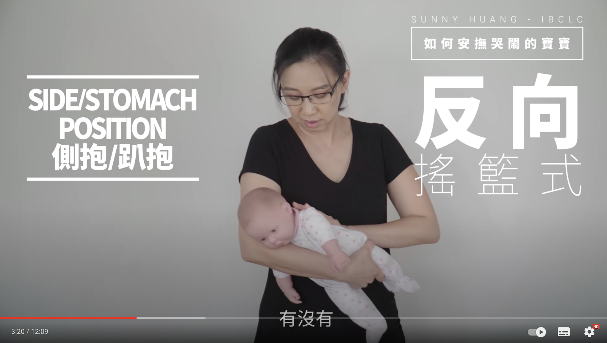
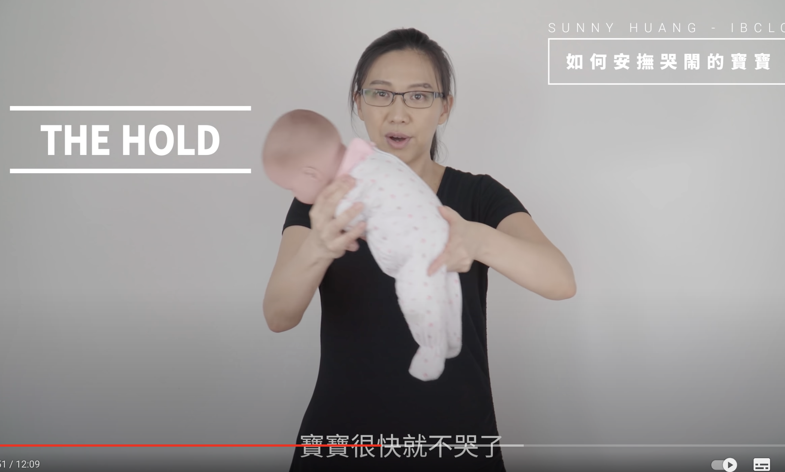

# 安抚宝宝

## 检查

- 尿布 如果宝宝尿了 或者拉了 都要换尿布
- 宝宝皮肤的温度 太冷/太热 摸宝宝脖子后面，肩膀中间，靠近后背的地方
- 拍嗝/排气 竖抱拍嗝30分钟
- 如果宝宝还哭的话 抱起来安抚
- 亲喂

## 5S安抚法

- SWADDLE 宝宝巾 
- SIDE/STOMACH POSITION 侧抱/趴抱
    
    
   还有一种抱法也能快速的安抚宝宝,Dr.Hamilton, The Hold 
   
- SWING/SWAY 摇摆
    - 定点左右摇摆
    - 定点八字摇摆
    - 定点八字顿点摇摆
    - 走动顿点摇摆
    - 原地爬楼梯/萝卜蹲
    - 真的爬楼梯
    - 抱的时候身体一定要放松。。
- SHUSH 嘘声/打开抽油烟机
- SUCK 吸吮
    - 可以用洗干净的手指

## 变换环境

