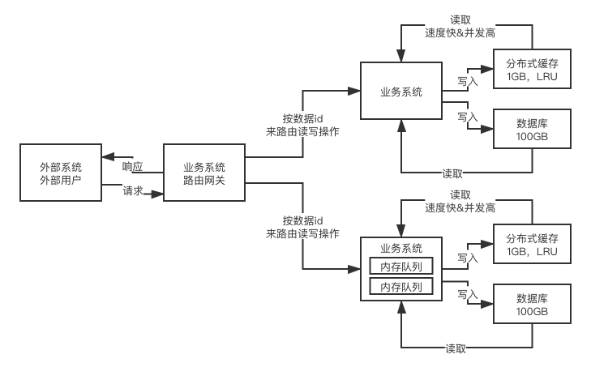
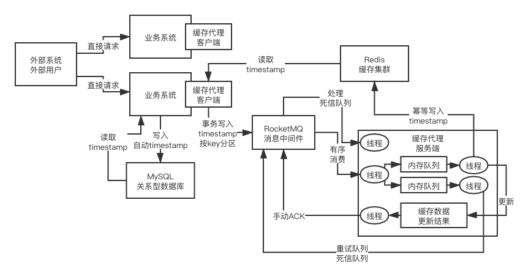

# 缓存应用

## 高并发场景下的缓存+数据库不一致问题

### 最初级的缓存不一致问题以及解决方案

问题：
先修改数据库，再删除缓存，如果删除缓存失败了，那么会导致数据库中是新数据，缓存中是旧数据，数据出现不一致

解决思路:
先删除缓存，再修改数据库，如果删除缓存成功了，如果修改数据库失败了，那么数据库中是旧数据，缓存中是空的，那么数据不会不一致
因为读的时候缓存没有，则读数据库中旧数据，然后更新到缓存中

、比较复杂的数据不一致问题分析

数据发生了变更，先删除了缓存，然后要去修改数据库，此时还没修改

一个请求过来，去读缓存，发现缓存空了，去查询数据库，查到了修改前的旧数据，放到了缓存中

数据变更的程序完成了数据库的修改

完了，数据库和缓存中的数据不一样了。。。。

### 为什么上亿流量高并发场景下，缓存会出现这个问题？

只有在对一个数据在并发的进行读写的时候，才可能会出现这种问题

其实如果说你的并发量很低的话，特别是读并发很低，每天访问量就1万次，那么很少的情况下，会出现刚才描述的那种不一致的场景

但是问题是，如果每天的是上亿的流量，每秒并发读是几万，每秒只要有数据更新的请求，就可能会出现上述的数据库+缓存不一致的情况

高并发了以后，问题是很多的

### 数据库与缓存更新与读取操作进行异步串行化

更新数据的时候，根据数据的唯一标识，将操作路由之后，发送到一个jvm内部的队列中

读取数据的时候，如果发现数据不在缓存中，那么将重新读取数据+更新缓存的操作，根据唯一标识路由之后，也发送同一个jvm内部的队列中

一个队列对应一个工作线程

每个工作线程串行拿到对应的操作，然后一条一条的执行

这样的话，一个数据变更的操作，先执行，删除缓存，然后再去更新数据库，但是还没完成更新

此时如果一个读请求过来，读到了空的缓存，那么可以先将缓存更新的请求发送到队列中，此时会在队列中积压，然后同步等待缓存更新完成

这里有一个优化点，一个队列中，其实多个更新缓存请求串在一起是没意义的，因此可以做过滤，如果发现队列中已经有一个更新缓存的请求了，那么就不用再放个更新请求操作进去了，直接等待前面的更新操作请求完成即可

待那个队列对应的工作线程完成了上一个操作的数据库的修改之后，才会去执行下一个操作，也就是缓存更新的操作，此时会从数据库中读取最新的值，然后写入缓存中

如果请求还在等待时间范围内，不断轮询发现可以取到值了，那么就直接返回; 如果请求等待的时间超过一定时长，那么这一次直接从数据库中读取当前的旧值

### 高并发的场景下，该解决方案要注意的问题

（1）读请求长时阻塞

由于读请求进行了非常轻度的异步化，所以一定要注意读超时的问题，每个读请求必须在超时时间范围内返回

该解决方案，最大的风险点在于说，可能数据更新很频繁，导致队列中积压了大量更新操作在里面，然后读请求会发生大量的超时，最后导致大量的请求直接走数据库

务必通过一些模拟真实的测试，看看更新数据的频繁是怎样的

另外一点，因为一个队列中，可能会积压针对多个数据项的更新操作，因此需要根据自己的业务情况进行测试，可能需要部署多个服务，每个服务分摊一些数据的更新操作

如果一个内存队列里居然会挤压100个商品的库存修改操作，每隔库存修改操作要耗费10ms区完成，那么最后一个商品的读请求，可能等待10 * 100 = 1000ms = 1s后，才能得到数据

这个时候就导致读请求的长时阻塞

一定要做根据实际业务系统的运行情况，去进行一些压力测试，和模拟线上环境，去看看最繁忙的时候，内存队列可能会挤压多少更新操作，可能会导致最后一个更新操作对应的读请求，会hang多少时间，如果读请求在200ms返回，如果你计算过后，哪怕是最繁忙的时候，积压10个更新操作，最多等待200ms，那还可以的

如果一个内存队列可能积压的更新操作特别多，那么你就要加机器，让每个机器上部署的服务实例处理更少的数据，那么每个内存队列中积压的更新操作就会越少

其实根据之前的项目经验，一般来说数据的写频率是很低的，因此实际上正常来说，在队列中积压的更新操作应该是很少的

针对读高并发，读缓存架构的项目，一般写请求相对读来说，是非常非常少的，每秒的QPS能到几百就不错了

一秒，500的写操作，5份，每200ms，就100个写操作

单机器，20个内存队列，每个内存队列，可能就积压5个写操作，每个写操作性能测试后，一般在20ms左右就完成

那么针对每个内存队列中的数据的读请求，也就最多hang一会儿，200ms以内肯定能返回了

写QPS扩大10倍，但是经过刚才的测算，就知道，单机支撑写QPS几百没问题，那么就扩容机器，扩容10倍的机器，10台机器，每个机器20个队列，200个队列

大部分的情况下，应该是这样的，大量的读请求过来，都是直接走缓存取到数据的

少量情况下，可能遇到读跟数据更新冲突的情况，如上所述，那么此时更新操作如果先入队列，之后可能会瞬间来了对这个数据大量的读请求，但是因为做了去重的优化，所以也就一个更新缓存的操作跟在它后面

等数据更新完了，读请求触发的缓存更新操作也完成，然后临时等待的读请求全部可以读到缓存中的数据

### 读请求并发量过高

这里还必须做好压力测试，确保恰巧碰上上述情况的时候，还有一个风险，就是突然间大量读请求会在几十毫秒的延时hang在服务上，看服务能不能抗的住，需要多少机器才能抗住最大的极限情况的峰值

但是因为并不是所有的数据都在同一时间更新，缓存也不会同一时间失效，所以每次可能也就是少数数据的缓存失效了，然后那些数据对应的读请求过来，并发量应该也不会特别大

按1:99的比例计算读和写的请求，每秒5万的读QPS，可能只有500次更新操作

如果一秒有500的写QPS，那么要测算好，可能写操作影响的数据有500条，这500条数据在缓存中失效后，可能导致多少读请求，发送读请求到库存服务来，要求更新缓存

一般来说，1:1，1:2，1:3，每秒钟有1000个读请求，会hang在库存服务上，每个读请求最多hang多少时间，200ms就会返回

在同一时间最多hang住的可能也就是单机200个读请求，同时hang住

单机hang200个读请求，还是ok的

1:20，每秒更新500条数据，这500秒数据对应的读请求，会有20 * 500 = 1万

1万个读请求全部hang在库存服务上，就死定了

（3）多服务实例部署的请求路由

可能这个服务部署了多个实例，那么必须保证说，执行数据更新操作，以及执行缓存更新操作的请求，都通过nginx服务器路由到相同的服务实例上

（4）热点商品的路由问题，导致请求的倾斜

万一某个商品的读写请求特别高，全部打到相同的机器的相同的队列里面去了，可能造成某台机器的压力过大

就是说，因为只有在商品数据更新的时候才会清空缓存，然后才会导致读写并发，所以更新频率不是太高的话，这个问题的影响并不是特别大

但是的确可能某些机器的负载会高一些

## 大型缓存全量更新问题

1. 网络耗费的资源大
2. 每次对redis都存取大数据，对redis的压力也比较大
3. 大家记不记得，之前我给大家提过，redis的性能和吞吐量能够支撑到多大，基本跟数据本身的大小有很大的关系

如果数据越大，那么可能导致redis的吞吐量就会急剧下降

缓存维度化解决方案
维度：商品维度，商品分类维度，商品店铺维度

## 缓存的经典问题

### 缓存雪崩
**(1) 是什么**

一段时间内本应在redis缓存中处理的大量请求，都发送到了数据库进行处理，导致对数据库的压力迅速增大，严重时甚至可能导致数据库崩溃，从而导致整个系统崩溃，就像雪崩一样，引发连锁效应，所以叫缓存雪崩。

**(2) 为什么**

出现上述情况的常见原因主要有以下两点：
1. 大量缓存数据同时过期，导致本应请求到缓存的需重新从数据库中获取数据。
2. redis本身出现故障，无法处理请求，那自然会再请求到数据库那里。

**(3) 怎么办**

针对大量缓存数据同时过期的情况：
1. 实际设置过期时间时，应当尽量避免大量key同时过期的场景，如果真的有，那就通过随机、微调、均匀设置等方式设置过期时间，从而避免同一时间过期。
2. 添加互斥锁，使得构建缓存的操作不会在同一时间进行。
3. 双key策略，主key是原始缓存，备key为拷贝缓存，主key失效时，可以访问备key，主key缓存失效时间设置为短期，备key设置为长期。
4. 后台更新缓存策略，采用定时任务或者消息队列的方式进行redis缓存更新或移除等。

针对redis本身出现故障的情况：
1. 事前，在预防层面，可以通过主从节点的方式构建高可用的集群，也就是实现主Redis实例挂掉后，能有其他从库快速切换为主库，继续提供服务。redis集群的多机房部署，主从尽量分布在不同的机房。
2. 事中，如果事情已经发生了，那就要为了防止数据库被大量的请求搞崩溃，可以采用服务熔断或者请求限流的方法。当然服务熔断相对粗暴一些，停止服务直到redis服务恢复，请求限流相对温和一些，保证一些请求可以处理，不是一刀切，不过还是看具体业务情况选择合适的处理方案。多级缓存本地缓存还能撑一部分流量。
3. 事后，对redis数据做恢复，有备份文件用备份文件，没有的话就快速预热，把热点key先刷进去，赶紧把redis启动起来

### 缓存击穿

**(1) 是什么**
缓存击穿一般出现在高并发系统中，是大量并发用户同时请求到缓存中没有但数据库中有的数据，也就是同时读缓存没读到数据，又同时去数据库去取数据，引起数据库压力瞬间增大。和缓存雪崩不同的是，缓存击穿指并发查同一条数据，缓存雪崩是不同数据都过期了，很多数据都查不到从而查数据库。

**(2) 为什么**
这种情况其实一般出现的原因就是某个热点数据缓存过期，由于是热点数据，请求并发量又大，所以过期的时候还是会有大量请求同时过来，来不及更新缓存就全部打到数据库那边了。

**(3) 怎么办**
针对这种情况有两种常见的处理方案：

1. 简单粗暴的对热点数据不设置过期时间，这样不会过期，自然也就不会出现上述情况了，如果后续想清理，可以通过后台进行清理。
2. 添加互斥锁，即当过期之后，除了请求过来的第一个查询的请求可以获取到锁请求到数据库，并再次更新到缓存中，其他的会被阻塞住，直到锁被释放，同时新的缓存也被更新上去了，后续请求又会请求到缓存上，这样就不会出现缓存击穿了。
3. 定期主动的刷新热点缓存

### 缓存穿透

**(1) 是什么**

缓存穿透是指数据既不在redis中，也不在数据库中，这样就导致每次请求过来的时候，在缓存中找不到对应key之后，每次都还要去数据库再查询一遍，发现数据库也没有，相当于进行了两次无用的查询。这样请求就可以绕过缓存直接查数据库，如果这个时候有人想恶意攻击系统，就可以故意使用空值或者其他不存在的值进行频繁请求，那么就会对数据库造成比较大的压力。

**(2) 为什么**

这种现象的原因其实很好理解，业务逻辑里面如果用户对某些信息还没有进行相应的操作或者处理，那对应的存放信息的数据库或者缓存中自然也就没有相应的数据，也就容易出现上述问题。

**(3) 怎么办**

针对缓存穿透，一般有以下三种处理方案：

1. 非法请求的限制，主要是指参数校验、鉴权校验等，从而一开始就把大量的非法请求拦截在外，这在实际业务开发中是必要的手段。
2. id字段对外展示的时候加密，数据库一般是自增的id，与前端交互的时候用加密的id值，不可预测。
3. 缓存空值或者默认值，如果从缓存取不到的数据，在数据库中也没有取到，那我们仍然把这个空结果进行缓存，同时设置一个较短的过期时间。通过这个设置的默认值存放到缓存，这样第二次到缓存中获取就有值了，而不会继续访问数据库，可以防止有大量恶意请求是反复用同一个key进行攻击。
4. 使用布隆过滤器快速判断数据是否存在。那什么是布隆过滤器呢，
简单来说，就是可以引入了多个相互独立的哈希函数，保证在给定的空间和误判率下，完成元素判重。
因为我们知道，存在hash碰撞这样一种情况，那如果只使用一个hash函数，则碰撞冲突的概率明显会变大，那为了减少这种冲突，我们可以多引入几个hash函数，而布隆过滤器算法的核心思想就是利用多个不同的hash函数来解决这样一种冲突。它的优点是空间效率高，查询时间短，远超其他算法，而它的缺点就是会存在一定的误识别率，它不能完全保证请求过来的key，通过布隆过滤器的校验，就一定有这个数据，毕竟理论上还是会存在冲突情况，无论概率多小。
但是，只要没有通过布隆过滤器的校验，那么这个key就一定不存在，只要利用这一点其实就已经可以过滤掉大部分不存在的key的请求了，在正常场景下已然足够了。

除了上述三种常见的Redis缓存异常问题之外，还经常听到的有缓存预热和缓存降级两个名词，与其说是异常问题，不如说是两种的优化处理方法。

### 缓存预热

缓存预热就是系统上线前后，将相关的缓存数据直接加载到缓存系统中去，而不依赖用户。这样就可以避免在用户请求的时候，先查询数据库，然后再将数据缓存的问题。用户直接查询事先被预热的缓存数据，这样可以避免那么系统上线初期，对于高并发的流量，都会访问到数据库中， 对数据库造成流量的压力。根据数据不同量级，可以有以下几种做法：

- 数据量不大：项目启动的时候自动进行加载。
- 数据量较大：后台定时刷新缓存。
- 数据量极大：只针对热点数据进行预加载缓存操作。

### 缓存降级

缓存降级是指当缓存失效或缓存服务出现问题时，为了防止缓存服务故障，导致数据库跟着一起发生雪崩问题，所以也不去访问数据库，但因为一些原因，仍然想要保证服务还是基本可用的，虽然肯定会是有损服务。因此，对于不重要的缓存数据，我们可以采取服务降级策略。一般做法有以下两种：

- 直接访问内存部分的数据缓存。
- 直接返回系统设置的默认值。

### 数据库缓存双写一致性问题

[非常棒的博客](http://kaito-kidd.com/2021/09/08/how-to-keep-cache-and-consistency-of-db/ )

#### what
数据库中的数据跟缓存中的数据不一致，导致查询缓存出现问题

#### why

1. 并发写入过程中线程t1写入v1,线程t2读取v2,v1是最新值，但是线程t2的执行时间过长。t1完成之后之后，t2才执行。
2. 数据库执行成功，redis执行失败，比如redis超时

#### how

1. 首先要定一下一致性的目标
    - 强一致性
    - 最终一致性
      通过异步消息的方式来解决
2. 强一致性
    - 基于内存队列的串行化方案
    - 
初始版本

#### problem & solution

http://kaito-kidd.com/2021/09/08/how-to-keep-cache-and-consistency-of-db/

1. **内存队列丢数据问题？**
因为是内存队列，如果应用突然宕机，数据可能会丢失。是会丢失，但是队列做的不是异步操作，是同步阻塞的操作，调用方会一直等待接口的结果，所以是不会有问题的。

2. **如果一个任务执行时间特别长，消息积压怎么办?**

3. **业务系统自己实现一个内存队列是不是太麻烦了？**

4. **老数据覆盖新数据问题？**
可以在数据库中维护一个版本号的字段，这个版本号存放在redis中，每次保存的时候校验一下数据是否是最新的。

最终方案

## 一些常用的缓存框架
