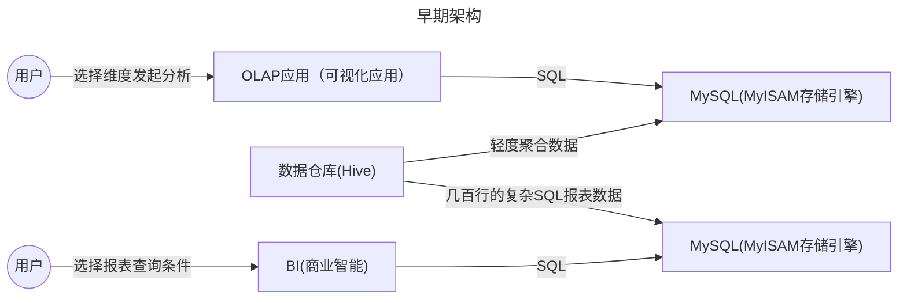
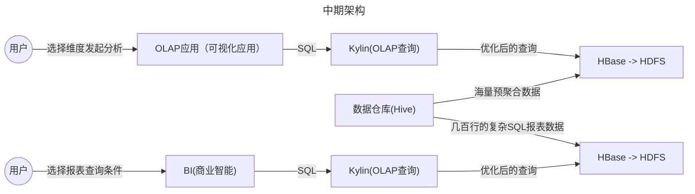

# ClickHouse

[官网](https://clickhouse.com/ )
[github](https://github.com/ClickHouse/ClickHouse )

## 石衫课程

- 基于大数据技术的互联网系统架构实战训练营
    - 阶段二：基于大数据技术的互联网架构设计与实战
        - 03_Clickhouse分布式实时OLAP分析系统原理剖析
        - 04_互联网保险系统的业务需求分析与讲解
        - 05_互联网保险系统的海量保单架构设计与代码开发

## OLAP架构演进


### 早期



问题：
1. MySQL很容易就会到达性能瓶颈


### 中期
v


问题：
1. 早期只能分析离线数据
1. 整个架构非常重，依赖的组件特别多，尤其是hbase那一套
1. 有些大公司实时用的是druid(不是很主流)
1. 实时OLAP刚刚要火起来的时候，ClickHouse突然横空出世

### ClickHouse


## 介绍

俄罗斯的Yandex公司开源的，clickhouse最早是他们自研了用来提供广告流量分析的，后来经过几次架构迭代和升级，达到了现在的成熟阶段。它是一个数据库管理系统**DBMS**

Yandex自己用clickhouse存了万亿级的数据，90%的查询都是1s内返回的。

但是clickhouse有一些缺点，
1. 不支持事物
1. 不擅长根据id去查询单行
1. 不擅长按行删除数据

优点：
1. 擅长针对明细数据，按多维度来汇总聚合分析

## 整体架构


### 列式存储

每一列，单独存储，不像MySQL，一张表我只读几个字段，但还是要所有的字段都读出来再过滤，因为行数据是存储在一起的。

### 数据压缩

数据存储到磁盘使用了LZ4算法，压缩比可达7:1

### CPU寄存器向量化执行

SIMD指令，Single Instruction Multiple Data,一条指令可以处理多条数据

### 多主架构/数据分片

每个节点都是主节点，去中心化。

### 数据分区

自己的电脑启动/home/poul/workspace/src/clickhouse/ClickHouse-v23.7.5.30-stable/build/programs/clickhouse-server时的数据目录
```shell
/data
```

自己的电脑启动/sbin/clickhouse-server时的数据目录
```shell
/var/lib/clickhouse/data
```


```shell
drwxr-x--- 2 clickhouse clickhouse 4.0K  8月25日 16:37 20150701_1_1_0/
drwxr-x--- 2 clickhouse clickhouse 4.0K  8月25日 16:37 20150702_2_2_0/
```

`20150701_1_1_0` 目录
```shell
-rw-r----- 1 clickhouse clickhouse  549  8月25日 16:37 checksums.txt
-rw-r----- 1 clickhouse clickhouse  568  8月25日 16:37 columns.txt
-rw-r----- 1 clickhouse clickhouse    2  8月25日 16:37 count.txt
-rw-r----- 1 clickhouse clickhouse 1.5K  8月25日 16:37 data.bin
-rw-r----- 1 clickhouse clickhouse  113  8月25日 16:37 data.cmrk3
-rw-r----- 1 clickhouse clickhouse   10  8月25日 16:37 default_compression_codec.txt
-rw-r----- 1 clickhouse clickhouse    1  8月25日 16:37 metadata_version.txt
-rw-r----- 1 clickhouse clickhouse    8  8月25日 16:37 minmax_pickup_datetime.idx
-rw-r----- 1 clickhouse clickhouse    2  8月25日 16:37 partition.dat
-rw-r----- 1 clickhouse clickhouse   50  8月25日 16:37 primary.cidx
-rw-r----- 1 clickhouse clickhouse  813  8月25日 16:37 serialization.json
-rw-r----- 1 clickhouse clickhouse   50  8月25日 16:37 skp_idx_idx_tripid_bf.cmrk3
-rw-r----- 1 clickhouse clickhouse   37  8月25日 16:37 skp_idx_idx_tripid_bf.idx
-rw-r----- 1 clickhouse clickhouse   50  8月25日 16:37 skp_idx_idx_tripid.cmrk3
-rw-r----- 1 clickhouse clickhouse   72  8月25日 16:37 skp_idx_idx_tripid.idx
-rw-r----- 1 clickhouse clickhouse   50  8月25日 16:37 skp_idx_idx_tripid_minmax.cmrk3
-rw-r----- 1 clickhouse clickhouse   34  8月25日 16:37 skp_idx_idx_tripid_minmax.idx2
```

`20150702_2_2_0` 目录
```shell
-rw-r----- 1 clickhouse clickhouse  549  8月25日 16:37 checksums.txt
-rw-r----- 1 clickhouse clickhouse  568  8月25日 16:37 columns.txt
-rw-r----- 1 clickhouse clickhouse    2  8月25日 16:37 count.txt
-rw-r----- 1 clickhouse clickhouse 1.4K  8月25日 16:37 data.bin
-rw-r----- 1 clickhouse clickhouse  113  8月25日 16:37 data.cmrk3
-rw-r----- 1 clickhouse clickhouse   10  8月25日 16:37 default_compression_codec.txt
-rw-r----- 1 clickhouse clickhouse    1  8月25日 16:37 metadata_version.txt
-rw-r----- 1 clickhouse clickhouse    8  8月25日 16:37 minmax_pickup_datetime.idx
-rw-r----- 1 clickhouse clickhouse    2  8月25日 16:37 partition.dat
-rw-r----- 1 clickhouse clickhouse   50  8月25日 16:37 primary.cidx
-rw-r----- 1 clickhouse clickhouse  813  8月25日 16:37 serialization.json
-rw-r----- 1 clickhouse clickhouse   50  8月25日 16:37 skp_idx_idx_tripid_bf.cmrk3
-rw-r----- 1 clickhouse clickhouse   37  8月25日 16:37 skp_idx_idx_tripid_bf.idx
-rw-r----- 1 clickhouse clickhouse   50  8月25日 16:37 skp_idx_idx_tripid.cmrk3
-rw-r----- 1 clickhouse clickhouse   72  8月25日 16:37 skp_idx_idx_tripid.idx
-rw-r----- 1 clickhouse clickhouse   50  8月25日 16:37 skp_idx_idx_tripid_minmax.cmrk3
-rw-r----- 1 clickhouse clickhouse   34  8月25日 16:37 skp_idx_idx_tripid_minmax.idx2
```

通过文件分区后的文件目录发现，创建表的时候指定分区键之后，会根据分区键路由到单独的一个文件目录中，类似于分表的方式。

## 数据模型

OLTP本质上就是高效的对单行数据做CRUD，事物，还要支持快速的根据多个条件检索数据，而不是跑聚合函数来分析

ClickHouse本身定位是OLAP数据库

DataType,用户进行序列化和反序列化

Kylin: OLAP查询引擎 -> MapReduce/Spark 离线批处理作业，对数据进行预聚合 -> HBase去进行预聚合数据的存储 -> HDFS进行底层分布式存储

DataType底层依赖Column和Field,简单来说Column映射的是表里的一列数据，就是这一列的全部数据，如果是列里的某一行的数据，那就是Field来代表的，但是他们也仅仅是映射而已，属于映射型的数据模型，就是代表了某种数据。

Block：


### 创建物化视图的方式
```sql
-- 2、创建底表
CREATE TABLE default.keywordAsinAdByCampaignIdView
(
    `adId` String,
    `campaignId` String,
    `asin` String,
    `keyword` String,
    `updateTime` Date,
    `spPosition` Nullable(String)
)
ENGINE = MergeTree()
PARTITION BY toYYYYMM(updateTime)
ORDER BY campaignId
SETTINGS index_granularity = 8192；

-- 2、创建物化视图
CREATE MATERIALIZED VIEW default.mv_keywordAsinAdByCampaignIdView TO default.keywordAsinAdByCampaignIdView
(
    `adId` String,
    `campaignId` String,
    `asin` String,
    `keyword` String,
    `updateTime` Date,
    `spPosition` Nullable(String)
) 
[POPULATE]  -- 开启POPULATE 则会在第一次创建视图的时候生成数据
AS
SELECT 
    adId,
    campaignId,
    asin,
    keyword,
    updateTime,
    spPosition
FROM default.keywordAsinAd;

-- 3、数据迁移
-- 通过insert select where 分批次导入。

-- 一次导入10天的
insert into keywordAsinAdByCampaignIdView (adId, campaignId, asin, keyword, updateTime, spPosition)
SELECT adId, campaignId, asin, keyword, updateTime, spPosition
from keywordAsinAd
where  updateTime >= '2023-10-01' and  updateTime < '2023-10-10';
```


## 安装

`curl https://clickhouse.com/ | sh`


## MergeTree引擎的

主键索引/一级索引： 每隔8192条数据之后，写入一条索引值，稀疏索引.

MarkRange数据结构


## 常用的SQL

ClickHouse的SQL语法跟MySQL非常像

###  查看表占用的存储空间
```sql
SELECT formatReadableSize(total_bytes) FROM system.tables WHERE name = 'opensky';
```

```sql
SELECT
    parts.*,
    columns.compressed_size,
    columns.uncompressed_size,
    columns.ratio
FROM
(
    SELECT
        database,
        table,
        formatReadableSize(sum(data_uncompressed_bytes)) AS uncompressed_size,
        formatReadableSize(sum(data_compressed_bytes)) AS compressed_size,
        sum(data_compressed_bytes) / sum(data_uncompressed_bytes) AS ratio
    FROM system.columns
    GROUP BY
        database,
        table
) AS columns
RIGHT JOIN
(
    SELECT
        database,
        table,
        sum(rows) AS rows,
        max(modification_time) AS latest_modification,
        formatReadableSize(sum(bytes)) AS disk_size,
        formatReadableSize(sum(primary_key_bytes_in_memory)) AS primary_keys_size,
        any(engine) AS engine,
        sum(bytes) AS bytes_size
    FROM system.parts
    WHERE active and table = 'brandAdvertising'
    GROUP BY
        database,
        table
) AS parts ON (columns.database = parts.database) AND (columns.table = parts.table)
ORDER BY parts.bytes_size DESC
```

```sql
SELECT
    database,
    table,
    formatReadableSize(sum(data_uncompressed_bytes)) AS uncompressed_size,
    formatReadableSize(sum(data_compressed_bytes)) AS compressed_size,
    round((sum(data_compressed_bytes) / sum(data_uncompressed_bytes)) * 100, 2) AS compression_ratio_percent
FROM system.parts
WHERE active
GROUP BY
    database,
    table
ORDER BY sum(data_compressed_bytes) DESC
LIMIT 100
```


###  查看创建表的DDL语句
```sql
show create table `trips`;
```

###  创建索引
```sql
## 通过在执行查询时启用跟踪，用户可以看到关于跳数索引使用情况的详细信息, 此配置是**连接**级别的
SET send_logs_level='trace';

## set类型
ALTER TABLE skip_table ADD INDEX vix my_value TYPE set(100) GRANULARITY 2;

ALTER TABLE skip_table MATERIALIZE INDEX vix;

## bloom_filter类型
alter table trips add index idx_tripid_bf trip_id TYPE bloom_filter GRANULARITY 3;

## minmax类型
alter table trips add index idx_tripid_minmax trip_id type minmax GRANULARITY 3;
```

###  导出数据到文件

```shell

clickhouse-client --query "SELECT * from default.esKeywordAsinView limit 2" --format SQLInsert > esKeywordAsinView.sql

clickhouse-client --query "SELECT * from default.esKeywordAsinView limit 2" --format CSV > esKeywordAsinView.csv

clickhouse-client --query "select event_time,query_duration_ms,replaceAll(replaceAll(query,'\n',' '),'asinSearchKeywordScore_20230911','asinSearchKeywordScore_test') as query  from system.query_log as log where log.event_date = '2023-09-12' and log.query like '%asinSearchKeywordScore_20230911%' and log.query like '%order by af desc limit 1%' limit 10000" --format CSVWithNames > bs_sql_20230912_test.csv
```

### 导入数据从文件
```shell
clickhouse-client --password clickhouse -d test --multiquery <  /home/poul/tmp/esKeywordAsinView.sql
```

### 查询执行过的sql日志

```sql
select * from system.query_log where event_date = '2023-08-28' and event_time >= '2023-08-28 20:38:54' and query_id = '8e2abe2e-7009-4c44-9c60-efdb158bce16' limit 1\G;
```

### 查看系统中所有的字典表及状态

```sql
SELECT name, status FROM system.dictionaries;
select * from system.dictionaries;
```

### 重新加载字典表

字典表的名字必须要带scheme的名字，不然可能会出现找不到的问题。
```sql
SYSTEM RELOAD DICTIONARY default.dictionary_name
```

### 物化视图刷新
```sql

```

### 删除物化视图
```sql
DROP table 
```

### 如何停止ALTER 和 DELETE 操作在后台执行的任务

查询当前正在执行的变更
```sql
SELECT database, table, mutation_id, command, parts_to_do, is_done
FROM system.mutations
WHERE is_done = 0;
```

取消变更
```sql
KILL MUTATION WHERE mutation_id = 'your_mutation_id' AND database = 'your_database' AND table = 'your_table';
```

### System库中有用的表信息

#### 1. system.parts
作用：包含所有表的分区和分片信息。
示例查询：
```sql
SELECT * FROM system.parts WHERE table = 'your_table';
```
#### 2. system.mutations
作用：包含所有正在进行或已经完成的变更操作（如 ALTER 和 DELETE）。
示例查询：
```sql
SELECT * FROM system.mutations WHERE table = 'your_table';
```
#### 3. system.tables
作用：包含关于所有表的元数据信息。
示例查询：
```sql
SELECT * FROM system.tables WHERE database = 'your_database';
```
#### 4. system.columns
作用：包含关于所有列的元数据信息。
示例查询：
```sql
SELECT * FROM system.columns WHERE table = 'your_table';
```
#### 5. system.query_log
作用：记录所有执行的查询信息。
示例查询：
```sql
SELECT * FROM system.query_log WHERE type = 'QueryFinish' ORDER BY event_time DESC LIMIT 10;
```
#### 6. system.processes
作用：包含当前正在执行的查询。
示例查询：
```sql
SELECT * FROM system.processes;
```
#### 7. system.metrics
作用：提供各种运行时指标，包括内存使用、CPU使用等。
示例查询：
```sql
SELECT * FROM system.metrics;
```
#### 8. system.settings
作用：包含当前服务器的配置设置。
示例查询：
```sql
SELECT * FROM system.settings;
```
#### 9. system.replicas
作用：提供关于复制表的信息，包括复制状态和延迟。
示例查询：
```sql
SELECT * FROM system.replicas;
```
#### 10. system.events
作用：提供关于内部事件的统计信息，如已处理的查询数、分区合并数等。
示例查询：
```sql
SELECT * FROM system.events;
```
#### 11. system.asynchronous_metrics
作用：包含定期收集的异步系统指标。
示例查询：
```sql
SELECT * FROM system.asynchronous_metrics;
```
#### 12. system.disks
作用：包含关于所有配置的磁盘的信息。
示例查询：
```sql
SELECT * FROM system.disks;
```
#### 13. system.clusters
作用：包含关于配置的集群的信息。
示例查询：
```sql
SELECT * FROM system.clusters;
```
#### 14. system.detached_parts
作用：包含被分离但仍在磁盘上的数据分片信息。
示例查询：
```sql
SELECT * FROM system.detached_parts;
```
#### 15. system.dictionaries
作用：包含所有已加载的字典的信息。
示例查询：
```sql
SELECT * FROM system.dictionaries;
```
#### 16. system.macros
作用：包含服务器配置中定义的所有宏。
示例查询：
```sql
SELECT * FROM system.macros;
```
#### 17. system.networks
作用：包含网络接口和其IP地址信息。
示例查询：
```sql
SELECT * FROM system.networks;
```
#### 18. system.zookeeper
作用：包含Zookeeper状态和配置的信息。
示例查询：
```sql
SELECT * FROM system.zookeeper;
```
#### 19. system.dictionaries
作用：包含所有字典的详细信息。
示例查询：
```sql
SELECT * FROM system.dictionaries;
```
#### 20. system.replicated_fetches
作用：包含关于当前正在进行的复制任务的信息。
示例查询：
```sql
SELECT * FROM system.replicated_fetches;
```

这些 system 表提供了对ClickHouse服务器和数据库状态的深刻洞察，帮助管理员和用户监控系统性能、调试查询和管理数据库配置。

## 源码编译

阅读github中的build文件`https://github.com/ClickHouse/ClickHouse/blob/master/docs/en/development/build.md`,参见“Building on Any Linux”部分

1. 环境准备
```shell
sudo pacman -S git cmake ccache python3 ninja nasm yasm gawk lsb-release wget gnupg
```

1. 下载源码
```shell
git clone --recursive --shallow-submodules https://github.com/ClickHouse/ClickHouse.git

## 
git clone -b v20.8.17.25-lts http://github.com/ClickHouse/ClickHouse.git ClickHouse-v20.8.17.25-lts

git clone -b v23.7.5.30-stable http://github.com/ClickHouse/ClickHouse.git ClickHouse-v23.7.5.30-stable

git submodule update --init --recursive
```

1. 编译
```shell
mkdir build
cmake -S . -B build
cmake --build build --parallel 3
## 断断续续的编译了好几天，编译目录太大了，经常导致磁盘空间不够，所以把编译目录迁移到机械硬盘上
cmake -S . -B /run/media/poul/新加卷/src_build/clickhouse
cmake --build /run/media/poul/新加卷/src_build/clickhouse
```

```shell
# vscode debug编译
/sbin/cmake -DCMAKE_BUILD_TYPE:STRING=Debug -DCMAKE_EXPORT_COMPILE_COMMANDS:BOOL=TRUE -DCMAKE_C_COMPILER:FILEPATH=/sbin/clang -DCMAKE_CXX_COMPILER:FILEPATH=/sbin/clang++ -S /home/poul/workspace/src/clickhouse/ClickHouse-v23.7.5.30-stable -B /home/poul/workspace/src/clickhouse/ClickHouse-v23.7.5.30-stable/build -G Ninja

/sbin/cmake --build /home/poul/workspace/src/clickhouse/ClickHouse-v23.7.5.30-stable/build --config Debug --target all --parallel 3 -- 
```


由于经常出现编译断掉的情况所以，写了个自动重启的脚本：

```shell
#! /bin/sh
run_cmake() {
  jobs=1
  if [ $# -ge 1 ]; then
    jobs=$1
  fi
  nohup  /sbin/cmake --build /home/poul/workspace/src/clickhouse/ClickHouse/build --config Debug --target all --parallel $jobs  --  >> build.log  2>&1  &
  child_pid=$!
  echo $child_pid > build.pid

  echo "cmake启动成功 pid: $child_pid"

  echo "等待进程结束"
  wait $child_pid
  exit_status=$?

  echo "" > build.pid
  if [ $exit_status -eq 0 ]; then
      echo "子进程成功完成，退出状态码为 $exit_status"
  else
      echo "子进程出现错误，退出状态码为 $exit_status 重新启动：。。。"
      nohup sh build.sh $jobs > /dev/null 2>&1 &
  fi
}
```


