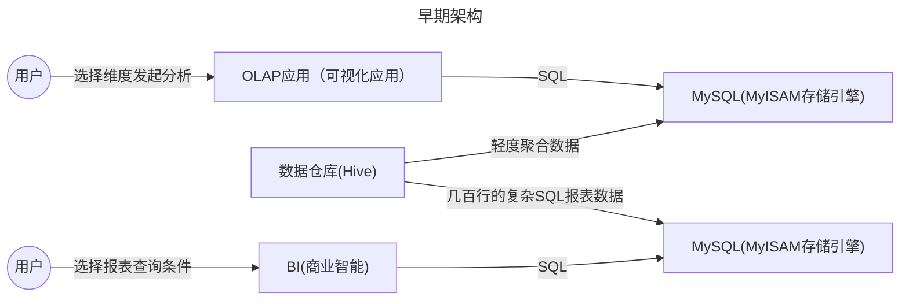
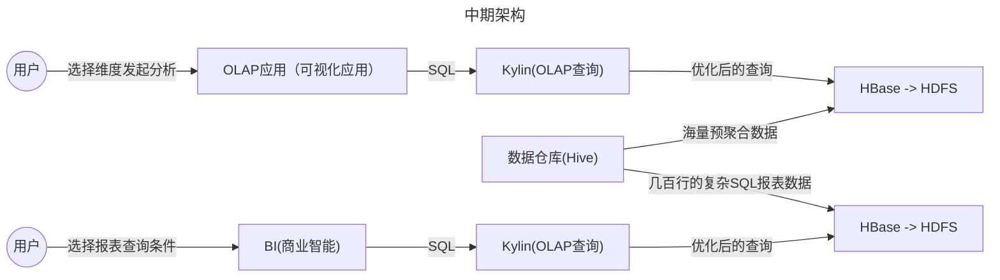

# ClickHouse

[官网](https://clickhouse.com/ )
[github](https://github.com/ClickHouse/ClickHouse )

## 石衫课程

- 基于大数据技术的互联网系统架构实战训练营
    - 阶段二：基于大数据技术的互联网架构设计与实战
        - 03_Clickhouse分布式实时OLAP分析系统原理剖析
        - 04_互联网保险系统的业务需求分析与讲解
        - 05_互联网保险系统的海量保单架构设计与代码开发

## OLAP架构演进


### 早期



问题：
1. MySQL很容易就会到达性能瓶颈


### 中期
v


问题：
1. 早期只能分析离线数据
1. 整个架构非常重，依赖的组件特别多，尤其是hbase那一套
1. 有些大公司实时用的是druid(不是很主流)
1. 实时OLAP刚刚要火起来的时候，ClickHouse突然横空出世

### ClickHouse


## 介绍

俄罗斯的Yandex公司开源的，clickhouse最早是他们自研了用来提供广告流量分析的，后来经过几次架构迭代和升级，达到了现在的成熟阶段。它是一个数据库管理系统**DBMS**

Yandex自己用clickhouse存了万亿级的数据，90%的查询都是1s内返回的。

但是clickhouse有一些缺点，
1. 不支持事物
1. 不擅长根据id去查询单行
1. 不擅长按行删除数据

优点：
1. 擅长针对明细数据，按多维度来汇总聚合分析

## 整体架构




### 列式存储

每一列，单独存储，不像MySQL，一张表我只读几个字段，但还是要所有的字段都读出来再过滤，因为行数据是存储在一起的。

### 数据压缩

数据存储到磁盘使用了LZ4算法，压缩比可达7:1

#### 支持的压缩算法

[压缩模型](https://clickhouse.com/docs/data-compression/compression-modes)
[列压缩模型](https://clickhouse.com/docs/sql-reference/statements/create/table#column_compression_codec)

### CPU寄存器向量化执行

SIMD指令，Single Instruction Multiple Data,一条指令可以处理多条数据

### 多主架构/数据分片

每个节点都是主节点，去中心化。

### 数据分区

启动服务的时候最好指定一下配置文件 `/etc/clickhouse-server/config.xml`,如果不指定的话，默认使用当前目录的`data`

配置文件中的数据目录默认是
```shell
/var/lib/clickhouse/data
```

```shell
sudo /home/poul/workspace/src/clickhouse/ClickHouse-v23.7.5.30-stable/build/programs/clickhouse-server --config-file=/etc/clickhouse-server/config.xml

sudo /sbin/clickhouse-server --config-file=/etc/clickhouse-server/config.xml
自己的电脑启动/home/poul/workspace/src/clickhouse/ClickHouse-v23.7.5.30-stable/build/programs/clickhouse-server时的数据目录
```


相关的目录文件
```shell
drwxr-x--- 2 clickhouse clickhouse 4.0K  8月25日 16:37 20150701_1_1_0/
drwxr-x--- 2 clickhouse clickhouse 4.0K  8月25日 16:37 20150702_2_2_0/
```

`20150701_1_1_0` 目录
```shell
-rw-r----- 1 clickhouse clickhouse  549  8月25日 16:37 checksums.txt
-rw-r----- 1 clickhouse clickhouse  568  8月25日 16:37 columns.txt
-rw-r----- 1 clickhouse clickhouse    2  8月25日 16:37 count.txt
-rw-r----- 1 clickhouse clickhouse 1.5K  8月25日 16:37 data.bin
-rw-r----- 1 clickhouse clickhouse  113  8月25日 16:37 data.cmrk3
-rw-r----- 1 clickhouse clickhouse   10  8月25日 16:37 default_compression_codec.txt
-rw-r----- 1 clickhouse clickhouse    1  8月25日 16:37 metadata_version.txt
-rw-r----- 1 clickhouse clickhouse    8  8月25日 16:37 minmax_pickup_datetime.idx
-rw-r----- 1 clickhouse clickhouse    2  8月25日 16:37 partition.dat
-rw-r----- 1 clickhouse clickhouse   50  8月25日 16:37 primary.cidx
-rw-r----- 1 clickhouse clickhouse  813  8月25日 16:37 serialization.json
-rw-r----- 1 clickhouse clickhouse   50  8月25日 16:37 skp_idx_idx_tripid_bf.cmrk3
-rw-r----- 1 clickhouse clickhouse   37  8月25日 16:37 skp_idx_idx_tripid_bf.idx
-rw-r----- 1 clickhouse clickhouse   50  8月25日 16:37 skp_idx_idx_tripid.cmrk3
-rw-r----- 1 clickhouse clickhouse   72  8月25日 16:37 skp_idx_idx_tripid.idx
-rw-r----- 1 clickhouse clickhouse   50  8月25日 16:37 skp_idx_idx_tripid_minmax.cmrk3
-rw-r----- 1 clickhouse clickhouse   34  8月25日 16:37 skp_idx_idx_tripid_minmax.idx2
```

`20150702_2_2_0` 目录
```shell
-rw-r----- 1 clickhouse clickhouse  549  8月25日 16:37 checksums.txt
-rw-r----- 1 clickhouse clickhouse  568  8月25日 16:37 columns.txt
-rw-r----- 1 clickhouse clickhouse    2  8月25日 16:37 count.txt
-rw-r----- 1 clickhouse clickhouse 1.4K  8月25日 16:37 data.bin
-rw-r----- 1 clickhouse clickhouse  113  8月25日 16:37 data.cmrk3
-rw-r----- 1 clickhouse clickhouse   10  8月25日 16:37 default_compression_codec.txt
-rw-r----- 1 clickhouse clickhouse    1  8月25日 16:37 metadata_version.txt
-rw-r----- 1 clickhouse clickhouse    8  8月25日 16:37 minmax_pickup_datetime.idx
-rw-r----- 1 clickhouse clickhouse    2  8月25日 16:37 partition.dat
-rw-r----- 1 clickhouse clickhouse   50  8月25日 16:37 primary.cidx
-rw-r----- 1 clickhouse clickhouse  813  8月25日 16:37 serialization.json
-rw-r----- 1 clickhouse clickhouse   50  8月25日 16:37 skp_idx_idx_tripid_bf.cmrk3
-rw-r----- 1 clickhouse clickhouse   37  8月25日 16:37 skp_idx_idx_tripid_bf.idx
-rw-r----- 1 clickhouse clickhouse   50  8月25日 16:37 skp_idx_idx_tripid.cmrk3
-rw-r----- 1 clickhouse clickhouse   72  8月25日 16:37 skp_idx_idx_tripid.idx
-rw-r----- 1 clickhouse clickhouse   50  8月25日 16:37 skp_idx_idx_tripid_minmax.cmrk3
-rw-r----- 1 clickhouse clickhouse   34  8月25日 16:37 skp_idx_idx_tripid_minmax.idx2
```

通过文件分区后的文件目录发现，创建表的时候指定分区键之后，会根据分区键路由到单独的一个文件目录中，类似于分表的方式。

## 存储引擎


### MergeTree

创建一张表

```sql
-- 该表负责存储用户参加过的活动，每参加一个活动，就会生成一条记录
CREATE TABLE IF NOT EXISTS user_activity_event (
    ID UInt64,  -- 表的 ID
    UserName String,  -- 用户名
    ActivityName String,  -- 活动名称
    ActivityType String,  -- 活动类型
    ActivityLevel Enum('Easy' = 0, 'Medium' = 1, 'Hard' = 2),  -- 活动难度等级
    IsSuccess Int8,  -- 是否成功
    JoinTime DATE  -- 参加时间
) ENGINE = MergeTree()
PARTITION BY toYYYYMM(JoinTime)  -- 按照 toYYYYMM(JoinTime) 进行分区
ORDER BY ID;  -- 按照 ID 字段排序

-- 插入一条数据
INSERT INTO user_activity_event VALUES (1, '张三', '寻找遗失的时间', '市场营销', 'Medium', 1, '2020-05-13');
INSERT INTO user_activity_event VALUES (3, '王五', '寻找遗失的时间', '市场营销', 'Medium', 1, '2020-06-11');
```

The merge mechanism does not guarantee that all rows with the same primary key will be in the same data part.


## 数据模型

OLTP本质上就是高效的对单行数据做CRUD，事物，还要支持快速的根据多个条件检索数据，而不是跑聚合函数来分析

ClickHouse本身定位是OLAP数据库

DataType,用户进行序列化和反序列化

Kylin: OLAP查询引擎 -> MapReduce/Spark 离线批处理作业，对数据进行预聚合 -> HBase去进行预聚合数据的存储 -> HDFS进行底层分布式存储

DataType底层依赖Column和Field,简单来说Column映射的是表里的一列数据，就是这一列的全部数据，如果是列里的某一行的数据，那就是Field来代表的，但是他们也仅仅是映射而已，属于映射型的数据模型，就是代表了某种数据。

Block：


### 创建物化视图的方式
```sql
-- 2、创建底表
CREATE TABLE default.keywordAsinAdByCampaignIdView
(
    `adId` String,
    `campaignId` String,
    `asin` String,
    `keyword` String,
    `updateTime` Date,
    `spPosition` Nullable(String)
)
ENGINE = MergeTree()
PARTITION BY toYYYYMM(updateTime)
ORDER BY campaignId
SETTINGS index_granularity = 8192；

-- 2、创建物化视图
CREATE MATERIALIZED VIEW default.mv_keywordAsinAdByCampaignIdView TO default.keywordAsinAdByCampaignIdView
(
    `adId` String,
    `campaignId` String,
    `asin` String,
    `keyword` String,
    `updateTime` Date,
    `spPosition` Nullable(String)
) 
[POPULATE]  -- 开启POPULATE 则会在第一次创建视图的时候生成数据
AS
SELECT 
    adId,
    campaignId,
    asin,
    keyword,
    updateTime,
    spPosition
FROM default.keywordAsinAd;


-- 3、数据迁移
-- 通过insert select where 分批次导入。

-- 一次导入10天的
insert into keywordAsinAdByCampaignIdView (adId, campaignId, asin, keyword, updateTime, spPosition)
SELECT adId, campaignId, asin, keyword, updateTime, spPosition
from keywordAsinAd
where  updateTime >= '2023-10-01' and  updateTime < '2023-10-10';
```

物化视图实际上是底层的表在起作用,比如类似下面这个样子
```
┌─database─┬─table_name─────────────────────┬─engine───────────┐
│ default  │ .inner.keywordAsinAdByAsinView │ MergeTree        │
│ default  │ keywordAsinAdByAsinView        │ MaterializedView │
└──────────┴────────────────────────────────┴──────────────────┘
```
所以查询

### 删除物化视图

```sql
DROP VIEW IF EXISTS default.keywordAsinAdByCampaignView;
```

### 字典表 Dictionary


[Dictionaries](https://clickhouse.com/docs/en/dictionary)
[Data Modelling - Defining Dictionaries](https://clickhouse.com/docs/en/sql-reference/dictionaries)
[ways-to-store-dictionaries-in-memory](https://clickhouse.com/docs/en/sql-reference/dictionaries#ways-to-store-dictionaries-in-memory)
[Using Dictionaries to Accelerate Queries](https://clickhouse.com/blog/faster-queries-dictionaries-clickhouse)


### 投影 Projection

投影是为了加速非Primary Key的查询，本质是在每个Part目录下再创建一个子目录来存储。


创建表`trips`

```sql
CREATE TABLE trips
(
    `trip_id` UInt32,
    `vendor_id` Enum8('1' = 1, '2' = 2, '3' = 3, '4' = 4, 'CMT' = 5, 'VTS' = 6, 'DDS' = 7, 'B02512' = 10, 'B02598' = 11, 'B02617' = 12, 'B02682' = 13, 'B02764' = 14, '' = 15),
    `pickup_date` Date,
    `pickup_datetime` DateTime,
    `dropoff_date` Date,
    `dropoff_datetime` DateTime,
    `store_and_fwd_flag` UInt8,
    `rate_code_id` UInt8,
    `pickup_longitude` Float64,
    `pickup_latitude` Float64,
    `dropoff_longitude` Float64,
    `dropoff_latitude` Float64,
    `passenger_count` UInt8,
    `trip_distance` Float64,
    `fare_amount` Float32,
    `extra` Float32,
    `mta_tax` Float32,
    `tip_amount` Float32,
    `tolls_amount` Float32,
    `ehail_fee` Float32,
    `improvement_surcharge` Float32,
    `total_amount` Float32,
    `payment_type` Enum8('UNK' = 0, 'CSH' = 1, 'CRE' = 2, 'NOC' = 3, 'DIS' = 4),
    `trip_type` UInt8,
    `pickup` FixedString(25),
    `dropoff` FixedString(25),
    `cab_type` Enum8('yellow' = 1, 'green' = 2, 'uber' = 3),
    `pickup_nyct2010_gid` Int8,
    `pickup_ctlabel` Float32,
    `pickup_borocode` Int8,
    `pickup_ct2010` String,
    `pickup_boroct2010` String,
    `pickup_cdeligibil` String,
    `pickup_ntacode` FixedString(4),
    `pickup_ntaname` String,
    `pickup_puma` UInt16,
    `dropoff_nyct2010_gid` UInt8,
    `dropoff_ctlabel` Float32,
    `dropoff_borocode` UInt8,
    `dropoff_ct2010` String,
    `dropoff_boroct2010` String,
    `dropoff_cdeligibil` String,
    `dropoff_ntacode` FixedString(4),
    `dropoff_ntaname` String,
    `dropoff_puma` UInt16
)
ENGINE = MergeTree
PARTITION BY toYYYYMM(pickup_date)
ORDER BY pickup_datetime;
```

导入数据
```sql
INSERT INTO trips
SELECT * FROM s3(
    'https://datasets-documentation.s3.eu-west-3.amazonaws.com/nyc-taxi/trips_{1..2}.gz',
    'TabSeparatedWithNames', "
    `trip_id` UInt32,
    `vendor_id` Enum8('1' = 1, '2' = 2, '3' = 3, '4' = 4, 'CMT' = 5, 'VTS' = 6, 'DDS' = 7, 'B02512' = 10, 'B02598' = 11, 'B02617' = 12, 'B02682' = 13, 'B02764' = 14, '' = 15),
    `pickup_date` Date,
    `pickup_datetime` DateTime,
    `dropoff_date` Date,
    `dropoff_datetime` DateTime,
    `store_and_fwd_flag` UInt8,
    `rate_code_id` UInt8,
    `pickup_longitude` Float64,
    `pickup_latitude` Float64,
    `dropoff_longitude` Float64,
    `dropoff_latitude` Float64,
    `passenger_count` UInt8,
    `trip_distance` Float64,
    `fare_amount` Float32,
    `extra` Float32,
    `mta_tax` Float32,
    `tip_amount` Float32,
    `tolls_amount` Float32,
    `ehail_fee` Float32,
    `improvement_surcharge` Float32,
    `total_amount` Float32,
    `payment_type` Enum8('UNK' = 0, 'CSH' = 1, 'CRE' = 2, 'NOC' = 3, 'DIS' = 4),
    `trip_type` UInt8,
    `pickup` FixedString(25),
    `dropoff` FixedString(25),
    `cab_type` Enum8('yellow' = 1, 'green' = 2, 'uber' = 3),
    `pickup_nyct2010_gid` Int8,
    `pickup_ctlabel` Float32,
    `pickup_borocode` Int8,
    `pickup_ct2010` String,
    `pickup_boroct2010` String,
    `pickup_cdeligibil` String,
    `pickup_ntacode` FixedString(4),
    `pickup_ntaname` String,
    `pickup_puma` UInt16,
    `dropoff_nyct2010_gid` UInt8,
    `dropoff_ctlabel` Float32,
    `dropoff_borocode` UInt8,
    `dropoff_ct2010` String,
    `dropoff_boroct2010` String,
    `dropoff_cdeligibil` String,
    `dropoff_ntacode` FixedString(4),
    `dropoff_ntaname` String,
    `dropoff_puma` UInt16
") SETTINGS input_format_try_infer_datetimes = 0
```

上面的表的主键是`pickup_datetime`

如果我们查询
```sql
select * from trips where trip_id = 1201418711
```
因为不在主键中，所以会导致全表扫描。


下面是当前表，在磁盘上的存储
```shell
drwxr-x---  2 clickhouse clickhouse 4096 Jun 24 08:17 201507_1_1_0/
drwxr-x---  2 clickhouse clickhouse 4096 Jun 24 08:18 201507_5_5_0/
drwxr-x---  2 clickhouse clickhouse 4096 Jun 24 08:18 201508_2_2_0/
drwxr-x---  2 clickhouse clickhouse 4096 Jun 24 08:18 201508_3_3_0/
drwxr-x---  2 clickhouse clickhouse 4096 Jun 24 08:18 201508_6_6_0/
drwxr-x---  2 clickhouse clickhouse 4096 Jun 24 08:18 201509_4_4_0/
drwxr-x---  2 clickhouse clickhouse 4096 Jun 24 08:18 201509_7_7_0/
drwxr-x---  2 clickhouse clickhouse 4096 Jun 24 08:17 detached/
-rw-r-----  1 clickhouse clickhouse    1 Jun 24 08:17 format_version.txt
```

创建投影
```sql
ALTER TABLE trips ADD PROJECTION trip_id_projection(
    select * order by trip_id
);

-- 创建投影后，历史数据并不能生效，需要手动触发一下
ALTER TABLE trips MATERIALIZE PROJECTION trip_id_projection;


-- 因为投影是异步创建的，可以通过下面的sql查询投影是否创建完毕
SELECT * FROM system.mutations WHERE table = 'trips'
```

创建投影之后的文件目录
```shell
drwxr-x---  2 clickhouse clickhouse 4096 Jun 24 08:17 201507_1_1_0/
drwxr-x---  3 clickhouse clickhouse 4096 Jun 24 08:28 201507_1_1_0_8/
drwxr-x---  2 clickhouse clickhouse 4096 Jun 24 08:18 201507_5_5_0/
drwxr-x---  3 clickhouse clickhouse 4096 Jun 24 08:28 201507_5_5_0_8/
drwxr-x---  2 clickhouse clickhouse 4096 Jun 24 08:18 201508_2_2_0/
drwxr-x---  3 clickhouse clickhouse 4096 Jun 24 08:28 201508_2_2_0_8/
drwxr-x---  2 clickhouse clickhouse 4096 Jun 24 08:18 201508_3_3_0/
drwxr-x---  3 clickhouse clickhouse 4096 Jun 24 08:28 201508_3_3_0_8/
drwxr-x---  2 clickhouse clickhouse 4096 Jun 24 08:18 201508_6_6_0/
drwxr-x---  3 clickhouse clickhouse 4096 Jun 24 08:28 201508_6_6_0_8/
drwxr-x---  2 clickhouse clickhouse 4096 Jun 24 08:18 201509_4_4_0/
drwxr-x---  3 clickhouse clickhouse 4096 Jun 24 08:28 201509_4_4_0_8/
drwxr-x---  2 clickhouse clickhouse 4096 Jun 24 08:18 201509_7_7_0/
drwxr-x---  3 clickhouse clickhouse 4096 Jun 24 08:28 201509_7_7_0_8/
drwxr-x---  2 clickhouse clickhouse 4096 Jun 24 08:17 detached/
-rw-r-----  1 clickhouse clickhouse    1 Jun 24 08:17 format_version.txt
-rw-r-----  1 clickhouse clickhouse  103 Jun 24 08:28 mutation_8.txt
```


再执行查询
```sql
explain
select * from trips where trip_id = 1201418711
```

```text
   ┌─explain────────────────────────────────────┐
1. │ Expression ((Project names + Projection))  │
2. │   Filter                                   │
3. │     ReadFromMergeTree (trip_id_projection) │
   └────────────────────────────────────────────┘
```
能看到走投影了

## 安装

`curl https://clickhouse.com/ | sh`

```shell
[poul@poul-work clickhouse]$ sudo ./clickhouse install
[sudo] password for poul:
Copying ClickHouse binary to /usr/bin/clickhouse.new
Renaming /usr/bin/clickhouse.new to /usr/bin/clickhouse.
Creating symlink /usr/bin/clickhouse-server to /usr/bin/clickhouse.
Creating symlink /usr/bin/clickhouse-client to /usr/bin/clickhouse.
Creating symlink /usr/bin/clickhouse-local to /usr/bin/clickhouse.
Creating symlink /usr/bin/clickhouse-benchmark to /usr/bin/clickhouse.
Creating symlink /usr/bin/clickhouse-obfuscator to /usr/bin/clickhouse.
Creating symlink /usr/bin/clickhouse-git-import to /usr/bin/clickhouse.
Creating symlink /usr/bin/clickhouse-compressor to /usr/bin/clickhouse.
Creating symlink /usr/bin/clickhouse-format to /usr/bin/clickhouse.
Creating symlink /usr/bin/clickhouse-extract-from-config to /usr/bin/clickhouse.
Creating symlink /usr/bin/clickhouse-keeper to /usr/bin/clickhouse.
Creating symlink /usr/bin/clickhouse-keeper-converter to /usr/bin/clickhouse.
Creating symlink /usr/bin/clickhouse-disks to /usr/bin/clickhouse.
Creating symlink /usr/bin/ch to /usr/bin/clickhouse.
Creating symlink /usr/bin/chl to /usr/bin/clickhouse.
Creating symlink /usr/bin/chc to /usr/bin/clickhouse.
Creating clickhouse group if it does not exist.
 groupadd -r clickhouse
Creating clickhouse user if it does not exist.
 useradd -r --shell /bin/false --home-dir /nonexistent -g clickhouse clickhouse
Will set ulimits for clickhouse user in /etc/security/limits.d/clickhouse.conf.
Creating config directory /etc/clickhouse-server.
Creating config directory /etc/clickhouse-server/config.d that is used for tweaks of main server configuration.
Creating config directory /etc/clickhouse-server/users.d that is used for tweaks of users configuration.
Data path configuration override is saved to file /etc/clickhouse-server/config.d/data-paths.xml.
Log path configuration override is saved to file /etc/clickhouse-server/config.d/logger.xml.
User directory path configuration override is saved to file /etc/clickhouse-server/config.d/user-directories.xml.
OpenSSL path configuration override is saved to file /etc/clickhouse-server/config.d/openssl.xml.
Creating log directory /var/log/clickhouse-server.
Creating data directory /var/lib/clickhouse.
Creating pid directory /var/run/clickhouse-server.
 chown -R clickhouse:clickhouse '/var/log/clickhouse-server'
 chown -R clickhouse:clickhouse '/var/run/clickhouse-server'
 chown  clickhouse:clickhouse '/var/lib/clickhouse'
Enter password for the default user:
Password for the default user is an empty string. See /etc/clickhouse-server/users.xml and /etc/clickhouse-server/users.d to change it.
Setting capabilities for clickhouse binary. This is optional.
 chown -R clickhouse:clickhouse '/etc/clickhouse-server'

ClickHouse has been successfully installed.

Start clickhouse-server with:
 sudo clickhouse start

Start clickhouse-client with:
 clickhouse-client
```


## MergeTree引擎的

主键索引/一级索引： 每隔8192条数据之后，写入一条索引值，稀疏索引.

MarkRange数据结构


## 常用的SQL

ClickHouse的SQL语法跟MySQL非常像

###  查看表占用的存储空间
```sql
SELECT formatReadableSize(total_bytes) FROM system.tables WHERE name = '.inner.bt_keywordAsinAdLatestAsinView';
```

```sql
SELECT
    parts.*,
    columns.compressed_size,
    columns.uncompressed_size,
    columns.ratio
FROM
(
    SELECT
        database,
        table,
        formatReadableSize(sum(data_uncompressed_bytes)) AS uncompressed_size,
        formatReadableSize(sum(data_compressed_bytes)) AS compressed_size,
        sum(data_compressed_bytes) / sum(data_uncompressed_bytes) AS ratio
    FROM system.columns
    GROUP BY
        database,
        table
) AS columns
RIGHT JOIN
(
    SELECT
        database,
        table,
        sum(rows) AS rows,
        max(modification_time) AS latest_modification,
        formatReadableSize(sum(bytes)) AS disk_size,
        formatReadableSize(sum(primary_key_bytes_in_memory)) AS primary_keys_size,
        any(engine) AS engine,
        sum(bytes) AS bytes_size
    FROM system.parts
    WHERE active and table = 'asinVariant'
    GROUP BY
        database,
        table
) AS parts ON (columns.database = parts.database) AND (columns.table = parts.table)
ORDER BY parts.bytes_size DESC
```

```sql
SELECT
    database,
    table,
    formatReadableSize(sum(data_uncompressed_bytes)) AS uncompressed_size,
    formatReadableSize(sum(data_compressed_bytes)) AS compressed_size,
    round((sum(data_compressed_bytes) / sum(data_uncompressed_bytes)) * 100, 2) AS compression_ratio_percent
FROM system.parts
WHERE active and database = 'default' and table = 'asinVariant'
GROUP BY
    database,
    table
ORDER BY sum(data_compressed_bytes) DESC
LIMIT 200
```

### 查询表每一列占用的磁盘空间

```sql
SELECT 
    name AS column_name,
    formatReadableSize(data_compressed_bytes) AS compressed_size,
    formatReadableSize(data_uncompressed_bytes) AS uncompressed_size,
    round(data_compressed_bytes / data_uncompressed_bytes, 2) AS compression_ratio
FROM system.columns
WHERE database = 'default' 
  AND table = 'product2RepairTest3'
ORDER BY data_compressed_bytes DESC;


```


### 查询字典表占用的内存空间

```sql
SELECT name,formatReadableSize(bytes_allocated) AS size,status
FROM system.dictionaries
order by bytes_allocated desc;


SELECT formatReadableSize(sum(bytes_allocated)) AS size
FROM system.dictionaries;
```


### 查询投影占用的磁盘大小

```sql
SELECT
    table,
    name,
    formatReadableSize(sum(bytes_on_disk)) AS total_size
FROM system.projection_parts
WHERE database = 'default'
  -- AND table = 'trips'
GROUP BY table, name
ORDER BY sum(bytes_on_disk) DESC;
```


### 查询clickhouse内存占用并清理

```sql
检查其他内存占用：

当前查询占用：
SELECT formatReadableSize(sum(memory_usage)) FROM system.processes;

缓存占用：
SELECT *, formatReadableSize(value) FROM system.asynchronous_metrics WHERE (metric LIKE '%Cach%') OR (metric LIKE '%Mem%') ORDER BY metric ASC;

这个是由于查询结果集过大或后台异步任务（如主键合并）占用内存所致。

建议您：
1. 优化查询，减少结果集大小。
2. 查看`system.processes`和`system.merge`表，确认是否有高内存占用的后台任务。
3. 考虑垂直升配，提高实例内存规模。
4. 清理缓存：执行`SYSTEM DROP MARK CACHE`和`system drop uncompressed cache` `SYSTEM DROP QUERY CACHE;`。


SYSTEM DROP MARK CACHE;
system drop uncompressed cache;
SYSTEM DROP QUERY CACHE;


若问题持续，请检查内存使用情况并考虑调整`mark_cache_size`和`uncompressed_cache_size`参数。操作前请做好数据备份，并在非业务高峰期进行。
```


###  查看创建表的DDL语句
```sql
show create table `trips`;
```

###  创建索引
```sql
## 通过在执行查询时启用跟踪，用户可以看到关于跳数索引使用情况的详细信息, 此配置是**连接**级别的
SET send_logs_level='trace';

## set类型
ALTER TABLE skip_table ADD INDEX vix my_value TYPE set(100) GRANULARITY 2;

ALTER TABLE skip_table MATERIALIZE INDEX vix;

## bloom_filter类型
alter table trips add index idx_tripid_bf trip_id TYPE bloom_filter GRANULARITY 3;

## minmax类型
alter table trips add index idx_tripid_minmax trip_id type minmax GRANULARITY 3;
```

###  导出数据到文件

```shell

clickhouse-client --query "SELECT * from default.esKeywordAsinView limit 2" --format SQLInsert > esKeywordAsinView.sql

clickhouse-client --query "SELECT * from default.esKeywordAsinView limit 2" --format CSV > esKeywordAsinView.csv
clickhouse-client --query "SELECT * from default.esKeywordAsinView limit 2" --format TSV > esKeywordAsinView.tsv

clickhouse-client --query "select event_time,query_duration_ms,replaceAll(replaceAll(query,'\n',' '),'asinSearchKeywordScore_20230911','asinSearchKeywordScore_test') as query  from system.query_log as log where log.event_date = '2023-09-12' and log.query like '%asinSearchKeywordScore_20230911%' and log.query like '%order by af desc limit 1%' limit 10000" --format CSVWithNames > bs_sql_20230912_test.csv
```

### 导入数据从文件
```shell
clickhouse-client --password clickhouse -d test --multiquery <  /home/poul/tmp/esKeywordAsinView.sql
```
```shell
clickhouse-client --host=your_clickhouse_host --query="INSERT INTO your_table FORMAT CSV" < your_file.csv
clickhouse-client --host=your_clickhouse_host --query="INSERT INTO your_table FORMAT CSVWithNames" < your_file.csv
```

### 查询执行过的sql日志

```sql
select * from system.query_log where event_date = '2023-08-28' and event_time >= '2023-08-28 20:38:54' and query_id = '8e2abe2e-7009-4c44-9c60-efdb158bce16' limit 1\G;
```

### 查看系统中所有的字典表及状态

```sql
SELECT name, status FROM system.dictionaries;
select * from system.dictionaries;
```

### 重新加载字典表

字典表的名字必须要带scheme的名字，不然可能会出现找不到的问题。
```sql
SYSTEM RELOAD DICTIONARY default.dictionary_name
```


### 查询字典表的内存占用


```sql
SELECT
    name AS dictionary_name,
    status,
    formatReadableSize(bytes_allocated) AS memory_usage
FROM system.dictionaries
order by bytes_allocated desc
```

### 物化视图刷新
```sql

```

### 删除物化视图
```sql
DROP table 
```

### 如何停止ALTER 和 DELETE 操作在后台执行的任务

查询当前正在执行的变更
```sql
SELECT database, table, mutation_id, command, parts_to_do, is_done
FROM system.mutations
WHERE is_done = 0;
```


取消变更
```sql
KILL MUTATION WHERE mutation_id = 'your_mutation_id' AND database = 'your_database' AND table = 'your_table';
```


### 优化表的分区

查询表分区数量
```sql
SELECT
    `table`,
    partition,
    count()
FROM system.parts
WHERE (database = 'default') AND (`table` = 'keywordAsinAd')
GROUP BY
    `table`,
    partition
ORDER BY
    `table` ASC,
    partition ASC
```

优化表分区
```sql
OPTIMIZE TABLE `.inner.keywordAsinAdByAsinView` PARTITION '202409' final
```

查询正在执行的optimize
```sql
SELECT query_id, user, query, elapsed, read_rows, read_bytes, written_rows, written_bytes 
FROM system.processes 
WHERE query LIKE 'OPTIMIZE%';
```

停止正在执行的 OPTIMIZE
```sql
KILL QUERY WHERE query_id = '<query_id>';
```

查询历史 OPTIMIZE 操作
```sql
SELECT query_start_time, query_duration_ms, query, result, exception
FROM system.query_log
WHERE query LIKE 'OPTIMIZE%' AND type = 'QueryFinish'
ORDER BY query_start_time DESC;
```


### 如何让sql不走OS cache

```sql
select * from default.my_table where id='abc' settings min_bytes_to_use_direct_io=1;
```
参见 https://github.com/ClickHouse/ClickHouse/issues/36301

但是貌似不起作用

### System库中有用的表信息

#### 1. system.parts
作用：包含所有表的分区和分片信息。
示例查询：
```sql
SELECT * FROM system.parts WHERE table = 'your_table';

-- 查询表的分区数量
SELECT partition,count()  FROM system.parts WHERE table = 'keywordSearchAsinScoreWeek_20250928' group by partition order by partition
```
#### 2. system.mutations
作用：包含所有正在进行或已经完成的变更操作（如 ALTER 和 DELETE）。
示例查询：
```sql
SELECT * FROM system.mutations WHERE table = 'keywordAsinRec';
```
#### 3. system.tables
作用：包含关于所有表的元数据信息。
示例查询：
```sql
SELECT * FROM system.tables WHERE database = 'your_database';
```
#### 4. system.columns
作用：包含关于所有列的元数据信息。
示例查询：
```sql
SELECT * FROM system.columns WHERE table = 'your_table';
```
#### 5. system.query_log
作用：记录所有执行的查询信息。
示例查询：
```sql
SELECT * FROM system.query_log WHERE type = 'QueryFinish' ORDER BY event_time DESC LIMIT 10;
```
#### 6. system.processes
作用：包含当前正在执行的查询。
示例查询：
```sql
SELECT * FROM system.processes;
-- 
select query from system.processes
```
#### 7. system.metrics
作用：提供各种运行时指标，包括内存使用、CPU使用等。
示例查询：
```sql
SELECT * FROM system.metrics;
```
#### 8. system.settings
作用：包含当前服务器的配置设置。
示例查询：
```sql
SELECT * FROM system.settings;
```
#### 9. system.replicas
作用：提供关于复制表的信息，包括复制状态和延迟。
示例查询：
```sql
SELECT * FROM system.replicas;
```
#### 10. system.events
作用：提供关于内部事件的统计信息，如已处理的查询数、分区合并数等。
示例查询：
```sql
SELECT * FROM system.events;
```
#### 11. system.asynchronous_metrics
作用：包含定期收集的异步系统指标。
示例查询：
```sql
SELECT * FROM system.asynchronous_metrics;
```
#### 12. system.disks
作用：包含关于所有配置的磁盘的信息。
示例查询：
```sql
SELECT * FROM system.disks;
```
#### 13. system.clusters
作用：包含关于配置的集群的信息。
示例查询：
```sql
SELECT * FROM system.clusters;
```
#### 14. system.detached_parts
作用：包含被分离但仍在磁盘上的数据分片信息。
示例查询：
```sql
SELECT * FROM system.detached_parts;
```
#### 15. system.dictionaries
作用：包含所有已加载的字典的信息。
示例查询：
```sql
SELECT * FROM system.dictionaries;
```
#### 16. system.macros
作用：包含服务器配置中定义的所有宏。
示例查询：
```sql
SELECT * FROM system.macros;
```
#### 17. system.networks
作用：包含网络接口和其IP地址信息。
示例查询：
```sql
SELECT * FROM system.networks;
```
#### 18. system.zookeeper
作用：包含Zookeeper状态和配置的信息。
示例查询：
```sql
SELECT * FROM system.zookeeper;
```
#### 19. system.dictionaries
作用：包含所有字典的详细信息。
示例查询：
```sql
SELECT * FROM system.dictionaries;
```
#### 20. system.replicated_fetches
作用：包含关于当前正在进行的复制任务的信息。
示例查询：
```sql
SELECT * FROM system.replicated_fetches;
```

#### 21. system.merges
作用： 当前正在进行的merge
示例查询
```sql
-- 查询当前进行的merge
select table,sum(elapsed),count() from system.merges group by table order by sum(elapsed) desc
```

这些 system 表提供了对ClickHouse服务器和数据库状态的深刻洞察，帮助管理员和用户监控系统性能、调试查询和管理数据库配置。

### 限制

### 查询CPU占用高的SQL


```sql
SELECT sum(`ProfileEvents.Values`[indexOf(`ProfileEvents.Names`, 'UserTimeMicroseconds')])   AS userCPU,
       sum(`ProfileEvents.Values`[indexOf(`ProfileEvents.Names`, 'SystemTimeMicroseconds')]) AS systemCPU,
       count(*) as sqlNum,
       substring(query, 1, 100)                                                               as q
FROM system.query_log
where (event_time >= toDateTime('2025-10-20 15:22:00')) AND (event_time <= toDateTime('2025-10-20 15:24:00'))
group by q
ORDER BY userCPU DESC limit 30;


select * from system.query_log where query like 'SELECT
            campaign_id as campaignId,
            uniqExactMerge(asin_set) AS asinNum%'
and event_time >= toDateTime('2025-09-29 10:30:00')
limit 10 \G
```


## system.query_log

- type: 查询类型，1 表示开始执行，2 表示结束执行，3 表示异常发生时的状态。
- event_date: 查询执行的日期（没有时间部分，仅日期）。
- event_time: 查询开始的时间（包含日期和时间）。
- event_time_microseconds: 查询开始的时间（微秒精度）。
- query_start_time: 查询开始的时间戳。
- query_duration_ms: 查询执行时间，单位为毫秒。
- read_rows: 读取的行数。
- read_bytes: 读取的数据量，单位为字节。
- written_rows: 写入的行数。
- written_bytes: 写入的数据量，单位为字节。
- result_rows: 查询结果返回的行数。
- result_bytes: 查询结果返回的数据量，单位为字节。
- memory_usage: 查询执行过程中使用的内存量，单位为字节。
- query: 执行的 SQL 查询文本。
- exception: 如果查询执行发生异常，则记录异常信息。
- exception_code: 异常代码，和异常信息对应。
- stack_trace: 异常发生时的堆栈跟踪。
- is_initial_query: 是否是初始查询（1 为初始查询，0 为子查询）。
- user: 执行查询的用户。
- query_id: 查询的唯一标识符。
- address: 客户端的 IP 地址。
- port: 客户端的端口。
- initial_user: 如果是子查询，此字段表示发起查询的用户。
- initial_query_id: 初始查询的标识符。
- initial_address: 初始查询发起客户端的 IP 地址。
- initial_port: 初始查询发起客户端的端口。
- interface: 查询接口的类型（如 TCP、HTTP 等）。
- os_user: 操作系统的用户。
- client_hostname: 客户端的主机名。
- client_name: 客户端名称。
- client_version_major: 客户端主版本号。
- client_version_minor: 客户端次版本号。
- client_version_patch: 客户端补丁版本号。
- http_method: HTTP 方法（GET 或 POST）。
- http_user_agent: 客户端的 User-Agent 字符串。
- quota_key: 配额限制的键。
- revision: ClickHouse 修订版本号。
- thread_ids: 查询使用的线程 ID。
- ProfileEvents: 查询期间发生的性能事件。
- Settings: 查询执行时的设置。
- used_aggregate_functions: 使用的聚合函数列表。
- used_aggregate_function_combinators: 使用的聚合函数组合器。
- used_database_engines: 使用的数据库引擎。
- used_data_type_families: 使用的数据类型系列。
- used_dictionaries: 使用的字典。
- used_formats: 使用的格式。
- used_functions: 使用的函数。
- used_storages: 使用的存储。
- used_table_functions: 使用的表函数。

### ProfileEvents解释

1. Query
解释: 总的查询计数。
用途: 表示查询执行的次数。
2. SelectQuery
解释: SELECT 查询的计数。
用途: 用于计数SELECT类型的查询，帮助区分不同类型的查询。
3. FileOpen
解释: 文件打开操作的计数。
用途: 表示查询过程中需要打开多少个文件，较高的值可能表明查询需要频繁访问磁盘文件。
4. Seek
解释: 文件指针移动（seek）操作的计数。
用途: 表示查询过程中文件指针的移动次数，频繁的 seek 操作可能会增加查询的 I/O 负担。
5. ReadBufferFromFileDescriptorRead
解释: 通过文件描述符从文件中读取的操作次数。
用途: 统计从磁盘读取数据的次数，通常与磁盘 I/O 直接相关。
6. ReadBufferFromFileDescriptorReadBytes
解释: 通过文件描述符从文件中读取的字节数。
用途: 表示从磁盘读取的数据总量，较高的值表明查询读取了大量数据。
7. ReadCompressedBytes
解释: 从压缩文件或压缩块中读取的字节数。
用途: 表示读取并解压缩了多少数据，可能影响查询的 CPU 和 I/O 性能。
8. CompressedReadBufferBlocks
解释: 读取的压缩块数量。
用途: 用于衡量查询过程中解压缩操作的频率。
9. CompressedReadBufferBytes
解释: 读取的压缩字节总数。
用途: 与 ReadCompressedBytes 类似，表示解压缩的数据量。
10. UncompressedCacheHits
解释: 未压缩缓存命中的次数。
用途: 表示查询直接从未压缩的缓存中获取数据的次数，较高的命中率通常意味着更好的性能。
11. UncompressedCacheMisses
解释: 未压缩缓存未命中的次数。
用途: 表示查询需要从磁盘读取数据而不是直接从缓存中读取的次数。
12. UncompressedCacheWeightLost
解释: 未压缩缓存中丢失的权重（通常以字节为单位）。
用途: 表示由于缓存被刷新或驱逐，导致未压缩缓存失效的字节量。
13. IOBufferAllocs
解释: I/O 缓冲区分配的次数。
用途: 表示查询过程中分配的 I/O 缓冲区的数量。
14. IOBufferAllocBytes
解释: I/O 缓冲区分配的总字节数。
用途: 表示分配的 I/O 缓冲区的总大小。
15. ArenaAllocChunks
解释: Arena 分配的内存块数量。
用途: 用于管理内存分配，表示分配的内存块数。
16. ArenaAllocBytes
解释: Arena 分配的总字节数。
用途: 表示查询期间分配的内存总量。
17. FunctionExecute
解释: 执行函数的次数。
用途: 表示在查询执行过程中调用的函数次数。
18. MarkCacheHits
解释: Mark 缓存命中的次数。
用途: Mark 缓存用于存储 MergeTree 数据结构中的元数据。较高的命中率意味着查询无需读取大量的磁盘数据。
19. CreatedReadBufferOrdinary
解释: 创建的普通读取缓冲区的次数。
用途: 表示查询过程中创建的读取缓冲区数量。
20. DiskReadElapsedMicroseconds
解释: 磁盘读取操作消耗的总时间（微秒）。
用途: 表示查询过程中花费在磁盘读取上的总时间，较高的值可能表明磁盘 I/O 成为瓶颈。
21. SelectedParts
解释: 选中的 MergeTree 数据部分的数量。
用途: 表示查询从多少数据部分中选择了数据，较多的部分可能意味着查询涉及了较大的数据范围。
22. SelectedRanges
解释: 选中的 MergeTree 数据范围的数量。
用途: 表示查询从多少数据范围中选择了数据。
23. SelectedMarks
解释: 选中的 MergeTree 数据标记的数量。
用途: 表示查询过程中访问了多少数据标记，较多的标记访问可能会影响查询性能。
24. SelectedRows
解释: 查询过程中选中的数据行数。
用途: 表示查询读取了多少行数据。
25. SelectedBytes
解释: 查询过程中选中的数据字节数。
用途: 表示查询读取了多少字节的数据。
26. ContextLock
解释: Context 锁定的次数。
用途: 表示查询过程中获得 Context 锁的次数，可能与查询上下文的管理有关。
27. RWLockAcquiredReadLocks
解释: 读写锁中的读锁获取次数。
用途: 表示查询过程中获取读锁的次数，读写锁用于同步访问共享资源。
28. RealTimeMicroseconds
解释: 查询实际消耗的总时间（微秒）。
用途: 用于衡量查询的整体耗时。
29. UserTimeMicroseconds
解释: 用户态消耗的总时间（微秒）。
用途: 表示在用户态（不包括内核态）花费的时间。
30. SystemTimeMicroseconds
解释: 系统态消耗的总时间（微秒）。
用途: 表示在系统态（包括内核态）花费的时间。
31. SoftPageFaults
解释: 软页错误的次数。
用途: 表示查询过程中发生的软页错误（从内存中获取数据，而不是从磁盘中）。
32. OSIOWaitMicroseconds
解释: 操作系统 I/O 等待时间（微秒）。
用途: 表示查询过程中由于等待 I/O 完成而导致的总延迟时间。
33. OSCPUWaitMicroseconds
解释: 操作系统 CPU 等待时间（微秒）。
用途: 表示查询过程中由于等待 CPU 资源而导致的总延迟时间。
34. OSCPUVirtualTimeMicroseconds
解释: 虚拟 CPU 时间（微秒）。
用途: 表示查询过程中在虚拟 CPU 上花费的时间。
35. OSReadBytes
解释: 操作系统读取的字节数。
用途: 表示查询过程中操作系统级别的读取字节总量。
36. OSWriteBytes
解释: 操作系统写入的字节数。
用途: 表示查询过程中操作系统级别的写入字节总量。
37. OSReadChars
解释: 操作系统读取的字符数。
用途: 另一种表示查询过程中读取的数据量的指标。
38. OSWriteChars
解释: 操作系统写入的字符数。
用途: 另一种表示查询过程中写入的数据量的指标。
39. QueryProfilerSignalOverruns
解释: 查询分析器信号溢出次数。
用途: 表示查询分析过程中由于信号溢出而未能准确捕获的事件次数。


## 新版本的Analyzer

- [Understanding Query Execution with the Analyzer](https://clickhouse.com/docs/en/guides/developer/understanding-query-execution-with-the-analyzer)
- [新版本的analyzer](https://clickhouse.com/blog/clickhouse-release-24-03#analyzer-enabled-by-default)
- [analyzer官方文档](https://clickhouse.com/docs/en/operations/analyzer)
- [阿里云新版analyzer相关文档](https://help.aliyun.com/zh/clickhouse/product-overview/enterprise-edition-release-notes/?spm=5176.23735256.console-base_help.dexternal.7b9537b4ylMFUo&scm=20140722.S_help%40%40%E6%96%87%E6%A1%A3%40%402862632.S_RQW%40ag0%2BBB2%40ag0%2BBB1%40ag0%2Bos0.ID_2862632-RL_allow~UND~experimental~UND~analy-LOC_console~UND~help-OR_ser-V_4-P0_0)


## 源码编译

阅读github中的build文件`https://github.com/ClickHouse/ClickHouse/blob/master/docs/en/development/build.md`,参见“Building on Any Linux”部分

1. 环境准备
```shell
sudo pacman -S git cmake ccache python3 ninja nasm yasm gawk lsb-release wget gnupg
```

1. 下载源码
```shell
git clone --recursive --shallow-submodules https://github.com/ClickHouse/ClickHouse.git

## 
git clone -b v20.8.17.25-lts http://github.com/ClickHouse/ClickHouse.git ClickHouse-v20.8.17.25-lts

git clone -b v23.7.5.30-stable http://github.com/ClickHouse/ClickHouse.git ClickHouse-v23.7.5.30-stable

git submodule update --init --recursive
```

1. 版本 v20.8.17.25-lts 编译过程


手动安装cmake3.10,如果使用其它版本可能会出问题

```shell
wget https://cmake.org/files/v3.10/cmake-3.10.3.tar.gz
tar -xzvf cmake-3.10.3.tar.gz
cd cmake-3.10.3

./bootstrap
make
sudo make install

/usr/local/bin/cmake --version
```

手动安装gcc9,如果使用其它版本可能会有问题

```shell
sudo pacman -S base-devel gmp mpfr libmpc

wget https://ftp.gnu.org/gnu/gcc/gcc-9.5.0/gcc-9.5.0.tar.gz
tar -xvf gcc-9.5.0.tar.gz
cd gcc-9.5.0

mkdir build
cd build

../configure --prefix=/usr/local/gcc-9 --enable-languages=c,c++ --disable-multilib

make -j$(nproc)

sudo make install
```

```shell
# 安装依赖
sudo pacman -S git cmake ninja clang gcc gdb libunwind zlib bzip2 lz4 xz

cd Clickhouse 
git submodule update --init --recursive
mkdir build && cd build
/usr/local/bin/cmake -G Ninja -DCMAKE_BUILD_TYPE=Debug  ..
ninja -j 20
```


1. 编译
```shell
mkdir build
cmake -S . -B build
cmake --build build --parallel 3
## 断断续续的编译了好几天，编译目录太大了，经常导致磁盘空间不够，所以把编译目录迁移到机械硬盘上
cmake -S . -B /run/media/poul/新加卷/src_build/clickhouse
cmake --build /run/media/poul/新加卷/src_build/clickhouse
```

```shell
# vscode debug编译
/sbin/cmake -DCMAKE_BUILD_TYPE:STRING=Debug -DCMAKE_EXPORT_COMPILE_COMMANDS:BOOL=TRUE -DCMAKE_C_COMPILER:FILEPATH=/sbin/clang -DCMAKE_CXX_COMPILER:FILEPATH=/sbin/clang++ -S /home/poul/workspace/src/clickhouse/ClickHouse-v23.7.5.30-stable -B /home/poul/workspace/src/clickhouse/ClickHouse-v23.7.5.30-stable/build -G Ninja

/sbin/cmake --build /home/poul/workspace/src/clickhouse/ClickHouse-v23.7.5.30-stable/build --config Debug --target all --parallel 3 -- 
```


由于经常出现编译断掉的情况所以，写了个自动重启的脚本：

```shell
#! /bin/sh
run_cmake() {
  jobs=1
  if [ $# -ge 1 ]; then
    jobs=$1
  fi
  nohup  /sbin/cmake --build /home/poul/workspace/src/clickhouse/ClickHouse/build --config Debug --target all --parallel $jobs  --  >> build.log  2>&1  &
  child_pid=$!
  echo $child_pid > build.pid

  echo "cmake启动成功 pid: $child_pid"

  echo "等待进程结束"
  wait $child_pid
  exit_status=$?

  echo "" > build.pid
  if [ $exit_status -eq 0 ]; then
      echo "子进程成功完成，退出状态码为 $exit_status"
  else
      echo "子进程出现错误，退出状态码为 $exit_status 重新启动：。。。"
      nohup sh build.sh $jobs > /dev/null 2>&1 &
  fi
}
```


# EOF

