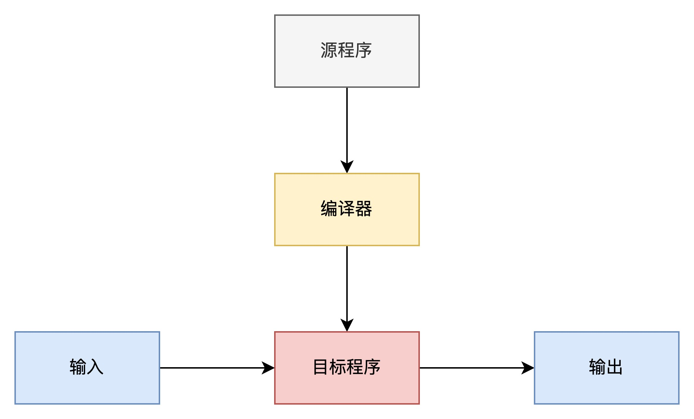
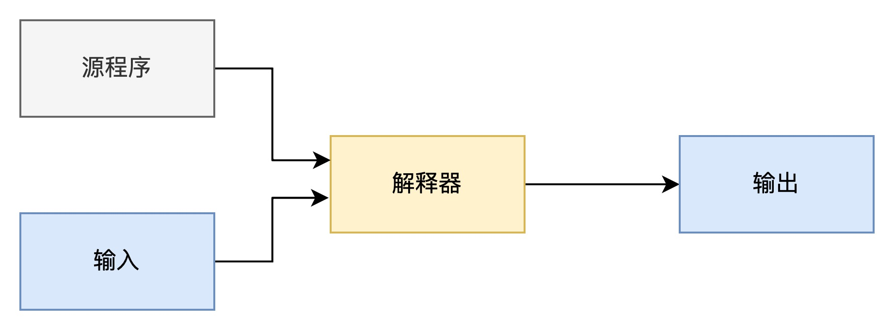

# 编译原理

- 程序设计语言分类 
    1. 第一代语言 机器语言
    2. 第二代语言 汇编语言
    3. 第三代语言 c，java这种的高级程序设计语言
    4. 第四代语言 特定应用设计的语言 比如SQL
    5. 第五代语言 基于逻辑和约束的语言 Prolog OPS5

## 相关书籍
龙书 + Engineering a Compiler  配合着看 适当的看一下 虎书

- 龙书  Compilers: Principles,Techniques,and Tools  作者 Alfred V.Aho,Ravi Sethi,Jeffrey D.Ullman
  - 斯坦福 线上地址 https://suif.stanford.edu/dragonbook/
  - 斯坦福公开课 https://learning.edx.org/course/course-v1:StanfordOnline+SOE.YCSCS1+2T2020/block-v1:StanfordOnline+SOE.YCSCS1+2T2020+type@sequential+block@b7e48a8aa0954d6c949dbd1cf4a01770/block-v1:StanfordOnline+SOE.YCSCS1+2T2020+type@vertical+block@f243ed486c8b4b3f90d33534e742c133
- 虎书  Modern Compiler Implementation in C  作者 Andrew W.Appel,with Jens Palsberg 
  https://www.cs.princeton.edu/~appel/modern/c/ 
- 鲸书  Advanced Compiler Design and Implementation  作者 Steven S.Muchnick 

- Engineering a Compiler  作者 Keith D. Cooper，Linda Torczon
  - ppt https://www.clear.rice.edu/comp412/

## 龙书笔记

## 第1章 引论

**编译器（Compiler）**： 一个编译器是一个程序，它可以阅读以某种语言（源语言）编写的程序，并把该程序翻译成一个等价的、用另一种语言（目标语言）编写的程序。编译器的重要任务之一就是报告它在翻译过程中发现的源程序中的错误.

**解释器（Interpreter）**: 直接利用用户提供的输入执行源程序中指定的操作。

**预处理器（preprocessor）**: 把源程序聚合在一起。还负责把那些称为宏的缩写形式转换为源语言的语句。

**汇编器（assembler）**: 由汇编代码生成可重定位的机器代码。

**链接器（linker）**： 连接其他可重定位的目标文件以及库文件，形成真正在机器上运行的代码。

**加载器（loader）**： 把所有的可执行目标文件放到内存中

