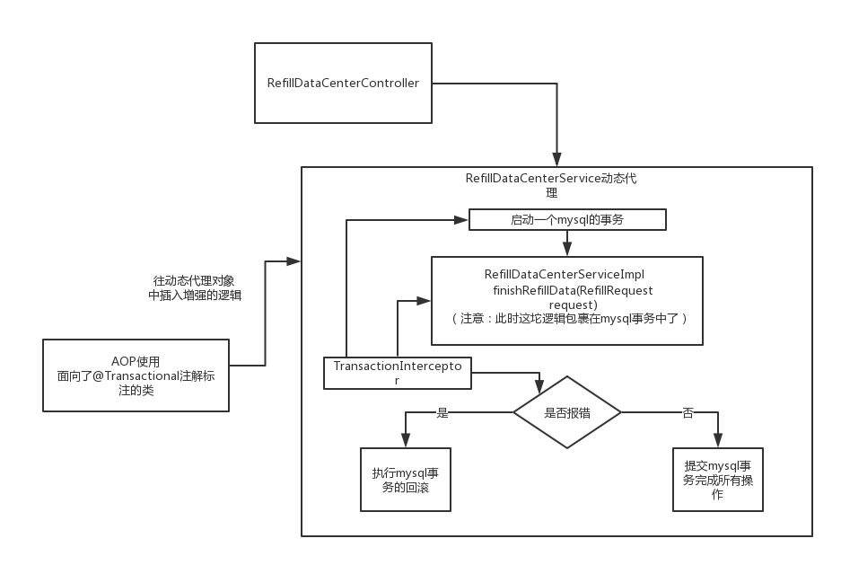
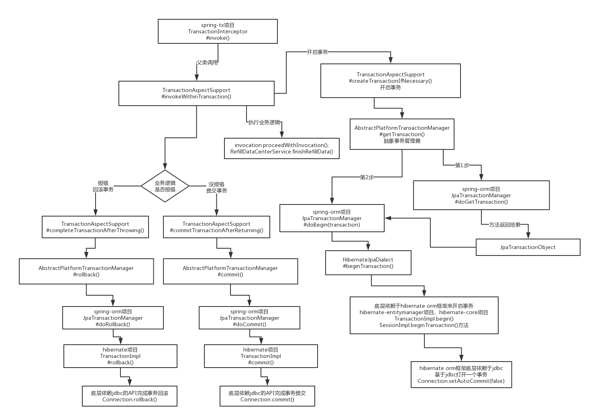

# 数据库的事务

## 事务的ACID

1. Atomic 
 原子性，就是一堆SQL，要么一起成功，要么都别执行，不允许某个SQL成功了，某个SQL失败了，这就是扯淡，不是原子性。
2. Consistency
 一致性，这个是针对数据一致性来说的，就是一组SQL执行之前，数据必须是准确的，执行之后，数据也必须是准确的。别搞了半天，执行完了SQL，结果SQL对应的数据修改没给你执行，那不是坑爹么。
3. Isolation
 隔离性，这个就是说多个事务在跑的时候不能互相干扰，别事务A操作个数据，弄到一半儿还没弄好呢，结果事务B来改了这个数据，导致事务A的操作出错了，那不就搞笑了。
4. Durability
 持久性，事务成功了，就必须永久对数据的修改是有效的，别过了一会儿数据自己没了，不见了，那就好玩儿了。

## 事务的隔离级别

见 `mysql`目录

## Spring 事务

