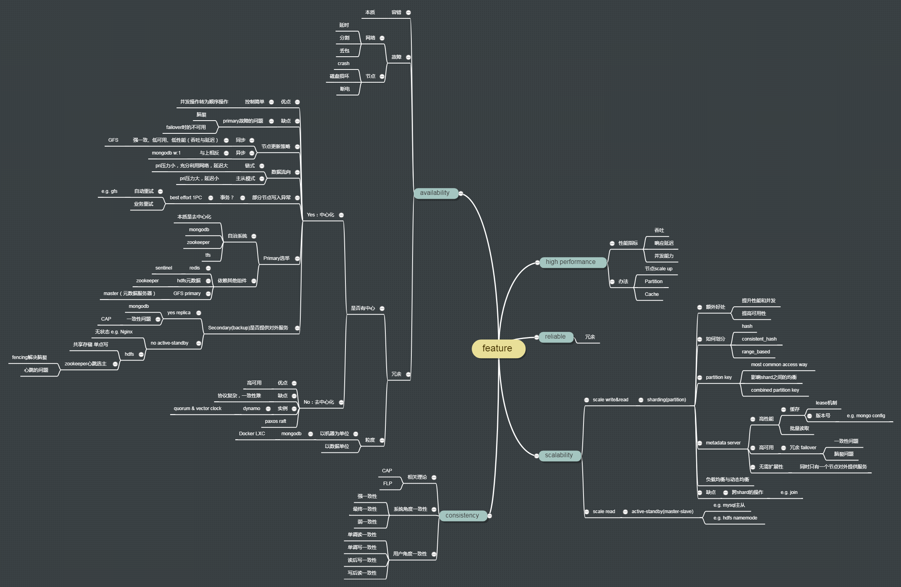

# 分布式系统

## 技能树

## 基本原理
分布式系统的基本原理包括以下几个方面：

分布式系统的定义和特点：分布式系统是由多个相互协作的计算机组成的系统，其特点包括分布性、并发性、缺乏全局时钟、异构性、开放性等。

进程通信和同步：在分布式系统中，进程之间需要进行通信和同步，以实现协同工作。常见的进程通信方式包括共享内存、消息传递等，而进程同步则需要考虑如何处理并发访问、死锁等问题。

分布式文件系统：分布式文件系统是为了让多个计算机共享文件而设计的系统。其基本思想是将文件分散存储在多个计算机上，同时提供统一的文件名空间和文件访问接口。

分布式共识算法：在分布式系统中，为了保证数据的一致性和可靠性，常常需要设计分布式共识算法。常见的分布式共识算法包括 Paxos、Raft 等。

分布式事务管理：在分布式系统中，跨多个计算机的事务管理是一个挑战。分布式事务管理需要考虑如何保证事务的原子性、一致性、隔离性和持久性。

分布式计算模型：在分布式系统中，常常需要进行分布式计算，如 MapReduce、Spark 等。这些计算模型需要设计合适的任务分配、数据传输、容错处理等机制。

这些是分布式系统的基本原理，理解这些原理对于深入理解分布式系统非常重要。

## 分布式一致算法

### Paxos

### raft

### gissp

## other
google开源技术：

google大数据3大论文：
MapReduce、GFS和BigTable

分布式系统理论基础
https://zhuanlan.zhihu.com/p/42234635
https://www.the-paper-trail.org/post/2014-08-09-distributed-systems-theory-for-the-distributed-systems-engineer/
https://www.zhihu.com/question/439289634

## 参考书
学习分布式系统的理论知识，以下是一些经典的书籍推荐：

- "Distributed Systems: Principles and Paradigms" by Andrew S. Tanenbaum and Maarten Van Steen - 这本书是分布式系统领域的经典教材，涵盖了分布式系统的基本原理、架构、通信、一致性、容错等方面的知识。

- "Designing Data-Intensive Applications" by Martin Kleppmann - 该书重点介绍了构建可靠、可扩展、高性能的分布式数据系统的设计原则和实践。它涵盖了分布式数据存储、数据复制、一致性、容错、流处理等方面的内容。

- "Distributed Systems for Fun and Profit" by Mikito Takada - 这是一本免费的在线书籍，提供了关于分布式系统的广泛概述，包括分布式计算、通信、一致性、容错、事务等方面的内容。它使用简洁的语言和实例来解释复杂的概念。

- "Distributed Systems: Concepts and Design" by George Coulouris, Jean Dollimore, Tim Kindberg, and Gordon Blair - 该书全面介绍了分布式系统的概念、设计原则和实现技术。它包括了分布式系统的通信、一致性、容错、安全性等方面的知识，并提供了案例研究和实例来加深理解。

- "Distributed Systems: Principles and Practice" by Thomas L. Keefe - 该书覆盖了分布式系统的基本概念、架构、通信、一致性、容错、安全性等方面的内容。它还涵盖了分布式文件系统、分布式数据库、分布式对象系统等具体的应用领域。

这些书籍提供了广泛的分布式系统知识，从基本原理到实际应用，适合不同层次的读者。除了这些书籍，还可以参考学术论文、研究报告和在线资源，如分布式系统领域的顶会和期刊（如ACM Transactions on Computer Systems、IEEE Transactions on Parallel and Distributed Systems），以及互联网上的分布式系统教程和博客文章。