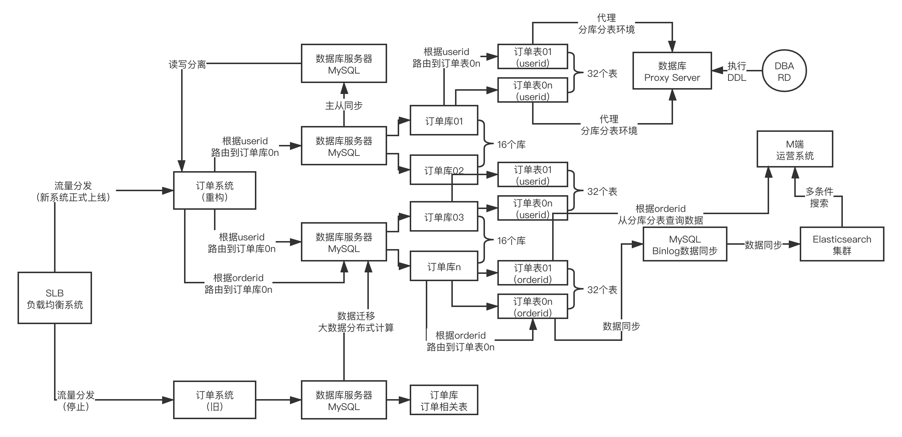

# 分库分表

## 原因

1. 单表达到1000万之后，mysql索引的性能不太好,B+树的索引高度过高,I/O次数增加。最好是百万级别
2. 数据库有很多表，每个表的数据量都很大，服务器的存储空间是有限的，而且，BufferPool也是有限的，综合以上两点需要做垂直分表
3. 8C16G的物理机，一般每秒TPS也就在几千的样子，不要超过2k/s,如果达到6k,8k每秒的TPS的话，数据库的磁盘I/O，网络，CPU、内存负载会比较高，数据库可能会有崩溃的危险

## 垂直分表

其实就是系统拆分，把一个系统拆分成多个模块，每个模块自己的表，单独的数据库

## 水平拆分

1亿的数据拆分，1024个表，放到4台数据库服务器上去，一台数据库200多张表。

分库分表的技术一般就是sharding sphere 或者mycat

## 分库分表策略
一般是按照一个id，取hash指，与分表的总数量做取模运算路由

## 分库分表带来的问题
第一个问题 **我如果按照A,B,C三个字段同时查询怎么办呢？而且还要分页？**
1. 第一种方式就是根据A，B，C三个字段分表三次，存储三份数据
2. 第二种方式的话就是把所有的索引数据都放到ES中，作二级索引。

第二个问题： **如果我的事务涉及到不同数据库的不同表，比如订单主表路由到D1库，订单详情表路由到D2库，怎么保证事务的一致性和原子性？**
1. 这个问题要解决的话就要引入分布式事务

第三个问题： **如果查询条件里没有包含散表的字段怎么办？比如一些组合条件和模糊搜索？**
1. 基于sharding-jdbc中间件去做merge 但是这中方式及其不推荐
2. 引入ES， 分库分表+ES是黄金搭档 这种几乎是不可避免的

## 读写分离
分库分表 + 读写分离 + ES 天下无敌

## 物理架构的规划
一般推荐分表就是分1024张
1. 需要几台机器，每台机器的配置 多少C多少G 几个主库几个从库 磁盘大小
2. 考虑因素：
    1. 当前的数据量
    2. 当前的数据库QPS
    3. 未来5年10年的数据增长量预估 大概每天增长多少的数据库 是1G多少G
    4. 未来5年10年的QPS的增长量预估 
3. ES服务器的配置 
    1. 原则上需要让ES的物理内存大一点，利用好OS cache，让索引数据都缓存在OS cache上

## 从单库单表怎么迁移到分库分表？

1. 先把数据copy一份到分库分表中去，新老两套数据库做双写
2. 双写的方式
    1. 可以使用nginx层做流量复制，copy一份流量到分库分表系统
3. 两套系统同时运行阶段，作数据的校验，确认分库分表系统的数据是否跟单库单表系统的数据一致
4. 运行一段时间之后，一般两周，检测到没有问题之后，就可以把业务全部切换到新的数据库中去
5. 老系统下掉

## 分库分表之后的DDL怎么办?

需要一个运维管理工作台，通过操作逻辑表，这个平台可以自动的把DDL的SQL同步到每个表上去。
如果做的更好一点的话，工作台需要记录，每个逻辑表拆分成了多少个物理表，每个物理表在哪个实力库上

## 分库分表的扩容怎么办？

随着数据量的增大，现有的分库分表不够用了怎么办呢？
如果说是扩大分表的数量的话需要rehash所有的数据，这个事决定不能干的事。太蠢了。
一般推荐的就是说一开始分表的时候就要把表分多一个，杜绝二次hash。

再就是可以对表整体的作迁移，到一个新的数据库实例上去，然后运维管理平台上面最好可以自动话的去实现这个事，并且，修改完路由规则之后，业务代码也不用动，跟着也会变。

## 分库分表的目标

根据业务对应数据的增长速度，来进行分库分表，保障业务10-20年没有什么问题。

## 分库分表步骤

1. 设计分库分表的方案
    range（不建议）、hash字段、分多少个表、几台数据库、多少个逻辑库、如何路由到库、怎么路由到表、各种业务的CRUD的业务能否在分库分表中运行
2. 重构数据存储的代码
    原则上不要碰业务代码。只动连接数据库的层面或者是sql语句
3. 数据迁移
    单库单表的数据copy到分库分表环境，并进行双写，保证两边的数据是一致的。确认新的环境没问题之后，业务查询切换到新环境，老数据库下线
4. 分库分表的环境运维
    分库分表的DDL和
5. 分库分表的扩容
    如果发现服务器数据量过大，存储空间不够，或者是QPS压力过大，首先要考虑先上读写分离，每个主库拉两个从库，分摊读压力，如果写的TPS还是很大的话，可以增加更多的数据库服务器，分摊写的压力

## 分库分表方案设计

假设刚开始1台数据库服务器，1张表，订单表里面有用户id，商家id

设计的方案：
1. 2台数据库服务器，每台服务器16个库，每个库32张表
2. 如果是即要通过用户id查询，又要通过商家id查询。可以两个key分别hash一套分库分表，数据冗余存储
3. 一般订单表会对应C端，B端和M端，每个端不同的处理策略
    1. C端的话用userId散表
    2. B端的话通过orderId散表，或者是商家id
    3. M端的话需要对全局的数据进行查询分析，一种方式是使用ES作二级索引，第二种方式就是把数据同步到数据仓库里面，出报表啥的。
4. 单库单表的数据，可能需要在每个库中都要方一份

## 遗留问题

1. **数据库怎么双写**
    1. 可以选择深夜，业务少的时候 用mysqldump，或者是用hadoop，spark通过mapreduce的job 直接把数据楼出来，根据分表策略路由到不同的表里面去
    2. 最前端使用SLB负载均衡，分发两份流量到不同的系统

## sharding-sphere
[官网](https://shardingsphere.apache.org/ )

## 难题

## EOF