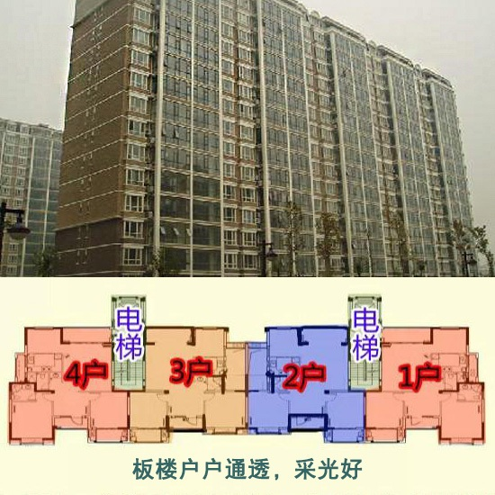
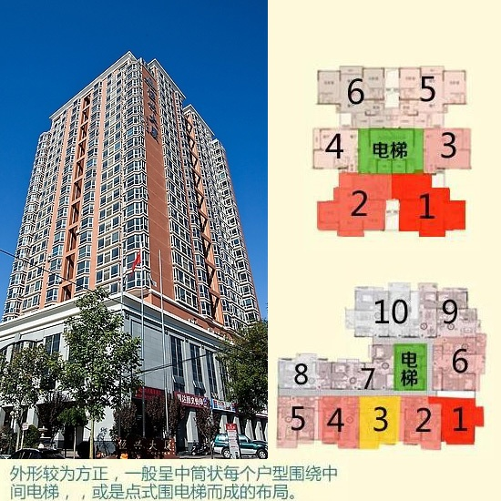
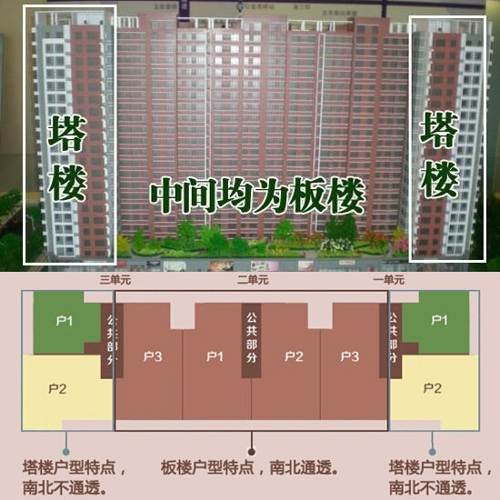
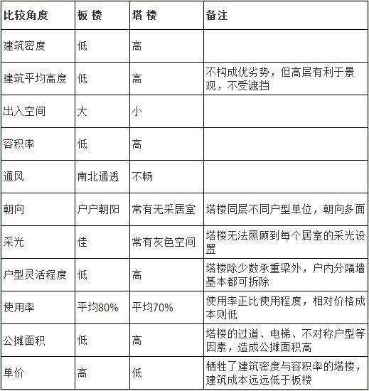

# 基础知识

## 楼型

### 板楼
板楼是指由多个住宅单元组合而成，每个单元用自己单独的楼梯、电梯。板楼的平面图上，长度明显大于宽度。板楼有两种类型，一种是长走廊式的，各住户靠长走廊连在一起；第二种是单元式拼接，若干个单元连在一起就拼成一个板楼。

### 塔楼 
塔楼主要是指以共用楼梯、电梯为核心布置多套住房的高层住宅。通俗地说，塔楼以电梯、楼梯为布局核心，上到楼层之后，向四面走可以直接进入户内。塔楼的平面图特点是，一层若干户共同围绕或者环绕一组公共竖向交通通道形成的楼房平面，平面的长度和宽度大致相同。

### 板塔结合

板塔结合是指一栋楼中有些户型有板楼的户型特点，有些户型有塔楼的户型特点。一般的，板塔结合建筑表现为：一栋楼，两端是塔楼户型，中间是板楼户型。

### 板楼对比塔楼

## 户型
户型有 平层、跃层、错层、复式。按面积来分户型可分为小户型、大户型。

### 平层户型
户型的一种，一般是指一套房屋的厅、卧、卫、厨等所有房间均处于同一层面上

### 跃层户型
跃层指住宅占有上下两层楼面，卧室、客厅、卫生间、厨房及其他辅助用房可以分层布置，上下层之间的交通不通过公共楼梯而采用户内独用小楼梯连接。跃层住宅是一套住宅占两个楼层，有内部楼梯联系上下层；一般在首层安排起居、厨房、餐厅、卫生间，最好有一间卧室，二层安排卧室、书房、卫生间等。

### 错层户型
所谓"错层式"住宅主要指的是一套房子不处于同一平面，即房内的厅、卧、卫、厨、阳台处于几个高度不同的平面上。

### 复式户型
复式户型在概念上是一层，并不含完整的两层空间，但层高较普通住宅高，可在局部拘出夹层，安排卧室或书房等用楼梯联系上下，其目的是在有限的空间里增加使用面积，提高住宅的空间利用率。