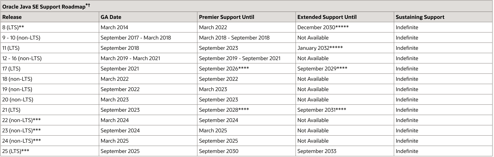

# Java

## 官方文档
[openjdk wiki](https://wiki.openjdk.java.net/ '')
[各个版本的文档官方索引](https://docs.oracle.com/en/java/javase/index.html '')
[JDK21文档](https://docs.oracle.com/en/java/javase/21/ '')
[JDK17文档](https://docs.oracle.com/en/java/javase/17/ '')
[JDK11文档](https://docs.oracle.com/en/java/javase/11/ '')
[JDK8文档](https://docs.oracle.com/javase/8/ '')

[官方教程文档](https://docs.oracle.com/javase/tutorial/index.html)
[jar manifest](https://docs.oracle.com/javase/tutorial/deployment/jar/manifestindex.html )
[JEP](https://openjdk.org/jeps/0)

## 各个版本的官方支持情况

## 小工具
- javap 查询class文件