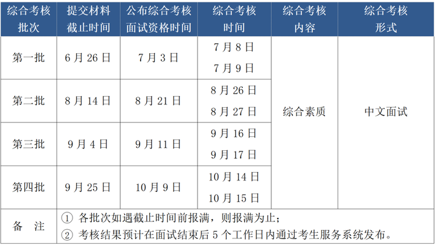

# 北京航空航天大学MBA

## 网址导航

[官网](https://mba.buaa.edu.cn/ )
[2024年报名考试流程](https://mba.buaa.edu.cn/info/1206/6835.htm )
[提前面试申请](https://mbacss.buaa.edu.cn )
[备考指南](https://zhuanlan.zhihu.com/p/642419331 )
## 关键信息

拟招人数： 325
学费： 22.8万

## 提前面试

目标： 第三批

### 准备资料

1. 大学期间成绩单
2. 2022年税收证明

### 自述短文
> 请描述您在过去工作中所取得的成就，或有助于评委更好地了解你的信息，请简要陈述（500字以内）。

在过去的职业道路中，我身处互联网开发领域，尽管我本科学习的物理学，这与科班出身相比，存在一定的差距。然而，通过不懈的努力和学习，我自信已经成功迎头赶上行业的主流水平。我了解并熟悉常见的开发方案，且能够独立开发一套系统的后端部分。这一切都是我对自身能力的坚定信心的源泉。

随着认知不断提升，我开始意识到“大丈夫生于天地间，岂能郁郁久居人下！”的真谛。在我看来，仅仅在底层敲代码或者为他人工作，终将限制了我的成长空间。我迫切地渴望了解更多，了解行业是如何运转的，了解社会和世界是如何相互交融的。

正是出于这个渴望，我决定通过攻读MBA来武装自己。我渴望学习关于公司运营和创业的知识，这些知识将帮助我更好地理解商业的本质，从而在我的职业生涯中更加深入地参与决策和规划。我相信，这些知识将使我能够看到问题的更多层面，从而为我在软件开发领域中的职业道路提供更多可能性。

除了知识，我也希望通过MBA学习来建立起广泛的人脉和资源。我理解，一个人在职业生涯中的成长离不开与他人的交流与合作。通过与来自不同背景和领域的同学们互动，我将能够拓展视野，获得不同的观点，并且有机会结交那些在各自领域杰出的人士。这将为我未来的理想和事业奠定坚实的基础。

综上所述，我希望通过MBA学习，不仅能够弥补我本科背景的短板，更能够获得深刻的商业洞察力，扩展我的人脉资源，为未来的职业道路和理想目标打下坚实的基础。我深感MBA是我人生旅程中的一个重要里程碑，我期待在这个过程中不断成长、锻炼和进步。

### 面试经历

您被分配到: 9月17日15:00组， 面试房间为: 新主楼A座1128教室（仅可刷身份证原件从北航学院路校区新东门进校），请准时参加面试。

9月11号接到现场面试的短信通知:

【北航MBA】恭喜您获得北航MBA综合考核面试资格。
1、请登录系统 https://mbacss.buaa.edu.cn/ ，点击“确认参加面试”查看面试时间、地点。请提前10分钟达到面试地点。
2、中心已帮您办理实名入校，当天仅可刷身份证原件从北航学院路校区新东门进入，请乘公共交通到校。
3、面试形式为中文个面，现场可查看具体流程，当天无需提供纸质材料，预祝大家面试顺利。010-82317578。

### 提前准备的面试问题

1. 为什么跳槽?
1. 现在的企业看中了你哪些特质?
1. 描述一个你认为最成功的的项目，为什么?
1. 讲讲你读完MBA后的职业规划?
1. 你完善了哪些内部管理制度？
1. 你所负责的工作流程手册对企业的价值是什么？
1. 毕业后那两个月干嘛去了?
1. 请你花3分钟时间简单的介绍下自己?
1. 为什么来北航，还有没有其他学校选择？
1. 工作跨度为什么这么大？
1. 你的职业规划是什么？
1. 追问：你这个职业规划貌似和管理没有什么关系呀?
1. 你为什么会转行呢？
1. 你从 3 个角度分析（经济，政治，军事）分析一带一路；
1. 你工程项目中遇到最大的困难是什么？
1. 你认为你的优势是什么？
1. 你们公司规模多大？
1. 你们公司客户都有谁？
1. 说一下你认为的资金链、现金链？

## 报名

1. 2023年9月24到27预报名 https://yz.chsi.com.cn/
1. 正式报名截止到2023年10月25号
1. 网上确认环节，2023年11月15号前后大概3天，每个学校不太一样
1. 正式考验的时间2023年12月23号，必须选择非全日制定向

## 初试

**初试时间**：2023年12月下旬 （具体时间以教育部文件规定为准）
**初试科目**：(199)管理类综合能力（数学、逻辑、写作） (204)英语（二）
**初试方式**：统一笔试，参加全国管理类联考

## 复试  

**复试政策**：自主划线
**复试科目**：综合素质面试、政治考核、 英语口语、听力测试
**复试时间**：2024年3月中旬，3月下旬出复试结果（具体时间以我校管理与经济学院专业学位教育联合中心通知为准）

[复试指南](https://zhuanlan.zhihu.com/p/586603649)
[2024年初试成绩分布](https://www.educity.cn/mba/5318398.html)
[招生专题](https://www.mbachina.com/zt/2024/buaaMBA/)

### 材料准备

1、满足北航MBA复试要求的考生，须提交复试通知书（北航研究生招生信息网上下载，无须盖章）。 
2、考生本人有效居民身份证原件及一份身份证件正反面的复印件，复印件纸型为A4纸，身份证件正反面需复印在同一页面上。 
3、现实表现材料（附件：报考2025年北京航空航天大学硕士研究生考生现实表现样表）。学院复试时不仅对考生进行思想政治素质和品德考核，还将结合其学习工作单位出具的现实表现材料进行评价，考核评价不合格者，不予拟录取。
4、考生本人签字的身体健康情况说明（附件：身体健康情况说明模板）。
5、学历证书（即毕业证书）或学位证书原件及一份复印件。
6、由档案所在工作单位人事部门提供的在校历年学习成绩表复印件，并加盖档案所在工作单位人事部门公章；若档案未在工作单位，须由档案存放管理部门提供档案内存放的在校历年学习成绩表的复印件，并须加盖档案存放管理部门8 公章。
7、考生应自觉遵守考场规则及考生所签署的《诚信复试承诺书》等内容，不得对外透露或传播复试试题内容等有关情况。对在研究生考试招生中违反考试管理规定和考场纪律，影响考试公平、公正的考生，一律按《中华人民共和国刑法》《中华人民共和国教育法》《最高人民法院最高人民检察院关于办理组织考试作弊等刑事案件适用法律若干问题的解释》及《国家教育考试违规处理办法》（教育部令第33号）严肃处理。
8、北京MBA教育中心要求提交的其他材料（以2025年北航MBA复试通知为准）。
9、以大学本科同等学力〔本科结业生及高职（专科）〕报考的考生，在复试时需要加试两门工商管理专业大学本科的主干课程。（具体内容请以后续发布的2025年北航MBA复试通知为准）

※ _不接受非第一志愿考生调剂_