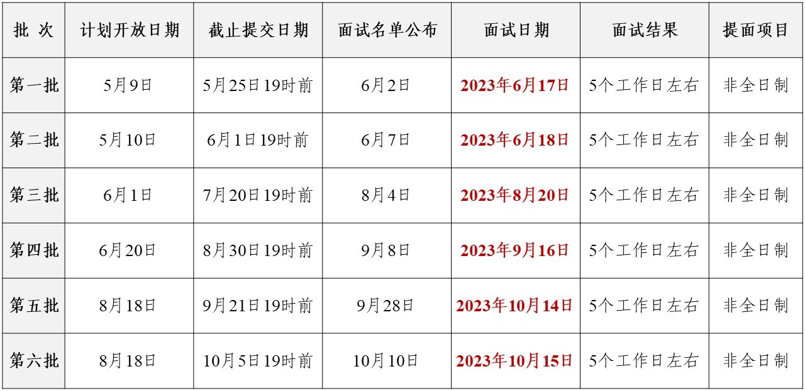

# 北京理工大学MBA

## 网址导航

[MBA官网](https://pdc.bit.edu.cn/ )
[MBA提前批报名系统](https://bitmba.campuswit.com/enroll/bitmba/#/login )
[2024提前面试方案](https://pdc.bit.edu.cn/zsdtnew/5f53d671ede54c8ca036cad37ce88236.htm )

[2024年工商管理硕士（MBA）招生说明(125100)](https://pdc.bit.edu.cn/zsdtnew/c8821534f75348b28605673e688cd1b8.htm )
[2024北京理工大学MBA提前面试详解——看这一篇文章就够了（内附面试真题）](https://zhuanlan.zhihu.com/p/628579872 )

## 关键词信息

拟招人数： 400
学费：21.6万

## 提前面试

目标： 第四批

### 准备资料

1. 

## 报名方式

**网上报名**：2023年10月中下旬，考生须在[研招网](http://yz.chsi.com.cn/)进行网上报名（学历查验），网上支付报名费（以研招网报名通知为准）
**网上确认**：2023年11月上旬，考生准备本人身份证等有效证件、毕业证原件，进行照片采集及验证。未通过学历校验考生，需准备学历认证报告等文件（具体要求以学校研究生院通知为准）
**打印准考证**：2023年12月中下旬

## 考试流程

### 初试

**初试时间**：2023年12月下旬 （具体时间以教育部文件规定为准）
**初试科目**：(199)管理类综合能力（数学、逻辑、写作） (204)英语（二）
**初试方式**：统一笔试，参加全国管理类联考

### 复试  

**复试政策**：自主划线
**复试科目**：综合素质面试、政治考核、 英语口语、听力测试
**复试时间**：2024年3月中旬，3月下旬出复试结果（具体时间以我校管理与经济学院专业学位教育联合中心通知为准）

※ _不接受非第一志愿考生调剂_