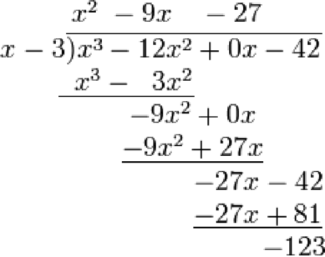

# 数学题整理

## 名词中英文

1. 素数/质数 prime number
1. 合数 composite number
1. 公约数 common divisor
1. 公倍数 common multiple 
1. 实数 real number
1. 有理数 rational number
1. 无理数 irrational number
1. 整数 integer
1. 分数 fraction
1. 绝对值 absolute value
1. 代数式 algebraic expression
1. 单项式 
1. 多项式
1. 整式
1. 同类项

## 概念

### 整数

### 自然数 natural numbers
按ISO 80000-2和ISO 2382定义，指非负整数；此定义相同于集合论和计算机科学领域中，认为0属于自然数。但在数论领域中，认为0不属于自然数，因而按数论描述，自然数会同义于正整数。为免歧义，可直接以术语“非负整数”代替自然数称之。

### 素数/质数 prime number
指在大于1的自然数中，除了1和该数自身外，无法被其他自然数整除的数（也可定义为只有1与该数本身两个正因数的数）。

### 合数 composite number
大于1的自然数若不是素数，则称之为合数（也称为合成数）。

### 代数式

由数和字母经过有限次的加、减、乘、除、乘方、开方等代数运算得到的式子，称为代数式。单个数字和字母也是代数式。

### 单项式

一般形式的单项式可以写作$ax^n$，其中a是常数系数，x是变量，n是一个非负整数。
有限个数字和字母的乘积

### 多项式

有限个单项式相加减

### 整式

单项式和多项式统称为整式

### 同类项

若两个单项式字母相同且字母的幂次也相同，则称这两个单项式为同类项。

### 多项式相等

若两个多项式的对应项系数均相等，则称这两个多项式相等。

### 一元n次多项式

设$n$是一个非负整数，$a_0,a_1,...,a_n$都是实数，$a_n \ne 0$,多项式$a_nx^n + a_{n-1}x^{n-1} + ... + a_1x + a_0$,被称为系数在实数域中的一元$n$次多项式。

### 零多项式

所有系数均为0的多项式称为零多项式，记为0

### 多项式整除

对任意两个实系数多项式$f(x)$和$g(x)$,其中$g(x)$不是零多项式，如果存在$h(x)$,使得$f(x) = g(x) \times h(x)$成立。那么称为$g(x)$整除$f(x)$,记为$g(x) | f(x)$,此时$g(x)$称为$f(x)$的因式，$f(x)$称为$g(x)$的倍式

### 多项式带余除法

对任意两个实系数多项式$f(x)$和$g(x)$,其中$g(x)$不是零多项式，则一定存在多项式$q(x)$,$r(x)$使的$f(x)=q(x)g(x) + r(x)$,这里$r(x)$为零多项式或者$r(x)$的次数小于$g(x)$的次数，且$q(x)$和$r(x)$都是唯一的。$q(x)$称为$g(x)$除$f(x)$所得的商式，$r(x)$称为$g(x)$除$f(x)$所得的余式

### 余式定理

用一次多项式$(x-a)$去除多项式 $f(x)$,所得的余式是一个常数，这个常数值等于函数值$f(a)$

### 因式定理

$f(x)$能被$(x-a)$整除 $\Leftrightarrow$ $f(x)$含有因式$(x-a)$ $\Leftrightarrow$ 当$f(a)=0$ $\Leftrightarrow$ $(x-a)|f(x)$ $\Leftrightarrow$ $a$是$f(x)=0$的根

### 多项式因式分解 - 提取公因式法

$ab + ac = a(b + c)$

比如： 

$x^2 - xy - x + y  = (x^2 - xy) - (x - y) = x(x - y) - (x-y) = (x - 1)(x - y) $

### 多项式因式分解 - 十字相乘法

$x^2 + (p + q)x + pq = (x + p)(x + q)$

### 多项式因式分解 - 公式法

- $a^2 - b^2  = (a+b)(a-b)$
- $a^2 \pm 2ab + b^2 = (a \pm b) ^ 2$
- $a^3 + b^3 = (a + b)(a^2 - ab + b^2)$
- $a^3 - b^3 = (a - b)(a^2 + ab + b^2)$
- $(a + b + c)^2 = a^2 + b^2 + c^2 + 2ab + 2ac + 2bc$
- $a^2 + b^2 + c^2 \pm ab \pm bc \pm ac = \frac12 \lbrack(a \pm b)^2 + (b \pm c ) ^2 + (a \pm c)^2 \rbrack$

比如：
$3x^3y - 81y^4 = 3y(x^3 - 27y^3) = 3y(x^3 - (3y)^3) = 3y(x - 3y)(x^2 + 3xy + 9y^2)$

### 多项式因式分解 - 分组分解法

$ac + ad + bc + bd = a(c + d) + b(c + d) = (a + b)(c + d)$

### 多项式因式分解 - 求根法

$f(x) = (x - a_1)(x - a_2)(x-a_3)\cdots \Leftrightarrow 
\begin{cases}
   f(a_1) = 0 \\
   f(a_2) = 0 \\
   f(a_3) = 0 \\
   \cdots
\end{cases} $

### 多项式因式分解 - 待定系数法

应用环境: 对变形后的代数式的构成是清晰的，只是对每部分的系数未知，那么就可以采用待定系数法。这种变形是恒等变形。

应用步骤：
1. 先将系数用参数表示
2. 展开对比系数，得到关于参数的方程，解方程即可得到参数（系数）

### 二项式定理
二项式定理的历史可以追溯到公元前4世纪的中国，当时杨辉和吴九皋分别独立发现了这个公式，称之为“杨辉定理”和“吴九皋定理”。在欧洲，这个公式最早被提出和证明的人是法国数学家布莱克（Blaise Pascal），他在1654年的一封信中首次阐述了二项式定理的基本思想，并给出了前几个特殊情况的展开式。此后，二项式定理得到了广泛的研究和应用，也被称为帕斯卡定理（Pascal's theorem）或牛顿-莱布尼茨公式（Newton-Leibniz formula）等名称。

二项式定理是一个基本的代数公式，它描述了如何展开一个二项式的幂。一个二项式是两个数的和或差的形式，比如 $(a + b)$ 或 $(a - b)$。二项式定理的表述如下：

$$(a + b)^n = \sum_{k=0}^n \binom{n}{k}a^{n-k}b^k$$

其中，$n$ 是任意正整数，$\binom{n}{k}$ 表示从 $n$ 个不同元素中选择 $k$ 个元素的组合数，$a^{n-k}$ 和 $b^k$ 是 $a$ 和 $b$ 的幂。

该公式告诉我们如何将 $(a + b)$ 的 $n$ 次幂展开成一系列项的和，每一项都是 $a$ 和 $b$ 的幂的乘积，系数为 $\binom{n}{k}$。二项式定理在代数、组合学、概率论等领域中都有广泛的应用。

### 二项式定理推广
二项式定理可以通过变形和推广，得到许多其他重要的数学公式。以下是一些常见的推广形式：

1. 负指数幂的二项式定理：对于 $n \in \mathbb{N}$ 和任意实数 $x$，我们有
$$(1+x)^{-n} = \sum_{k=0}^{\infty} \binom{n+k-1}{k} (-x)^k$$

    这个公式可以用于计算 $1/(1+x)^n$ 的幂级数展开式。

2. 多项式的二项式定理：如果 $a_1, a_2, \ldots, a_m$ 是任意实数，$n$ 是任意正整数，那么
$$(a_1+a_2+\cdots+a_m)^n = \sum_{k_1+k_2+\cdots+k_m=n} \binom{n}{k_1,k_2,\ldots,k_m} a_1^{k_1}a_2^{k_2}\cdots a_m^{k_m}$$

    其中，$\binom{n}{k_1,k_2,\ldots,k_m}$ 是一个多项式系数，表示从 $n$ 个不同元素中选择 $k_1$ 个元素标记为 $1$，$k_2$ 个元素标记为 $2$，$\ldots$，$k_m$ 个元素标记为 $m$ 的方案数。

3. 高维二项式定理：高维二项式定理描述了如何展开一个 $(a_1+a_2+\cdots+a_m)^n$ 的幂，其中 $a_1, a_2, \ldots, a_m$ 是任意实数，$n$ 是任意正整数，而 $(a_1+a_2+\cdots+a_m)$ 被视为一个向量。高维二项式定理的表述如下：
$$(a_1+a_2+\cdots+a_m)^n = \sum_{k_1+k_2+\cdots+k_m=n} \binom{n}{k_1,k_2,\ldots,k_m} a_1^{k_1}a_2^{k_2}\cdots a_m^{k_m}$$

    其中，$\binom{n}{k_1,k_2,\ldots,k_m}$ 是一个多项式系数，表示从 $n$ 个不同元素中选择 $k_1$ 个元素标记为 $a_1$，$k_2$ 个元素标记为 $a_2$，$\ldots$，$k_m$ 个元素标记为 $a_m$ 的方案数。高维二项式定理在向量分析、拓扑学等领域中有广泛的应用。

### 多项式定理
对于 $n$ 个变量 $x_1, x_2, \dots, x_n$，它们之和的 $m$ 次幂的展开式可以用多项式定理来计算，即：

$$(x_1 + x_2 + \dots + x_n)^m = \sum_{k_1+k_2+\dots+k_n=m} \binom{m}{k_1,k_2,\dots,k_n} x_1^{k_1}x_2^{k_2}\dots x_n^{k_n}$$

其中，$\binom{m}{k_1,k_2,\dots,k_n}$ 是多项式系数，表示将 $m$ 个相同的物品分成 $n$ 组，第 $i$ 组有 $k_i$ 个物品的方案数。具体地，$\binom{m}{k_1,k_2,\dots,k_n} = \dfrac{m!}{k_1!k_2!\dots k_n!}$。

例如，当 $n=2$ 时，有：

$$(x_1 + x_2)^m = \sum_{k_1+k_2=m} \binom{m}{k_1,k_2} x_1^{k_1}x_2^{k_2}$$

当 $n=3$ 时，有：

$$(x_1 + x_2 + x_3)^m = \sum_{k_1+k_2+k_3=m} \binom{m}{k_1,k_2,k_3} x_1^{k_1}x_2^{k_2}x_3^{k_3}$$

以此类推。

### 分式

设 $A,B$ 表示两个整式，若B中含有字母且 $B \ne  0$,则称$\frac{A}{B}$ 为分式。

### 分式裂项
一个分式拆分成几个分式的和或差

- $\frac{1}{x(x+1)} = \frac{1}{x} - \frac{1}{x + 1}$
- $\frac{1}{x(x+k)} = \frac{1}{k}(\frac{1}{x} - \frac{1}{x+k})$

### 正负幂次对称分式

形如$x^n + \frac{1}{x^n} (n \in \N_+)$的代数式称为正负幂次对称分布，有以下两种常见的变形形式：
1. $x^{2n} + \frac{1}{x^{2n}} = (x^n + \frac{1}{x^n})^2 - 2$
2. $x^{2n+1} + \frac{1}{x^{2n+1}}  =  (x^n + \frac{1}{x^n})(x^{n+1} + \frac{1}{x^{n+1}}) - (x+\frac{1}{x})$

### 方程/方程组

含有未知数的等式称为方程.未知数同时满足几个方程，则称这组方程为方程组。

### 一元一次方程

形如$ax + b = 0(a \ne 0) $的方程称为一元一次方程，其中$x$为未知数，$a,b$为常数

### 二元一次方程

由两个一次方程组成，并含有两个未知数的方程组。

一般形式：
$
\begin{cases}
   a_1x + b_1y + c_1 = 0 \\
   & 其中x,y 为未知数，a_1,a_2,b_1,b_2不同时为零 \\
   a_2x + b_2y + c_2 = 0 \\
\end{cases}
$

### 一元二次方程求解
一元二次方程是指一个只包含一个未知数的二次方程，通常的形式为：

$$ax^2+bx+c=0  (a \ne 0)$$

其中 $a, b, c$ 为已知常数，$x$ 为未知数。

求解一元二次方程的一般步骤如下：

将方程移项，使其等于 $0$。
$$ax^2+bx+c=0$$

计算判别式 $\Delta$。
$$\Delta=b^2-4ac$$

根据 $\Delta$ 的值进行分类讨论。

如果 $\Delta>0$，则方程有两个不同的实数根，可以使用公式

$$x_1=\frac{-b+\sqrt{\Delta}}{2a}, \qquad x_2=\frac{-b-\sqrt{\Delta}}{2a}$$

来计算这两个根。

如果 $\Delta=0$，则方程有唯一的实数根，可以使用公式

$$x=-\frac{b}{2a}$$

来计算这个根。

如果 $\Delta<0$，则方程没有实数根，但可以用虚数单位 $i$ 表示其根。此时方程的解为：

$$x_1=\frac{-b+\sqrt{-\Delta}i}{2a}, \qquad x_2=\frac{-b-\sqrt{-\Delta}i}{2a}$$

其中 $i$ 为虚数单位，满足 $i^2=-1$。

注意，如果一元二次方程中的 $a=0$，则方程退化为一元一次方程，可以使用一元一次方程的求解方法求解。

### 一元三次方程求解

### 一元四次方程求解

### 一元n次方程求解

一元 $n$ 次方程是指形如 $a_nx^n + a_{n-1}x^{n-1} + \cdots + a_1x + a_0 = 0$ 的方程，其中 $a_n, a_{n-1}, \cdots, a_1, a_0$ 都是已知常数，$x$ 是未知数，$n$ 是大于等于 $1$ 的自然数。

通常情况下，一元 $n$ 次方程的求解并没有通式，只有在 $n$ 小于等于 $4$ 的情况下才存在有限解的求解公式。对于 $n \geq 5$ 的情况，需要借助数值方法求解。

以下是一些解决一元 $n$ 次方程的方法：

$n=1$ 时，方程为一元一次方程，可以直接使用一元一次方程的求解方法解出。

$n=2$ 时，方程为一元二次方程，可以使用求解一元二次方程的公式求解。

$n=3$ 时，方程为一元三次方程，可以使用求解一元三次方程的公式求解。

$n=4$ 时，方程为一元四次方程，可以使用求解一元四次方程的公式求解。

对于 $n \geq 5$ 的情况，可以借助数值方法求解，如二分法、牛顿迭代法等。这些方法都是通过逐步逼近方程的实根来求解的，具体方法可以参考数值分析等相关课程。

### 韦达定理

$x_1,x_2$是一元二次方程$ax^2+bx+c=0(\Delta \ge 0)$的两个实根，则
$
\begin{cases}
   x_1 + x_2 = -\frac{b}{a} \\
   x_1x_2 = \frac{c}{a} \\
\end{cases}
$

根据韦达定理可以求出关于两个根的轮换对称式的数值
- $\frac{1}{x_1} + \frac{1}{x_2} = \frac{x_1+x_2}{x_1x_2}$
- ${x_1}^2 + {x_2}^2 = (x_1+x_2)^2 - 2x_1x_2$
- $\frac{1}{{x_1}^2} + \frac{1}{{x_2}^2} = \frac{(x_1+x_2)^2 - 2x_1x_2}{(x_1x_2)^2}$
- $|x_1 - x_2| = \sqrt{(x_1 - x_2)^2} = \sqrt{(x_1 + x_2)^2 - 4x_1x_2}$
- ${x_1}^3 + {x_2}^3 = (x_1 + x_2)^3 - 3x_1x_2(x_1 + x_2)$

### 分式方程

分母中含有未知数的有理方程

求解步骤
1. 在方程的两边都乘以最简公分母，约去分母，化成整式方程
2. 解这个整式方程
3. 把整式方程的解代入最简公分母，如果最简公分母的值不为0，则整式方程的解是原分式方程的解；否则需要舍去。
4. 写出原方程的根

### 不等式

用不等号将两个代数式连接而成的式子称为不等式，常见的不等号有 $\ne , \lt , \le , \gt , \ge$

### 不等式的性质

1. $a \gt b,则 a - b \gt 0,或 b - a \lt 0$
2. 传递性： 若$
\begin{cases}
   a \gt b \\
   & 则 a > c\\
   b \gt c \\
\end{cases}
$
3. 加法性质
   1. 可加性，若 $a \gt b , 则  a + c \gt b + c$
   2. 同向可加性： 若 $
\begin{cases}
   a \gt b \\
   & 则 a + c > b + d\\
   c \gt c \\
\end{cases}
$
4. 乘法性质
   1. 可乘性： 若 $a \gt b$,则 $
\begin{cases}
   c \gt 0, ac \gt bc \\
   c \lt c, ac \lt bc \\
\end{cases}
$
    2. 同向可乘性: 若$
\begin{cases}
   a \gt b \gt 0 \\
   & 则 ac \gt bd \\
   c \gt d \gt 0 \\
\end{cases}
$
    3. 乘方性： 若 $a \gt b \gt 0$,则$
\begin{cases}
   c \gt 0, a^c \gt b^c \\
   c \lt 0, a^c \lt b^c \\
\end{cases}
$

### 一元一次不等式

形如 $ax < b (b \ne 0)$(不等号可以为$\ne , \lt , \le , \gt , \ge$)的不等式称为一元一次不等式，其中$x$为未知数，$a,b$为常数

解的情况
1. 

## 公式定理整理

1. $a^n \times b^n = (a \times b)^n \space a,b,n \in R$ 

### n个素数的乘积，不会包含除这n个之外的其他素数因子。

这个结论可以从素数的基本性质中得到解释。素数是只能被 1 和自身整除的自然数，它们没有其它正因子。因此，如果你只乘以素数，而不乘以其它任何数，那么乘积也只会包含这些素数的乘积，不会有其它素数因子参与进来。

### 整数长除法， 
就是小学开始使用的除法运算

### 多项式长除法， 

 

## 相关知识，但是不会的地方

### 幂级数
幂级数是一种形如 $\sum_{n=0}^{\infty} a_n x^n$ 的数列或函数序列，其中 $a_n$ 是一些常数，$x$ 是变量。它是数学中非常重要的一类函数，因为它们可以表示成无限次可导的函数，并且在实际问题中经常出现。

幂级数可以在实数域、复数域或其他环中定义。在实数域上，幂级数有时被称为泰勒级数或麦克劳林级数，因为它们可以用于表示函数的泰勒展开式或麦克劳林展开式。

幂级数的收敛性和收敛半径是非常重要的概念。收敛半径是一个正实数 $R$，它表示在 $x$ 的绝对值小于 $R$ 时，幂级数收敛；在 $x$ 的绝对值大于 $R$ 时，幂级数发散。如果 $x$ 的绝对值恰好等于 $R$，则需要根据具体的级数来确定是否收敛。

幂级数在微积分、常微分方程、偏微分方程、数论、物理学等各个领域都有广泛应用。

### 幂级数展开式
幂级数展开式指的是将一个函数表示为一系列幂函数的和的形式，即：

$$f(x)=\sum_{n=0}^\infty a_n x^n$$

其中，$a_n$ 是函数 $f(x)$ 在 $x=0$ 处的 $n$ 阶导数的值除以 $n!$ 得到的常数。

需要注意的是，这个幂级数在 $x$ 的收敛区间内才成立。具体而言，如果该级数在 $x=x_0$ 处收敛，则该收敛区间为以 $x_0$ 为中心的最大区间。常见的求幂级数展开式的方法包括泰勒级数、麦克劳林级数和洛朗级数。  

### 求导

求导是微积分中的一个基本操作，用于计算函数的导数。如果函数 $y=f(x)$ 可导，则其导数 $y'$ 表示函数在某一点的变化率，即函数曲线在该点的切线斜率。通常的求导方法有以下几种：

1. 基本求导法则
    - $y=c$，其中 $c$ 为常数，有 $y'=0$；
    - $y=x^n$，其中 $n$ 为自然数，有 $y'=nx^{n-1}$；
    - $y=\sin x$，有 $y'=\cos x$；
    - $y=\cos x$，有 $y'=-\sin x$；
    - $y=\ln x$，有 $y'=\frac{1}{x}$；
    - $y=e^x$，有 $y'=e^x$。
2. 一般复合函数求导法则

    对于复合函数 $y=f(u)$，其中 $u=g(x)$ 是一个可导函数，则有链式法则：

    $$\frac{dy}{dx}=\frac{dy}{du}\cdot \frac{du}{dx}$$

    其中 $\frac{dy}{du}$ 表示 $y$ 对 $u$ 的导数，$\frac{du}{dx}$ 表示 $u$ 对 $x$ 的导数。

3. 高阶求导法则

    对于函数 $y=f(x)$，若其导数 $y'=f'(x)$ 可导，则称 $y$ 为二阶可导函数，其二阶导数 $y''=\frac{d^2y}{dx^2}$ 可以表示为：

    $$y''=\frac{d}{dx}\left(\frac{dy'}{dx}\right)=\frac{d^2y}{dx^2}$$

    更高阶的导数同理，可表示为：

    $$y^{(n)}=\frac{d^ny}{dx^n}$$

以上是求导的基本方法，但在实际问题中，可能需要应用更加复杂的求导方法，如隐函数求导法则、参数方程求导法则、对数微分法则等。

## 错误习题整理

### 在小于 100 的自然数中，含有奇数个正整数因子的自然数个数是( ).
A. 7个  B. 8个  C. 9个  D. 10个  E. 无法确定

**解析：**
当我们考虑自然数的因子个数时，我们需要知道一个重要的性质：一个正整数$n$的因子个数与其因数分解有关。如果将$n$表示为素数的幂的乘积（包括指数为0），则$n$有（指数+1）个因子。这是因为一个正整数的因子总是以成对的方式出现，例如，如果$n$有因子$a$，那么它必然有另一个因子$b$，使得$a \times b = n$。

现在，让我们考虑平方数。一个平方数是一个正整数的平方，即$n = m^2$，其中m是另一个正整数。当我们考虑平方数的因子个数时，我们可以用因数分解来表示它：

$n = m^2 = (p_1^{a_1}) \times (p_2^{a_2}) \times ... \times (p_k^{a_k})$

其中，$p_1、p_2、...、p_k$是不同的素数，并且每个$a_1、a_2、...、a_k$都是非负整数。注意，这里每个指数都是偶数（因为m是整数，所以指数总是偶数）。所以，一个平方数的因子个数为：

因子个数 = $(a_1 + 1) \times (a_2 + 1) \times ... \times (a_k + 1)$

由于每个指数都是偶数，所以每个因子个数的括号内部的值都是奇数。而奇数的乘积仍然是奇数。因此，一个平方数的因子个数总是奇数。

对于非平方数，其中至少存在一个指数是奇数，因此至少有一个因子个数的括号内部的值是偶数，导致最终的因子个数是偶数。

现在，让我们回到问题中，寻找小于100的自然数中含有奇数个正整数因子的自然数个数。我们已经知道这些自然数必须是平方数，因为只有平方数的因子个数是奇数。在小于100的数中，平方数有：1, 4, 9, 16, 25, 36, 49, 64, 81。这些数是满足条件的自然数，因为它们都是平方数，并且它们的因子个数是奇数。

因此，小于100的自然数中含有奇数个正整数因子的自然数个数是9个。

### 条件充分性判断问题，已知a,b,c,d均为正整数，则a + b + c + d的最小值为16
 
(1) abcd=120
(2) abcd=200

提示： abcd尽量取平均值可以得到最小值

# EOF