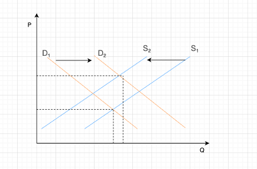

# 《管理经济学》ZF25082 班第 1 次作业

说明：每人提交一份作业（电子版，命名规则：学号-姓名-第 1 次作业），可以互相讨论，但要独立写作业。10 月 24 日前提交至邮箱 qinz@vip.163.com

## 1.	如果某一特定市场中出现如下情况，那么对产品均衡价格和销售量将会产生怎样的影响？
### ① 商品为正常商品，消费者的收入上升； 

需求曲线右移，均衡价格提高，销售量上升

### ② 某种消费的替代品价格上升；

需求曲线左移，均衡价格降低，销售量下降

### ③ 某种消费的互补品价格上升；

需求曲线左移，均衡价格降低，销售量下降

### ④ 某种主要原材料的价格上升；

供给曲线左移，均衡价格上升，销售量下降

### ⑤ 社会上正在广泛宣传，使用此种商品将会对健康造成危害；

需求曲线左移，均衡价格降低，销售量下降

### ⑥ 在这行业中，某种可以降低此类产品生产成本的新技术被开发出来。

供给曲线右移，均衡价格降低，销售量上升

## 2.	假设在第 1 题中的情况有两种同时发生。根据下面给出的每对情形，试通过定性分析，预测均衡时产品价格或交易量的变化方向。并解释为什么两个变量中有一个是不确定的。
### （1）①和⑥同时发生； 
① 需求曲线右移 ⑥ 供给曲线右移 ，均衡价格不确定，销售量上升。 需求拉高价格，供给压低价格，二者方向相反；哪一方效应更强决定价格最终是上升还是下降或不变
### （2）③和④同时发生； 
③ 需求曲线左移 ④ 供给曲线左移 ，均衡价格不确定，销售量下降。需求减少压低价格，供给减少推高价格；最终价格由两者相对强度决定
### （3）③和⑥同时发生；
③ 需求曲线左移 ⑥ 供给曲线右移 ，均衡价格下降，销售量不确定。需求左移使数量下降，供给右移使数量上升，两个方向相反；最终数量由二者强度决定

## 3.	某产品的需求曲线为：$Q_D=200-2P$，供给曲线为：$Q_S=40+2P$ ($Q_D$ ,$Q_S$ 的单位为个，P 的单位为元/个)。问：
### （1）达到均衡时，产品的价格与销售量是多少？
 达到均衡时： $200-2P = 40+2P ，得 P=40 ， Q= 40 + 2*40 = 120$
### （2）供给曲线不变，如果需求曲线变为 $Q_D = 130-P$，产品的均衡价格与均衡销售量是多少？
$130-P = 40+2P ,得 P = 30, Q = 40 + 2*30 = 100$
### （3）需求曲线不变，如果供给曲线变为 $Q_S= 50+3P$，产品的均衡价格与均衡销售量是多少？
$200-2P = 50+3P, 得 P = 30, Q = 50 + 3*30 = 140$

## 4.	某企业生产和销售一种按摩器，它的需求曲线方程是：Q=400-2P。式中，Q 为日销售量（台），P 为价格（元）。
### （1）假定该企业计划每日销售按摩器 180 台，价格应是多少？
$180=400-2P，P=110$
### （2）画出按摩器的需求曲线、边际收入曲线、总收入曲线；
需求曲线 $P=200−0.5Q$

总收入曲线 $TR(Q)=200Q−0.5Q^2$

边际收入曲线 $MR(Q)=200−Q$

### （3）求出按摩器价格 P=12 元时的点价格弹性。

## 5.某产品的需求函数为：P=20-2Q。试：
### （1）写出该产品的总收入、平均收入和边际收入的表达式；
总收入函数： $TR=P⋅Q=(20−2Q)Q=20Q−2Q^2$

平均收入函数：$AR=\frac{TR}{Q}=(20Q−2Q^2)/Q=20−2Q$

边际收入函数: $MR=dTR/dQ=d(20Q−2Q^2)/dQ=20−4Q$

### （2）平均收入与价格是什么关系？
$AR(Q)=20−2Q=P$ ,平均收入等于单价
### （3）平均收入曲线的斜率与边际收入曲线的斜率之间有什么关系？
平均收入曲线：AR=20−2Q，斜率 = −2
边际收入曲线：MR=20−4Q，斜率 = −4
边际收入曲线的斜率是平均收入曲线斜率的 2 倍（更陡） 

## 6.	对于柯布—道格拉斯生产函数 $Q = K^{0.5}L^{0.5}$
### （1）当厂商投入 25 单位资本，10000 单位劳动时，资本的边际产量是多少？

已知生产函数：
\[
Q = K^{0.5} L^{0.5}
\]

其中  
- \(K\)：资本投入  
- \(L\)：劳动投入  

资本的边际产量定义为：
\[
MP_K = \frac{\partial Q}{\partial K}
\]

对 \(Q = K^{0.5} L^{0.5}\) 求偏导：
\[
MP_K = 0.5 K^{-0.5} L^{0.5} = \frac{0.5 L^{0.5}}{K^{0.5}}
\]

代入 \(K = 25, L = 10000\)：

\[
K^{0.5} = \sqrt{25} = 5
\]
\[
L^{0.5} = \sqrt{10000} = 100
\]

代入计算：
\[
MP_K = \frac{0.5 \times 100}{5} = \frac{50}{5} = 10
\]

### （2）当厂商投入 25 单位资本，10000 单位劳动时，资本的平均产量是多少？
资本的平均产量定义为：
\[
AP_K = \frac{Q}{K}
\]

计算产出 \(Q\)：
\[
Q = K^{0.5} L^{0.5} = 5 \times 100 = 500
\]

代入 \(K = 25\)：
\[
AP_K = \frac{500}{25} = 20
\]

## 7.	某生产过程中劳动力的边际产量为$MPL = 10\sqrt{{K}/{L}}$，资本量是固定的，为 64 单位，工资为每人 10 元，产品售价为每件 5 元。请找出最优的人工投入量。

已知生产过程中劳动力的边际产量为：

$$
MPL = 10\sqrt{\frac{K}{L}}
$$

资本量固定为：

$$
K = 64
$$

工资为：

$$
w = 10
$$

产品售价为：

$$
P = 5
$$

在利润最大化时，满足**劳动的边际收益产品**等于工资：

$$
P \times MPL = w
$$

代入 \( MPL = 10\sqrt{\frac{K}{L}} \)：

$$
5 \times 10\sqrt{\frac{K}{L}} = 10
$$

化简：

$$
50\sqrt{\frac{K}{L}} = 10
$$

代入 \(K = 64\) 并求解 \(L\)

$$
50\sqrt{\frac{64}{L}} = 10
$$

两边同时除以 10：

$$
5\sqrt{\frac{64}{L}} = 1
$$

平方两边：

$$
25 \times \frac{64}{L} = 1
$$

$$
\frac{1600}{L} = 1
$$

$$
L = 1600
$$

## 8.	某年春节期间，草莓的价格由原来的每斤 35-40 元上升到每斤 50-70 元，而春节过后草莓的价格一路下跌到每斤 20-30 元。草莓的价格高开低走，年前年后大变样，究其原因，离不开两点：其一是“物以稀为贵”，年前草莓属于刚上市期，品种少、产量少，加之国际物流费用的水涨船高，这些水果的身价难免升高；其二是“特殊节日”，春节作为中国人最重要的节日之一，期间需拜访亲戚、招待亲朋好友，草莓等水果肯定少不了，年前价格高实属正常。而到了年后，气温逐渐升温，草莓产量增多，大甩卖、价格斩腰也正常不过。
### （1）草莓的价格为什么会在春节期间上涨？请画图说明。

春节期间草莓价格上升，是因为 需求增加 + 供给偏少。

- 供给端（S）减少 / 上升成本
    - 草莓刚上市，产量少；
    - 天气寒冷，运输成本、物流费用高；
    - 因此供给曲线 左移（S₁ → S₂）。
- 需求端（D）增加
    - 春节送礼、待客、消费旺季，草莓需求量大增；
    - 因此需求曲线 右移（D₁ → D₂）。

两方面叠加 → 均衡价格显著上升，销量略升或保持稳定。

### （2）草莓的价格为什么在春节过后一路下跌？请画图说明。

春节后草莓价格下降，是因为 供给大幅增加 + 需求减少。

- 供给端（S）增加
    - 气温上升，草莓大量上市；
    - 运输成本下降；
    - 因此供给曲线 右移（S₁ → S₂）。
- 需求端（D）减少
    - 节日过后，消费者需求回落；
    - 因此需求曲线 左移（D₁ → D₂）。

两方面叠加 → 均衡价格显著下降。

