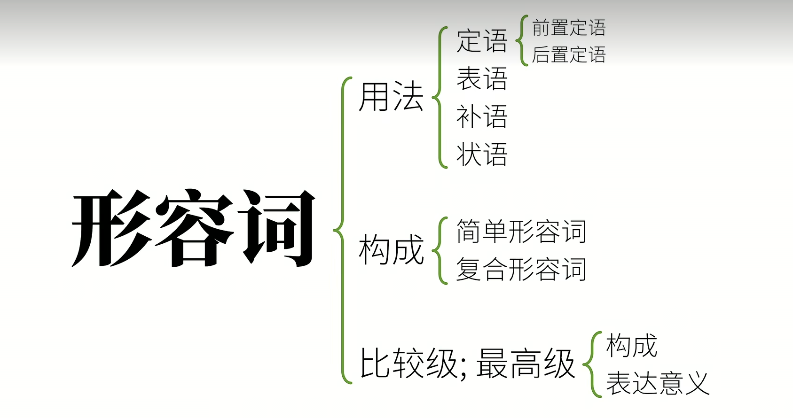
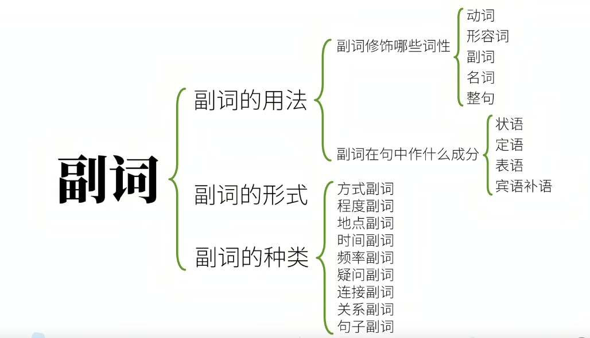
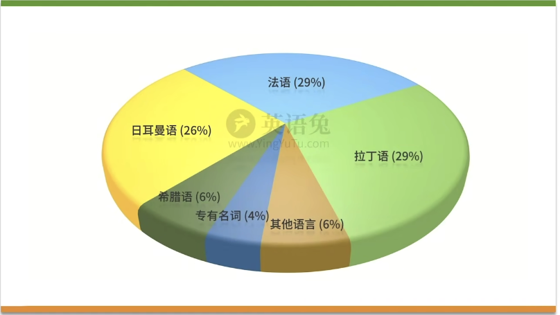

# 英语语法
英语语法的核心就是动词

## 英语兔
https://www.yingyutu.com/yufalilun
https://www.bilibili.com/video/BV1XY411J7aG/?spm_id_from=333.788.recommend_more_video.4&vd_source=973c7d5ced4869eb290f9a3842143b40

## 简单句 Simple Sentences

什么+怎么样

主语 + 谓语

## 基本句型/谓语动词 
1. 主语 + 不及物动词（intransitive verbs） ， 可以独立完成的动作
    1. Papa rabbit sleeps.
2. 主语 + （单）及物动词（Monotransitive /transitive verbs） + 宾语 , 有一个动作承受着
    1. I love you.
3. 主语 + 双及物动词（ditransitive verbs） + 间接宾语（Indirect object）+ 直接宾语（direct object），有两个动作承受着
    1. Papa rabbit teaches you English.
4. 主语 + 复杂及物动词（complex-transitive verbs）+ 宾语 + 宾语补足语(object complete ),只有一个动作承受着，但不同于2 
    1. Papa  rabbit considers you smart.
5. 主语 + 连系动词（linking verbs） + 主语补足语/表语 ，把这个词后面的信息赋予给前者
    1. Papa rabbit is tall.

## 句子成分
1. 主语(Subject)
2. 谓语(Predicate) 动词
3. 宾语 Object
4. 宾语补足语 Object complete
5. 主语补足语/表语 Subject complete 
6. 定语  Attributive 主要用来修饰主语或者是宾语 一般是形容词
7. 状语 Adverbial 主要用来修饰谓语动词 一般是副词
    用来修饰谓语动词、形容词、副词以及句子。状语是由副词、分词（分词短语）、介词短语、名词、以及if,whether，when,while,as soon as,because , until ,before 等引导的状语从句等来充当的。可以分为
    1. 时间状语
    1. 地点状语
    1. 条件状语
    1. 结果状语
    1. 程度状语
    1. 原因状语
    1. 目的状语
    1. 方式状语
    1. 方向状语
    1. 伴随状语
8. 同位语 Appositive 主要用来再把主语或者谓语说一遍

## 复合句 Compound Sentence 

简单句 + 简单句 ， 这种句子一般还会称之为并列句

## 复杂句 Complex Sentence 

简单句 套 简单句

主句 Main Clause +  从句 Subordinate Clause

根据所有的句子成分，除了特殊的谓语动词没有从句之外，其它的都可以有从句

### 主语从句

1. _That the rabbit ate a carrot_ is obvious.

1. _Whether the rabbit ate the carrot_ is obvious.

1. _Where the rabbit ate the carrot_ is obvious.

1. _When the rabbit ate the carrot_ is obvious.

1. _How the rabbit ate the carrot_ is obvious.

1. _Who ate the carrot_ is obvious.

1. _What the rabbit ate_ is obvious.

主语从句由引导词开头，比如 that,whether,where,when,how,who,what 等 代词/副词

如果这些词出现在疑问句中则叫疑问代词/副词。

**形式主语**

1. _It_ is obvious that the hungry rabbit had already eaten a carrot for dinner this evening.
其中的it代指的是后面的主语

### 宾语从句

1. **I saw** _that the rabbit ate a carrot_. 加粗部分是主句，斜体部分是从句

1. I saw _who ate the carrot_.

1. I saw _whether the rabbit ate the carrot_.

1. I saw _what the rabbit ate_.

1. I saw _where the rabbit ate the carrot_.

1. I saw _when the rabbit ate the carrot_.

1. I saw _how the rabbit ate the carrot_.

在非书面语中，宾语从句的引导词 that 往往可以省略

1. I know _(that)_ the rabbit ate a carrot.

不能省略引导词that的情况

1. I didn't know _that the rabbit ate the carrot_ and _that you saw it_.

1. I know,just like you do,_that the rabbit ate the carrot_.

示例：

1. I think (that) the rabbit is smart.

1. I believe (that) you will give me some coins.

1. I expect (that) you will give this video a thumbs-up.

表否定时，一般是加在位谓语动词前面

1. I don't think (that) the rabbit is smart.

1. I don't believe (that) you will give me some coins.

1. I don't expect (that) you will give this video a thumbs-up.

**大部分情况下，主语时态要跟宾语从句时态一致**

1. I don't think (that) you're right.

1. I didn't think (that) you were right.

1. I knew (that) the rabbit liked carrots.

**客观事实的话例外**

1. I knew (that) the run rise in the east.

**be + 形容词 + that..** 常见但是有归类争议

1. I am sure that there's a carrot on the table.

1. I am happy that there's a carrot on the table.

1. I am afraid that there's no carrot on the table.

宾语从句？同位语从句？状语从句？

### 宾语补语从句

1. You can call me Papa Rabbit.

1. You can call me what you like.

1. My education made me who I am today.

### 主语补语/表语从句

1. The problem is _that the rabbit is hungry_.

1. The reason is _that there's no more carrot_.

1. The question is _whether the rabbit is hungry_.

1. The question is _what the rabbit should eat_.

1. The question is _where/when/how the rabbit should be eat the carrot_.

1. It **seems** _that the rabbit is hungry_.

1. It feels _that you're not telling the truth_.

### 定语(形容词/关系)从句 （最难的/最重要）

1.  a carrot that I bought. 
    carrot 先行词
    that 关系词
    that I bought 定语从句

**关系代词**

1. who/whom/which/whose/that 做代词

1. The rabbit is reating a carrot _that_ I baught. 

1. that 和which一般情况下可以互换，但是在表示只有一个没得选（一般是最高级）的时候不能用which

**关系副词**

1. where/why/when 做副词

1. This was the place _where_ the rabbit ate the carrot.

1. This is the reason _why_ the rabbit ate the carrot.

1. That was the day _when_ the rabbit ate the carrot for the first time.

也可以把上面的关系副词转换成关系代词

1. This was the place _at which_ the rabbit ate the carrot.

1. This si the reason _for which_ the rabbit ate the carrot.

1. That was the day _on which_ the rabbit ate the carrot for the first time.

所以 关系副词 = 介词 + which

**限定性形容词性从句**

1. The rabbit ate the carrot _which_ was on the table.

**非限定性形容词性从句**
[讲的比较好的文章](https://zhuanlan.zhihu.com/p/152141601 )

定语从句有限制性和非限制性两种。

限制性定语从句是先行词不可缺少的部分，去掉它主句意思往往不明确；
非限制性定语从句是先行词的附加说明，去掉了也不会影响主句的意思，它与主句之间通常用逗号分开，将非限定性定语从句放在句子中间，其前后都需要用逗号隔开。

1. The rabbit ate the carrot, _which_ was on the table.
= The rabbit ate the carrot, _the carrot_ was on the table.

所以一般做插入语用,作为补充语句，去掉也是没有问题的。

1. My head,_which is big_,is useful when it rains.

1. The biggest carrot,_which the rabbit ate_,was on the table.

1. The rabbit ate the carrot, _which_ is not surprising. 代表前面一句话

1. as引导非限制性定语从句
    as引出非限定性定语从句时，**代替整个主句**，对其进行说明但通常用于像
    as we all know, 
    as it is known, 
    as is known to all, 
    as it is, 
    as is said above, 
    as always mentioned above, 
    as is usual, 
    as is often the case, 
    as is reported in the newspaper等句式中。
    as在非限定性定语从句中作主语、宾语，且引出的从句位置比较灵活，可位于**句首或句末**，也可置于**主句中间**。通常均由逗号将其与主句隔开。as有“正如……， 就像……”之意
    1. As is known to the United States, Mark Twain is a great American writer.
        美国人都知道，马克·吐温是一位伟大的美国作家。（as在从句中作主语）
    1. He forgot to bring his pen with him, as was often the case.
        他忘了带笔，这是常事。（as在从句中作主语）
    1. He is absorbed in work, as he often was.
        他正在全神贯注地工作，他过去经常这样。（as在从句中作表语）
    1. As we all know, the earth is round.
        众所周知，地球是圆的。（as在从句中作宾语）
    1. The two brothers were satisfied with this decision,as was agreed before hand.
        两兄弟对此决定都满意，这项决定在事前都已得到他们的同意。(as在从句中作主语)
    1. Taiwan is,as you know,an inseparable part of China.
        你知道，台湾是中国不可分割的一部分。(as在从句中作宾语)
    1. as it is known to all (that...) (as 作状语从句连词，是状语从句, 可以加that)
        与 as is known to all (as做主语，是定语从句)
        与 it is known to all that... (主语从句，it是形式主语)
        即：As is widely known, the moon is closer to us than the sun.(定从)
            = That the moon is closer to us than the sun is widely known.(主从)
            = It is widely known that the moon is closer to us than the sun.(主从)
           As it is known to everyone, I thought you knew about it too.(状从)

**限定性定语从句与非限定性定语从句的区别**

1. 限定性定语从句: 从句不能省略,如果省略整个句子意思不完整。
    非限定性定语从句: 从句可以省略,如果省略整个句子意思仍然完整 。
    eg. 
    1. The sun heats the earth , which makes it possible for plants to grow .
        太阳给予大地热，这就使植物的生长成为可能。
    1. The sun heats the earth which makes it possible for plants to grow .
        太阳给予大地热，大地使植物的生长成为可能。
    1. The old man has a son , who is in the army .
        那位老人有一个儿子，他在部队工作。
1. 限定性定语从句: 先行词可以用that 引导。
    非限定性定语从句: 先行词不可以用that 引导。
    eg. 
    1. I like read the book that you lend me.
1. 限定性定语从句: 引导词有时可以省略。
    非限定性定语从句: 引导词不可以省略。
1. 限定性定语从句: 主句与从句不需要用逗号隔开。
    非限定性定语从句: 主句与从句需要用逗号隔开。
1. 限定性定语从句: 从句只修饰先行词。
    非限定性定语从句:从句既可以修饰先行词，也可以修饰整个句子或句子的一部分。

### 状语(副词)从句

1. 时间
1. 地点
1. 条件
1. 让步
1. 方式
1. 比较
1. 原因
1. 目的
1. 结果

#### 时间副词从句

**在某一时间点之前**
1. The rabbit ate a carrot at home _before_ the wolf stopped by.

1. _Before_ the wolf stopped by,the rabbit ate a carrot at home.

**在某一时间点之中**
1. The rabbit was eating a carrot _when_ I reached home.

1. The rabbit was eating a carrot _while_ I was making a video.

1. I ate a carrot _as_ I made the video.

1. when/while/as 的不同
    1. when强调在某个时间点，有突然的意思
    1. while 强调一个时间段内
    1. as 强调同时进行两个动作

**在某一时间点之后**
1. The rabbit ate a carrot _after_ the wolf stopped by.

**从之前某一时间点开始算**
1. The rabbit has shared three carrots _since_ the wolf stopped by.

**直到之后的某一时间点**
1. The rabbit waited _until_ the wolf stopped by.

**-...就...**
1. The rabbit will eat a carrot _as soon as_ the wolf leaves.

**下次...**
1. The rabbit will share the biggest carrot _the next time_ the wolf stops by.

#### 地点副词从句

1. The rabbit ate the carrot _where_ he found it.

1. The rabbit ate the carrot at the place _where he found it_. 注意这个是定语从句，修饰前面的place的

1. This is _where he found the carrot_. 表语从句

1. _Where he found the carrot_ is a secret. 主语从句

1. The rabbit will go _wherever_ he can find a carrot.

1. The rabbit will go _where_ he can find a carrot.

1. The rabbit sees a carrot _everywhere_ he goes.

1. The rabbit cat eat a carrot _anywhere_ he likes.

#### 比较副词从句

**比...更...**
1. He is smarter _than_ me.

1. She is smarter _than I am_. (than me)

1. This carrot is bigger _than that one is_. (than that one)

1. She is more beautiful _than Snow White is_. (than Snow White )

**同样的**
1. This carrot is _as big as_ that one.

1. She is _as_ beautiful _as_ Snow Shite.

**越...越...**
1. the 形容词比较级， the 形容词比较级 。 

1. The _more_ you practice English,the _more_ fluent you become.

**越来越**
1. 形容词比较级 and 形容词比较级

#### 条件副词从句
条件句，一般是表示不确定的事情，所以用一般现在时态。

条件句一般比主句落后一个时态。

1. _If_ you like this video, you will give it a thumbs-up.

1. _If_ you don't like this video,you will not give it a thumbs-up.

1. _Unless_ you like this video,you will not give it a thumbs-up.

1. _Provided_ that my video is excellent,you will give it a thumbs-up.

1. _As long as_ I make excellent videos,you will remain my follower.

1. _In case_ you don't understand,please comment below.

#### 让步副词从句

1. _Even if_ I see a carrot,I will not eat it.

1. _Although/Though/Even though_ I see a carrot,I will not eat it. 注意这个地方后面的句子不能加but

1. no matter + 疑问代词， 不管。。。

1. _No matter what_ happens, I will not eat the carrot.

1. _No matter who_ orders me,..

1. _No matter how_ hungery I am,..

1. _Regardless_ of what kind of video I make, you will give me a thumbs-up.

#### 方式副词从句

**就像。。**
1. I feel good, _as if_ I had just eaten a carrot.

1. You spend so mouch money _as if_ you were a millionaire.

1. Eat the carrot _as_ I do.

1. Leave the carrot _as_ it is.

#### 原因副词从句

1. The rabbit ate the carrot _because_ he was hungry.

1. 注意 but / so ,都是构成复合句的连词，所以不能跟because/though 连起来使用。

1. The rabbit was hungry,_so_ he ate the carrot. 这是个复合句

1. _Since_ you hungry,you can eat the carrot.

1. _As_ you were not here,we ate the carrot without you.

1. 因果/语气上 because > since > as 
    1. because 引出确定的原因
    1. since 引出众所周知的事
    1. as 引出显而易见的事

1. because 引导的从句在主句前/后都可以
1. since/as 引导的从句一般只放在主句的前面

1. You must really like me, _for_ you have given all my videos a thumbs-up.
    1. 这里需要注意for构成的不是原因状语从句，构成的是**复合句**,所以for不能直接替换because

#### 目的副词从句

1. 目的（从句） ，事件 （主句）

1. In order that I could finish the video in time,I pulled an all-nighter.

1. 上面的话也可以说成： I pulled all-nithter so that I could finish the video in time. 这里so that不能放在句首

1. 目的副词从句中，一般使用情态动词 can,could,may,might,should,would.

1. "In order to" 和 "in order that" 都是表达目的的短语，但它们之间有一些微妙的区别。
    - In order to:
    使用范例：She studied hard in order to pass the exam.（她努力学习是为了通过考试。）
    解释：强调为了达到某个目的而采取的行动。通常后接一个动词短语，表示行为的目的。

    - In order that:
    使用范例：She studied hard in order that she might pass the exam.（她努力学习，以便她能够通过考试。）
    解释：更强调目的，通常后接一个完整的从句，其中包含主语和谓语动词。这种结构更显得正式一些。
    虽然两者在很多情况下可以互换使用，但 "in order that" 更常见于正式写作或较为正式的语境，而 "in order to" 在口语和一般写作中更为常见。选择使用哪个取决于句子的语境和作者的风格。

#### 结果副词从句

1. I ate a lot of carrots for lunch _so that_ I wasn't hungry at all in the afternoon.

1. The temperature was low _so that_ the lake froze. 

1. I like this video, so I'll give it a thumbs-up. 这个是复合句，不是从句

1. I ate _so_ many carrots for lunch _that_ I felt sick afterwards.

1. such + 名词性成分 + that ...

1. It was such _a tasty carrot_ that I ate it all at once.

### 同位语从句

同位语就是用不同的方式把一个概念再说一遍，用逗号隔开。
一般用来表述抽象的名词

1. My teacher,Papa Rabbit,likes carrots.

1. I like my teacher,Papa Rabbit.

1. The fact **that the rabbit ate the carrot** did not suprise me.

1. The question **whether the rabbit will eat the carrot** is on all our minds.

1. I have no idea **who ate the carrot**.

### 词类从句
根据词类的不同，还可以分为

1. 名词性从句
    - 主语从句
    - 宾语从句
    - 宾语补语从句
    - 主语补语/表语从句
    - 同位语从句
1. 形容词性从句 
    - 定语从句/关系从句
1. 副词性从句
    - 状语从句
        - 时间状语从句
        - 地点状语从句
        - 条件，原因，方式，比较。。。状语从句

## 词类
1. 名词 Nouns (n.)  表示人或事物的名称 box,pen,tree,apple
2. 冠词 Articles (art.)  用在名词前,帮助说明名词所指的范围 有三个 不定冠词a,an, 定冠词 the
3. 代词 Pronouns (pron.) 代替名词、数词、形容词 常见的代词有：
4. 形容词 Adjectives (adj.) 用来修饰名词,表示人或事物的特征 good,sad,high,short
5. 数词 Numberals (num.)表示数目或顺序 one,two,first
6. 副词 Adverbs （adv.) 修饰动、形、副等词,表示动作特征 there,widely,suddenly
7. 介词 Prepositions (prep.) 用在名词或代词前,说明它与别的词的关系 in,on,down,up
8. 叹词 Interjections (int.) 代替名词、数词、形容词等 oh,hello,hi,yeah
9. 连词 Conjunctions (conj.) 连接词和句子 if,because,but,and,yet
10. 动词 Verbs

作为学习者没有太多的必要去争论哪个词到底应该怎么划分到哪一类。同一种语法体系，也可能会随着时间的推移而变化。根本目的还是要**理解语法术语背后的用法**，这才是语言交流的根本。

## 动词

### 动词分类

|5大类动词|5大句型|
|--|--|
|1. 不及物动词|主语 + 动词|
|2. 单及物动词|主语 + 动词 + 宾语|
|3. 双及物动词|主语 + 动词 + 间接宾语 + 直接宾语|
|4. 复杂及物动词|主语 + 动词 + 宾语 + （宾语）补语|
|5. 连系动词|主语 + 动词 + 主语补语（表语）|

- 情态动词 情态动词是一类特殊的动词，用于表示说话人的态度、感情、推测、可能性、建议等。常见的情态动词有 can, could, may, might, must, shall, should, will, would 等。这些动词在语法上有特殊的用法，例如在否定句中后面不需要加 not，而是使用缩写形式，例如 can't, couldn't, shouldn't 等。情态动词通常和动词原形搭配使用，构成情态动词短语，表示某种意义。例如 can swim 表示能够游泳，should go 表示应该去。情态动词的用法比较灵活，需要根据具体语境进行理解和运用。
- 助动词 Auxiliary verbs
    包括：be、do、have、will、shall、would、should、can、could、may、might、must、ought to等。这些助动词通常用于构成时态、语态、情态等，来帮助构成句子的语法和意义。例如，在构成现在完成时时，常常使用助动词have，如“I have finished my homework.” 在情态动词中，常常使用can表示能力，could表示过去的能力或礼貌的请求，should表示建议或责任等。
- (连)系动词 是指用来连接主语和表语的动词，表达主语的状态、性质、特征、身份、位置等，常用的连系动词包括：
    - be动词：am, is, are, was, were, been, being
    - 感官动词：look, sound, smell, taste, feel, seem
    - 变化动词：become, turn, grow, get, go, come, remain, stay, keep, prove
    - 保持动词：stay, remain, keep, continue
- 实义动词 
    - 按动作承受者
        - vt.是及物动词,vt.后必须跟宾语：sing a song
        - vi.是不及物动词,vi.后不直接带宾语或不带宾语:jump high 
    - 按状态动作划分
        - 动作动词 通常表示具体的动作或行为，例如“run”（奔跑）、“eat”（吃）、“jump”（跳跃）等，它们表示动作发生的时间、持续的时间以及完成的状态。
        - 状态动词 则表示状态或情况，例如“be”（是）、“feel”（感觉）、“like”（喜欢）等，它们表示状态的持续或存在，并且通常没有一个具体的动作或行为。

动词的分类非常复杂，也说明在英语中的核心地位。

### 动词时态

**时间：**
- 现在
- 过去
- 将来
- 过去将来

**状态：**
- 进行中
- 已完成
- 完成进行
    - 比如： 这兔子从早上就开始吃胡萝卜，到现在还没吃完。
- 一般 

时间 + 状态组合起来一共有 $4 \times 4 = 16$种时态

---

1. 现在进行时态 Present Progressive Tense
2. 现在完成时态 Present Perfect Tense
3. 现在完成进行时态 Present  Perfect Progressive Tense
4. 现在一般时态 Present Simple Tense

---

5. 过去进行时态 Past Progressive Tense
6. 过去完成时态 Past Perfect Tense
7. 过去完成进行时态 Past  Perfect Progressive Tense
8. 过去一般时态 Past Simple Tense

---

9. 将来进行时态 Future Progressive Tense
10. 将来完成时态 Future Perfect Tense
11. 将来完成进行时态 Future  Perfect Progressive Tense
12. 将来一般时态 Future  Simple Tense

---

13. 过去将来进行时态 Past Future Progressive Tense
14. 过去将来完成时态 Past Future Perfect Tense
15. 过去将来完成进行时态 Past Future Perfect Progressive Tense
16. 过去将来一般时态 Past Future  Simple Tense

#### 一般现在时态

\+ 动词原形
\+ 动词原形 + s（第三人称单数）

1. 表达事实
    - I eat carrots.
    - The rabbit eat carrots.
    - The run rises in the east;
    - The earth revoles around the sun.
    - You like Papa Rabbit.

1. 表达习惯/重复的动作
    - I play bastetball.

1. 表示预计发生的事
    - The bus leaves at 8PM tonight.
    - The bus leaves at 8PM every day.

#### 现在进行时态

助动词be的变位 + 动词的现在分词（动词 + ing）

1. I am eating a carrot.
1. I am thinking of you.

#### 现在完成时态

助动词have的变位 + 动词的过去分词

1. I have eaten a carrot.

#### 现在完成进行时态

have的变位 + been + 动词的现在分词

1. I have been watching my vedio.
1. I have been thinking of you.

#### 一般过去时态
\+ 动词过去式

1. I ate a carrot yestoday.

一般指过去的某个时间点，发生了某件事

1. You watched my video.
1. I used to play basketball. 表示过去

#### 过去进行时态

助动词be的变位（过去式） + 动词的现在分词

1. The rabbit was eating a carrot.

#### 过去完成时态

助动词have的变位(过去式 had) + 动词的过去分词

1. I had eaten 5 carrots for lunch yestoday.

#### 过去完成进行时
have的变位(过去式 had) + been + 动词的现在分词

1. The rabbit had been eating a carrot.

#### 一般将来时态

由于英语中动词没有将来式，所以需要加助动词来完成将来式
将来时态的表达有以下几种方式：

1. The bus leaves at 8PM.
1. 助动词be的变位 + going + to + 动词原形
    1. I'm going to eat a carrot.
1. 助动词be的变位 + to + 动词原形, 有命令的意思
    1. You are to eat a carrot.
1. 助动词be的变位 + about + to + 动词原形
    1. I'm about to eat a carrot.
1. 最普遍的方式就是使用助动词will,shell  + 动词原形
    1. I will eat a carrot.

#### 将来进行时态

will + be + 动词的现在分词

1. I will be eating a carrot for lunch tomorrow from 1PM to 3PM.

#### 将来完成时态
will + have + 动词的过去分词

1. I will have finished making the video by 4PM tomorrow,so I can publish it after that.

#### 将来完成进行时态

will + have + been + 动词的现在分词

1. I will have been eating carrots for 2 hours by 3PM tomorrow.

#### 一般过去将来时态

would + 动词原形

1. I sad I would eat a carrot for lunch.

助动词be的变位 + going + to

1. I said I was going to eat a carrot for lunch. 

#### 过去将来进行时态
would + be + 动词的现在分词

1. I said I would be eating a carrot at 1PM tomorrow.

#### 过去将来完成时态

would + have + 动词的过去分词

1. I said I would have eaten a carrot by 1PM tomorrow.

#### 过去将来完成进行时态

would + have + been + 动词现在分词

1. I said I would have been eating lunch for 2 hours by 1PM tomorrow.

### 动词现在分词

动词 + ing

### 动词过去分词
 
动词 + ed

[不规则动词列表](./irregular-verbs.pdf )

### 动词过去式  

动词 + ed

注意 动词过去式 不等于 动词过去

### 动词语气 
1. 虚拟语气 Subjunctive Mood
2. 陈述语气 Indicative Mood
3. 祈使语气 Imperative Mood
4. 疑问语气 
5. 条件语气 
6. 感叹语气 

#### 陈述语气
描述现实

1. The rabbit ate a carrot.

#### 祈使语气

表命令、请求。

1. Rabbit, eat the carrot.
1. Please, give me a thumbs-up!

表达技巧：
1. 用第二人称（你）用一般现在时态
1. 去掉“你”，并保证动词原形

比如：

1. You eat the carrot. => Eat the carrot!
1. You don't eat it. => Don't eat it!
1. You are quite. => Be quite!
1. You never give up. => Never give up!
1. You give me coins. => Give me coins!

#### 虚拟语气

表述主观意愿，或者是想象的假设，跟现实不符合，事情发生的概率非常小

1. 对现在的不可能假设， 条件句： 过去式，  主句： would/could/might + 动词原形
    1. If I were you,I would give this video a thumbs-up.

1. 对过去的不可能假设， 条件句： had + 动词过去分词，   主句： would/could/might have + 动词过去分词
    1. If I had watched this video before,I would have aced my test.

1. 对将来的不可能假设， 条件句： should/were to/did + 动词原形，   主句： would/could/might + 动词原形
    1. If I should meet thee after long years,how should I greet thee?
    1. If it should/were to snow tomorrow,I should go skiing.

1. 条件句可省略if,主谓要到装
    1. Had he worked harder,he would have got through the exam.

1. 条件句发生的动作和主句发生的动作时间不一致，要根据时间状语进行调整。
    1. If you had taken the madicine yesterday,you world feel much better now.

虚拟语气表达愿望，请求，建议，命令等

1. wish(希望比较小),hope 
1. 对现在的愿望： wish + 动词过去式
    1. I wish that I were a rabbit.
    1. I wish you were here.
1. 对过去的愿望： wish + had/would have + 动词过去分词
    1. I wish (that) I had eaten the carrot.
1. 对将来的愿望： wish + should/would/could/might + 动词原形
    1. I wish (that) I could eat the carrot.

1. would rather,would sooner,had rather,would just as soon,would prefer,宁可，但愿。从句用虚拟语气，若表示现在或将来的事情，谓语用过去时；若表示过去的动作，用过去完成时
1. I would rather that you didn't eat the carrot.
1. I'd just as soon you had returned the book yesterday.

1. demand/suggest/insist/order... + (should) + 动词原形，在强制性语气的宾语从句中，即含有表示建议、命令、劝告、决心等主观色彩的动词 + that + (should) + 动词原形这种结构的句子中，should经常被省略。
    1. I demand/suggest/insist/order that you (should) give me a carrot.
    1. 当以上动词转化为名词（suggestino,proposal）时,后接的同位语从句或表语从句时，从句要求用虚拟语气，其谓语部分用“(should) + 动词原形”
        1. His demand is that all of us (should) be present at the meeting.

1. It is/was + 形容词/过去分词 + that + (should) + 动词原形，这些形容词主要表示必要性、重要性、强制性、合适性、义务性，即某人对某事的反应。
    这类形容词/过去分词包括
    1. important,natural,desirable,possible,astonishing,advisable,anxious,appropriate,compulsory,crucial,eager,essential,fitting,imperative,improper,necessary,obligatory,preferable,proper,urgent,vital,willing,shocked,requested.
    1. It is requested that a vote be taken.
    1. It is neccessary that we all should do our best to protect environment around us.
    1. 表示“不可思议，滑稽，不可想像，令人吃惊”之意的形容词，如：amazing，strange，odd，ridiculous,surprising,unthinkable,incrediable等，其后的that从句中should一般不省略，翻译为“竟然”，表示说话人的惊异、懊悔、失望等感情
    1. It is surprising that they shoud pass the time like that.

1. It's (high/about/good) time that ... ，表示“该是。。。的时候了”，表示建议现在应该做什么事，从句一般用一般过去时。
    1. It's time that you went to bed.
    1. It's high time that we took action.

1. 在lest that...,for fear that...,in case that...,引导的表示消极意义的目的状语从句中常用虚拟语气，意为“唯恐，以免”，从句用“may/might/can/could/should + 动词原形”
    1. She left early for fear that she should miss the train.
    1. She worked hard lest she should fail the exam.

1. 含蓄虚拟条件句时指未出现由if引导的明显的条件句，此时条件句以其他方式进行表达。如，without,but for,otherwise,or,but that,given,provided,supposing,were it not for等
    1. Without your help,we couldn't have finished the work on time.
    1. But for the English examination I would have gone to the concert last night.
    1. I wouldn't have succeeded without your help.
    1. We didn't know his telephone number;otherwise we would have telephoned him.

1. [Be型虚拟语气](https://zhuanlan.zhihu.com/p/581035165#:~:text=be%E5%9E%8B%E8%99%9A%E6%8B%9F%E5%BC%8F%E6%98%AF,you%20besent%EF%BC%8Che%20be%20sent%E3%80%82 )

### 谓语动词的三大本领（限定动词）
1. 表示动作的**时间**
    1. 现在
    2. 过去
    3. 将来
    4. 过去将来，从过去某个时间点算将来
2. 表示动作的状态, 1 2 两者合在一起就是 时态tense 所以理论上英语有16种**时态**
    1. 未说明，一般
    2. 完成
    3. 进行
    4. 完成进行，不但完成而且继续
3. 表示动作的假设，情感等 **语气**
    1. 虚拟语气
    2. 陈述语气
    3. 祈使语气
以上合称为 **时** **体** **气** ， Tense Aspect Mood, TAM    

也叫**限定动词**

### 非谓语动词（非限定动词）
动词其实可以充当所有的句子成分，
非谓语动词几乎可以取代所有的从句，从而简化句子，这种情况就会丧失时间，状态，语气，语态的功能。
此时需要转化成下面的其中之一部分

#### 动词不定式/INFINITE， to + 动词原形

一般用来表示目的或结果，或者某个具体的动作
1. 直接跟动词不定式作宾语的动词（往往表示请求、要求、选择、决定、打算、企图）

1. 有些情况下需要使用不带to的动词不定时
    1. 感官动词，
    1. 个别表示使役意义的动词，如have，make，let etc.
        - The teather has us write a composition every week.
    1. 一些情态动词
    1. do/did/does/done nothing/anything/everything but do 句型中，如果前面没有do的话后面的to不能省略
        1. I can do noting but follow your advice.
        1. There is no choice but to wait and see.
    1. 
    1. 由并列连词，and,except,but,than,or连接两个以上的具有相同意义或功能的不定式时，第二个动词不定式不带to
        - I'd like to stay with you,help you and learn from you.
        - She told us to stay at home and wait till she came back.
    1. 如果两个不定式表示对照或者对比时，则不能省略to
        - To be or not to be,that is the question.
        - To try and fail is better than not to try at all.
1. 有些动词后面一般跟 疑问代词 + 动词不定时 作宾语
    1. consider,discover,discuss,explain,guess,know,inquire,observe,show,teach,understand,wonder等
    1. I wonder who to invite. 我不知道邀请谁
    1. Ask my brother where to put the car.
1. 

- To be or not to be,that is the question. 完全不定式
- You helped me (to) cook the carrot. 裸不定式

- 不定式做主语
    - To eat a carrot every day is good for the rabbit.
    - It is good for the rabbit to eat a carrot every day. it is + 形容词 + for sb. + to do sth.
- 不定式做宾语
    - The rabbit likes to eat carrots.
    - I consider it important to eat a carrot every day.
- 不定式做宾语补语
    - The rabbit expected the wolf to eat a carrot.
    - see/find/watch/have/make/let 这些使役动词使用不定式做宾语补足语的时候需要去掉to
    - Carrots make the rabbit fell happy.
    - The wolf helped the rabbit (to) grow carrots.
- 不定式做主语补语
    - The rabbit's dream is to eat every kind of carrot in the world.
- 不定式做定语
    - The rabbit has a lot of carrots to eat.
- 不定式做状语，表原因
    - I was surprised to get a thumbs-up.
- 不定式做状语，表目的
    - I will do anything to get a thumbs-up.
- 不定式做状语，表结果
    - I got enough thumbs-up to make another video.
- 高级不定式 to + 动词原形（状态）,这个地方虽然表达了状态，但是实际还是**不受时间限制**的
    - to be eating a carrot
    - to have eaten a carrot
    - to have been eating a carrot
    - The rabbit seemed to be eating a carrot.
    - The rabbit will appear to have eaten a carrot.
    - I find it easy to learn English.
- **有些动词后面是不可以用不定式的**
    - ~~The rabbit enjoys to eat carrots.~~
    - The rabbit enjoys eating carrots.
    - 这些动词还有 avoid,advise,consider,escape,mind,practice..
    - 动词词组有 insist on,give up,feel like,put off
- 有的时候to 作 为词组，这个时候不能理解为动词不定式
    - The rabbit is looking forward to seeing the wolf again. 其中 look forwrad to 是一个动词短语，to为介词，后面的seeing 为动名词充当宾语
#### 动名词 动词原形 + ing

- 动名词作主语
    - Eating carrots is health for the rabbit.

- 动名词作主语补语
    - The rabbit's hobby is growing carrots.
    - Seeing is believing.

- 动名词作定语
    - a sleeping pill 

- 动名词作宾语
    - The rabbit likes eating carrots.

- 动名词作宾语 vs 不定式做宾语
    - The rabbit stopped to eat a carrot. 停下手里的活，然后去吃胡萝卜
    - The rabbit stopped eating a carrot. 停止吃胡萝卜
    - The wolf forgot to invite the rabbit to her party. forget to do 表示忘记去做
    - The rabbit fotgot accepting the wolf's invitation.  forget doing 表示忘记做过

- 介词 + 宾语
    - The rabbits is found of eating carrots.

- 在demand,deserve,need,require,want,worth等词后面接动名词形式表示被动的意思
    - My socks want mending.
    - That novel is well worth reading.
    - This grammatical rule deserves mentioning.

- 不定式的完成式
    - to have + 动词过去分词
- 不定式的进行式
    - to be + 动词现在分词
- 一些固定用法
    - approach to + 动名词
    - be supposed to do something

#### 现在分词

现在分词的格式和动名词是完全相同的。
这里注意，现在分词不会携带时间状态，相当于是形容词

- 现在分词作定语
    - a sleeping rabbit
    - a talking rabbit

- 现在分词和动名词的区别
    - 对比两个句子 
        1. a sleeping rabbit ，一只正在睡觉的兔子
        1. a sleeping pill ， 一片安眠药
    - 第一个句子中的 sleeping， 形容词的意思
    - 第二个句子中的 sleeping， 名词的意思

- 现在分词作表语
    - The story is interesting.
    - The game is exciting.
    - The rabbit is charming.
    - The news is encouraging.
    - 这里能更直观的看到，动名词是形容词的性质 

- 现在分词作宾语补语
    - The wolf saw the rabbit eating a carrot.

- 现在分词作状语，表时间，原因，目的，条件，结果，让步，方式，和伴随情况
    - Hearing the news,the rabbit became excited.
    - Not knowing what to eat,the rabbit skipped lunch.

#### 过去分词 

- 过去分词作定语
    - a excited rabbit

- 过去分词短语作后置定语
    - The carrot cake eaten by the rabbit is delicious.

- 过去分词作主语补语
    - The rabbit is interested in growing carrots.
    - 现在分词也可以做表语，两种方式的区别，请看下面的例句：
        1. The story is interesting. 故事很有趣
        1. The rabbit is interested. 兔子很感兴趣

- 过去分词作宾语补语
    - The rabbit found his carrot stolen.

- 过去分词作状语,表地点
    - Seen from the hill,the carrot field looks beautiful.

- 过去分词作状语,表原因
    - Born in a rabbit family,the rabbit has been growing carrots all his life.

- 过去分词作状语,表条件
    - Given another chance,the rabbit would go to the wolf's party.

- 一种高级语法：
    - The work **finished**,the rabbit went home. 句中的finished描述的是work，并不是rabbit.
    - The weather permitting,the rabbit will go out. 

### 独立主格

先看一个句子
- Invited by the wolf,the rabbit decided to go to the party.
- Beacuse of the wolf invited him,the rabbit decided to go to the party.

由于一句话中不能出现两个谓语动词。所以除了谓语动词其它的动词，都要转换成非谓语动词。

- 名词/代词 + 现在分词
    - The wolf **inviting** him,the rabbit decided to go to the party.
        - 邀请这个动作是由wolf发起的，所以用现在分词，前半句本身是从句，跟实际的主语rabbit不同，前半句是以wolf为主语的，所以叫独立主格，独立主格可以简化一般的从句，
    - 比如再看一个例句： If the weather permits,the rabbit will go out.
    - 用独立主格的方式简化上面的句子： The weather **permitting**,the rabbit will go out.
    - The rabbit is **lying** in bed,a carrot still held in his hand.
    - 简化的是下面的句子： The rabbit is lying in bed and a carrot is still held in his hand. 这个是and引导的并列句

- 名词/代词 + 过去分词
    - The work **finished**,the rabbit went home.
    - 被简化的句子： After the work was finished,the rabbit went home.

- 名词/代词 + 动词不定式(一般表将要发生的动作)
    - The rabbit **to come**,the wolf is overjoyed.

- 名词/代词 + 名词
    - Many animals went to the party,**some** of them **rabbits and wolfs**.

- 名词/代词 + 形容词
    - Many animals went to the party,**some** of them **happy**.

- 名词/代词 + 副词
    - The rabbit sat on a chair,**head down**.

- 名词/代词 + 介词短语
    - The rabbit came in, **carrot in hand**.

- 名词/代词 + ~~being~~ + ... ,像是省略了现在分词being的简化形式
    - Many animals went to the party,some of them ~~being~~ rabbits and wolves.
    - Many animals went to the party,some of them ~~being~~ happy.
    - The rabbit sat on a chair,head ~~being~~  down.
    - The rabbit came in, carrot ~~being~~ in hand.

- with + 宾语 + 宾语补语
    - With the work finished,the rabbit went home. 下面可以去掉with做简化
    - The work finished,the rabbit went home.
    
    - The rabbit came in,with a carrot in his hand.
    - The rabbit came in, carrot in hand.
- 独立主格中，如果逻辑主语与分词
    - 是主谓的关系，就用现在分词
    - 如果是动宾关系，就用过去分词
    - 完成式 having done

### 助动词&情态动词

概念：
1. 辅助主动词
1. 不能像主动词那样单独作谓语动词

因为英语中的动词是没有将来式的所以需要助动词 will + 动词原形  来辅助构成，will 自己本身没有办法独立存在。

- The rabbit **will** eat a carrot.
- The rabbit **can** kill a wolf.

#### 基本助动词
- be
- do
- have 

#### 情态助动词

- can/could
- may/might 
    - 可能行比can/could小，所以用于请求句的时候会更委婉一点
- will/would
- shall/should
- must 
- ought to
- dare/dared
- need 
- used to 

#### 半助动词
- be able to
- be going to
- be about to
- had better

### 系动词/连系动词

系动词的作用就是“**赋值**”，需要跟实义动词区分开来

- The carrot **smells** nice.
- The room **remained** empty.
- The sky **grew** dark.

keep,stay,seem,appear,feel,become,turn,prove...

### 使役动词
 
 make/let/have/get + 宾语 + 宾语补语

- I **make** the wolf eat carrots from time to time. 强迫做某事
- I'll **let** the wolf eat some chocolate. 
- I'll **have** the wolf wash the dishes. 给某人一个任务，责任。
- I had someone wash my car.
- I had washed my car.
- I had my carrot stolen yesterday.
- I'll **get** the wolf to clean the kitchen after she washes the dishes.  说服，鼓励某人做某事

## 名词

### 普通名词
比如：
    rabbit

### 专有名词
一般首字母大写
比如： 
    Earth

或者人命：
比如：
    Tom

单数形式
复数形式

可数名词
不可数名词

## 代词

替代名词的词

- 人称代词
- 物主代词
- 反身代词
- 强调代词
- 相互代词
- 指示代词
- 不定代词
- 疑问代词
- 连接代词
- 关系代词

### 人称代词
代指人的词。
|中文|英文(主格)|英文(宾格)|
|--|--|--|
|我|I|me|
|我们|we|us|
|你|you|you|
|你们|you|you|
|他|he|him|
|他们|they|them|
|她|she|her|
|她们|they|them|
|它|it|it|
|它们|they|them|

人称代词的格，位于主语的代词是主格，位于宾语的代词是宾格

例如：
I saw him,he alse saw me.

### 物主代词
属格，表达所属关系，物主代词也分好几种

例如
It is **my** carrot.
其中的my叫形容词性物主代词。

例如：
The carrot is **mine**.
其中的mine叫名词性物主代词

|中文|英文(形容词性)|英文(名词性)|
|--|--|--|
|我的|my|mine|
|我们的|our|ours|
|你的|your|yours|
|你们的|your|yours|
|他的|his|his|
|他们的|their|theirs|
|她的|her|hers|
|她们的|their|theirs|
|它的|its|its|
|它们的|their|theirs|

### 反身代词

例如：
I saw myself.

|中文|英文(反身代词)
|--|--|
|我自己|myself|
|我们自己|ourselves|
|你自己|yourself|
|你们自己|yourselves|
|他自己|himself|
|他们自己|themselves|
|她自己|herself|
|她们自己|themselves|
|它自己|itself|
|它们自己|themselves|

### 强调代词

单词跟反身代词一样，但是用法不一样

例如：

The rabbit washed himself. 
其中的himself是反身代词作宾语。

The rabbit washed the carrot himself.
其中的himself是强调代词作状语

### 相互代词

例如： 

We should help each other.
其中的each other是相互代词.

还有一个是one another.
传统上 each other 用于两者之间
one another用于三者/三者之上

### 指示代词

比如 “这“，”那“ 用来表示某个人或物的词

|中文|英文(指示代词)
|--|--|
|这|this|
|这些|these|
|那|that|
|那些|those|

### 不定代词

不确定代表名词有多少个的词。

最常见的有：

#### 一些
many 代替/修饰 可数名词
much 代替/修饰 不可数名词

a few 修饰**可数**名词 **表肯定**
few 修饰**可数**名词 **表否定**
a little 修饰**不可数**名词 **表肯定**
little 修饰**不可数**名词 **表否定**
例如：
a few carrots 一些胡萝卜
few carrots 很少的胡萝卜
a little warter 一些水
little warter 很少水

some 一些，（一般用在**肯定句**中）
any 一些，一般用在**疑问/否定句**中
例如：
The rabbit needs some carrots.

Does the rabbit need any carrots?

The rabbit doesn't need any carrots.

但是也有例外，

如果希望得到对方肯定的回答的时候就用some
比如:
Would you like some coffee?

如果any表示任何一个时，可以用在肯定句中(貌似这个地方后面得接名词单数)
比如:
The rabbit can eat any carrot.

#### 每

each  + 可数名词单数 表示2个或以上的每一个  单独一个earch可作代词，做主语
every + 可数名词单数 表示3个或以上的每一个  不可单独做主语

例如
each/every carrot

There are many carrots,**each** is big.
其中的each不能用every，因为every不能单独做主语

There are many carrots on **each** side of the street.
其中的each不能用every替代，因为表示2个

#### 两者中

either  两者中的每一个   （作主语时谓语动词用单数形式）
neither 两者中每一个都不 （作主语时谓语动词用单数形式）

Give the rabbit this or that carrot,**either** is good.

Don't give the rabbit this or that carrot, **neither** is good.

**Either** of the carrots is good.

**Neither** of the carrots is good.

#### 全部

both 都，全部  两者都    作主语时谓语动词要用复数形式
all  都，全部  三者及以上 作主语时谓语动词要用复数形式

Both of the two rabbits are cute.
All of the rabbits are cute.

#### 另外的
other 另外的，其他的。修饰名词
例如：
I like this carrot,I don't like other carrots.

the other 特指两者中的另一个
例如
This carrot is bigger than the other carrot.

another 泛指，3个及以上的另一个，不确定具体指哪一个
The rabbit don't like this carrot,give him another carrot.

#### 一个
one 
it

比如：
The rabbit don't like this carrot,give him another one.

#### 复合不定代词

已下面这些开头，与其他的代词构成的不定代词
every-   everyone,everybody  everything
some-    someone,somebody    something
any-     anyone,anybody      anything
no-      nobone,nobody       nothing

例如：
everyone is here.
The rabbit needs something to eat.
Nothing can stop the rabbit from eating carrots.

形容词在修饰复合不定代词的时候要**后置**
比如：
The rabbit has something important to do.
The rabbit has nothing important to do.

### 疑问代词
当我们不知道某人或某物，当需要提出问题的时候

例如：
**Who** saw the rabbit?
疑问代词作主语  **主格**
**Whom** did the rabbit see?
疑问代词住宾语  **宾格**

**what** did the rabbit see?
兔子看见了什么
**which** is the best carrot?
哪个萝卜最好看
**whose** is this carrot?
这是谁的胡萝卜

### 链接代词
主要是引导主语从句，宾语从句，和表语从句

- who
- whom
- whose 
- what
- which 
- whoever
- whomever
- whatever
- whichever

例如：
I don't know **who** you are. // 引导宾语从句
**What** he said isn't true.// 引导主语从句
The important thing is **which** rabbit is smarter.// 引导表语从句
The rabbit wants to eat **whatever** he likes.// +ever表示任何东西

### 关系代词
关系代词专用于定语从句
- who
- whom
- whose 
- which 
- that
- as 

The rabbit who became hungry ate a carrot.

The rabbit whom I saw ate a carrot.

The rabbit whose ears are along ate a carrot.

The rabbit ate the carrot which/that I bought.

The rabbit ate the carrot, as was expected.

## 介词
### 介词原理

据说介词这个术语来自清朝末年的语言学家马建忠老师，原话是：

    “凡虚字用以连实字相关之义者，曰‘介字’。介字云者，犹为实字之介绍耳。”

白话讲： 介词属于虚词，用来介绍实词使用的。

实词： 大多代表具体的，有意义的词 seat,window,agg,drink,run

介词归根结底是前置词,是附加信息，通过与其之后的内容的关系，来表达某种信息。这也导致了介词的多样性。

时间信息，空间信息，方式信息，逻辑信息（原因，目的，对象）
preposition + ... 
所以介词**不能单独作为句子成分**。

### 介词的构成形式

1. 简单介词 由一个单词组成 比如 in ，on
2. 短语介词 即一个短语作介词 比如 
    - by way of 通过...的方式，
    - at the end of 在...的末尾，
    - along with 和...一起， 
    - because of 因为.. ，
    - previous to ... 之前
3. 合成介词 多个词合成的 into onto within notwithstanding 
4. 分词介词 动词的分词充当的 including,regarding,considering,given

一些使用频率非常高的介词，无法与中文词一一对应，因为介词在英语句子中**引申的含义非常多**。就导致了学习介词的难点。但是这本质上其实就是**多义词**，跟中文一样的。
所以学习介词的原则就是**不要把英文介词和中文介词一一对应**。

in 表示处在一个大的空间范围内，并且可以移动  in this year
on 表示在什么物体上面，表示一个平面         on Monday
at 表示一个接触点                        at 6 'clock
需要辩证的相对的去看待，就是需要根据语境来区分

There are 60 minutes **in** an hour. 这个地方就不能用on

**in** the morning.
**at** the noon.

### 学习介词的诀窍
从根源意义来推到引申含义

###  表空间的介词
- in 在...里面
- on 在...表面上，需要接触
比如：
    There are some apples **on** the tree. 长在树上
    There are some birds **in** the tree.  外部事物在树里面
- at 在某处，指确定、具体的点
比如：
    The bus stopped at the bus station.
- over 在...上方 接触表示覆盖住，或者不接触表示上方,或者表示越过上空
比如：
    The mother put a blanket **over** the child.
    the bridge **over** the river.
    The plane flew **over** the mountain.
- above 在...上方 (高于平面) 跟over的静态含义相似，两个的区别是over指正上方，above只要是高出就行，above不能描述动态
- under 在...下面， 表示物体之间可以接触，也可以留有一定的空间，指正下方
比如：
    There is a ball under the desk.
- below 在...下方 与above相对 表示低于某个平面可以是正下方，也可以不是
- near 在...附近，周围  有些距离
- by 在...旁边 
- beside 在...旁边 表空间介词时，与by同义，可互换
- next to 靠近，紧挨着  和by，beside 都表示比较接近，可以互换，同义
比如：
    the building **next to** the school.
    The rabbit sat **by/beside/next to** the wolf.
- across 从表面穿过,需要接触 
比如：
    go across the street 
    swim across the river
- through 从内部穿过
比如：
    go through the tunnel.
    walk through the forest.
    look through the window.
- past 经过，路过
比如：
    The rabbit walked **past** through the wolf,without saying words..
- in front of 在...前面
比如：
    The rabbit is standing **in front of** the wolf.
- before 在...之前,但是一般不用做空间介词，只在某些特殊情况下
比如：
    She played the violin before the crowd.
- behind 在...之后 与 in front of 相对
比如：
    The wolf is standing behind the rabbit.
- between... and...  在...之间 
比如：
    The carrot is between the rabbit and the wolf.
    You shuldn't eat between meals. 你不应该在正餐之间吃东西。
- among 在三者及以上事物中间
比如：
    The rabbit is standing amoung the carrots. 
- round 围绕，环绕
- around 围绕，环绕 与round同作介词时同义，可互换
比如：
    trees **round/around** the field.环绕田地四周的树
- along 沿着，顺着
比如：
    walk along this road.
- to 向...
比如：
    go to school 
- toward/towards 朝着 ... 的方向 
比如:
    walk toward home.
- onto 到...上面
比如：
    The rabbit jumped onto the table.
- into 到...里面
比如：
    walk into the house.
- out of 从...里面出来
比如: 
    get out of the car.
- opposite 在...对面
比如:
    Our school is opposite my house.
- against 与...相反,倚,靠
比如：
    We were rowing against the current.我们逆水行舟
    The rabbit was leaning against the tree.
- up 沿着...向上
比如：
    up the hill. 上山
    up the river. 沿着河流向上流方向
- down 沿着...向下
比如：
    wolk down the road.
    roll down the hill.从山上滚下去
- off 离...有一定的距离
比如：
    New Zealand lies off the eastern coast of Australia.
### 表时间的介词
- in 在范围相对较大的时间内
比如:
    in 2030
    in winter.
- on 在范围相对较小的时间
比如：
    on Monday.
- at 表示非常确定的时间点
比如：
    at 6 o'clock.
    at noon.
    at sunset.
    at dawn.
    at the age of 6.
- during 持续，在...期间
比如：
    during the past 2 days.
- for 因为，因。。。持续
比如：
    I've been learning English for 2 years.
- since 自从
比如：
    since last week.
- before 在...之前
比如：
    before 6 o'clock
    before Monday
- after 在...之后，与before相对
比如：
    after two years.
- from...to... 从...到...
比如：
    from 9:00 to 10:00
- by **不超过**...边界，不迟于..,在...之前
比如：
    by 2 o'clock
    Please finish your homework **by** 8PM. 强调8点是截止时间
    Please finish your homework **before** 8PM. 
- until 直到...为止
比如：
    until 2 o'clock
### 表方式的介词
- in 用...方式
比如：
    Let's talk in English.
- through  通过...方式,经历
比如：
    We succeed through hard work.
- by 由在...旁边引申出来的意思,
比如:
    We learn English by watching videos.
    I go to work by car.
- with 和...一起 后面一般接具体的有形工具
比如：
    We write with pens.我们和笔一起完成写字这个行为
- on 后面接电子通讯设备比较多
比如：
    We talked on the phone.
### 表原因的介词
- for 因为..
比如：
    This rabbit is famous for being able to speak.
- with 合..一起, 引申为分不开
比如:
    The rabbit is shaking with cold.
- because of  因为 + 名词
    这里区分一下because是连词，后面需要接从句
- due to 因为
- owing to 因为
- an account of 因为
比如：
    The rabbit didn't go out **because of/due to/owing to/an account of**  the rain. 
### 表关于的介词
- about 在...外面，关于
比如:
    Could you tell me something about your school?
- of 此外的附加的
比如：
    He thought of something important.
- on 在...上面
比如：
    Would you like some advice on learning English?
### 表数值的介词
- at 价格，比率等数值点
比如:
    at a high price.
    at a fast rate.
- by 后面接某种度量标准
比如:
    They get paid by the hour. 
- for 以...的价钱
比如：
    I bought these books for 100 Yuan.
### 表状态的介词
- in 表示在某个状态中
比如：
    in progress
    in a dilemma
- on 受到...的支持
比如:
    on a diet
    on drugs
- at 在某个特定的状态
比如：
    at work
    at dinner
- under 在一个框架前提之下
比如:
    under discussion. 在讨论中
    under construction. 在施工中
### 表排除的介词
- besides 除了...还
比如：
    I like many things besides carrots.
- except 除了，排除
比如:
    Everone went to the parth except the rabbit.
- except for 除了，用法与except相似，这里主要是用来对之前的内容进行反驳
比如：
    The party is great except for the loud music.

### 介词短语
介词后面也需要宾语，叫**介词宾语**，跟通常宾语一样，可以由多种词类充当。
比如：
- 名词 in the room
- 代词 in it 
- 数词 the age of 20
- 形容词 in general 
- 副词 from here

介词 + 介词宾语  = 介词短语

介词短语可以充当句子的各种成分
- 主语 between 10 and 11 is a good time for me.
- 主语补语 the meeting is at 2 o'clock.
- 定语 this is the key to the house
- 宾语补语 I found the carrot in good condition. 我发现那个胡萝卜保存完好
- 状语 最常见的用法 来修饰动词
比如：
    The rabbit ate a carrot at noon.
    The rabbit is eating a carrot in the kitchen.
    The rabbit likes traveling by car.
### 介词固定搭配
- in tears 哭了
- for example 比如
- at ease 自在
- in turn 依次
- need for 对...的需要
- long for 对...的渴望
- ready for 为...准备

动词+介词 = 短语动词
比如：
check out 退房
make out 分辨
put out 熄灭
pass out 晕倒
work out 健身
look out 小心
knock out 打晕

其实就是阅读量的问题

### 自己记录的难点
1. 介词to和动词不定式中的to的区别
    1. 介词to
        - 功能： 作为介词时，用来表示方向、目的、关系等。它引导一个名词、代词或动名词短语
        - 例子： She went **to** the store.
        - 例子： She confessed **to** stealing the cookies.
    1. 动词不定式to
        - 功能： 在动词不定式中，to用来引导不定式动词的基本形式，构成不定式短语。动词不定式常用于表示目的、原因、意图等
        - 例子： She likes **to** read books.
        - 例子： She wants **to** learn a new language.
    1. 自我理解，不定式to后面肯定要跟动词，介词to就不一定了。

1. 介词在语言中有多种功能，主要用于建立名词、代词、动名词或动词与其他句子成分之间的关系。

## 冠词

### 不定冠词 a/an
a用于辅音**音素**前面，an用于**元音**因素

泛指某一个
例如：
    I saw a rabbit.// 泛指兔子物种的某一个

泛指某一类，这个虽然语法上没有错，但是最好还是用零冠词
例如：
    A rabbit is smarter than a wolf.

表示数字1
例如：
    I give you a carrot.

表示每
例如：
    I eat 10 carrots a day.

主谓一致
例如：
    a teacher and video creator.
    a teacher and a video creator.

固定表达
例如：
    have a good time.
    as a result
    in a hurry
    all of a sudden

### 定冠词 the

指特定的事物,再次提到的事物

/ðə/   辅音音素前
/ðiː/  元音音素前

例如：
    the apple
    the hour
    I saw a rabbit,**the** rabbit ran fast.
    the first rabbit
    the biggest rarrot.

用在独一无二的名词前
例如：
    the sun 
    the moon
    the greate wall

也可以做泛指：泛指还是建议用零冠词
例如：
    I like playing **the** piano.
    The computer has changed our way of life.

加在形容词前面转成名词，表泛指
例如：
    the rich
    the poor
    the rich should help the poor.

固定表达：
例如：
    all the time
    by the way
    out of the question// 不可能
### 零冠词
泛指

复数泛指：
例如：
    Rabbits are smart.
    Computers have changed our way of life.

不可数名词泛指：
例如：
    water is important

单数泛指概念，脑子中的概念，抽象
例如：
    summer is holt,winter is cold.

专有名词前面
例如：
    papa rabbit

固定表达
例如：
    from time to time
    face to face 
    our of question // 没问题

## 数词

### 基数词
表示数量上的多少

478,873,465,823
英语中的正式读法： four hundred and seventy-eight billion eight hundred and seventy-three million four hundred and sixty-five thousand eight huandred and twenty-three

**表示具体的数值**

1. one and two is three. 1加2等于3
    one and two做主语
    three做表语

2. It costs fifty.
   fifty 做宾语

3. There are two hundred students.
    two hundred 做定语

4. You two can go with me.
    two 做同位语

**表示模糊的数值**

5. hundreds of 成百上千， thousands of 成千上万，millions of 

6. ten of thousands of 数已万计

7. hundreds of thousands of 几十万

### 序数词
表示顺序的先后

**序数词充当句子的成分**
1. The fifth to pay the bill will get this prize.
    主语
1. Please give me the second. 
    做宾语
1. He is the 13th person to fall over this morning.
    做定语
1. She was the fifth to pay the bill.
    做表语

使用序数词的时候注意，一般情况下前面都要加the，因为已经是特指了。

但是有些情况下是不能加the的，比如
1. This is my first book.
   my作为限定词，再加the的意义就不大了

**分数**
1. one third 1/3
1. three fifths 3/5 后面的序数词要复数，因为前面的基数词大于1
1. a half 1/2  不能说成 one second
1. a quarter 1/4
1. two and one third $2\frac13$

**小数**
1. one point three four 1.34
2. zero point five seven 0.57

**百分数**
1. twenty-five percent 25%
2. two point file percent 2.5%

**倍数**
1. This carrot is half/twice/three times the size of that one.
    (倍数  + the + 计量 + of)
1. I have half/twice/three times as many carrots as he has.
    (倍数 + as...as...)
1. I can eat three times faster than he can.
    (倍数 + 比较级 + than)
1. I have increased my income by three times.
    (by + 倍数)

**数学符号和算术**
1. 2 plus 2 is 4

1. 4 minus 2 is 2

1. 2 multiplied by /times 3 is 6

1. 8 divided by 4 is 2

1. 2 squared is 4

**单位/日期**

1. 500 B.C. 公元前500年

1. 500 A.D. 公元500年

1. 2020 公元2020年

1. 2020‘s/2020s 21世纪20年代

**单位/长度**

1. 长 long/形容词 length/名词

1. 宽 wide/形容词 width/名词

1. 高 high/形容词 height/名词

1. The river is 1000 merters long.
    基数词 + 单位词（复数） + 形容词（长宽高）

1. The river is 1000 merter is length.
    基数词 + 单位词（复数） + in + 名词（长宽高） 

**单位/面积&体积**

1. This room is 20 by 35 meters.

1. This room is 500 square meters.

1. This box is 8 by 5 by 6 centimeters.

**单位/温度**

1. 37 degrees centigrade/Celsius

1. 37 degrees Fahrenheit

1. 10 degrees below zero

## 形容词

### 前置定语
1. a hungry rabbit

1. a little white rabbit

1. a beautifal big round new black Chinese woodend table
   多形容词做前置定语顺序一般是 限定词（主观）特征 尺寸 形状 新旧 颜色 来源 材料 用途

### 后置定语

1. 修饰复合不定代词 somebody anybody everything nothing

1. somebody nice , anybody absent, verything possible, nothing wrong

### 形容词短语做定语

1. carrots good for the rabbit.

1. the rabbit eager to eat carrots.
    形容词 + 动词不定式

1. the rabbit busy eating carrots.
    形容词 + 动名词

1. 使用定语从句替换上面两个句子
    1. the rabbit that is eager to eat carrots.
    1. the rabbit that is busy eating carrots.

### 做表语

1. The rabbit is hungry.  连系动词 + 表语

1. The rabbit is alive/asleep/alone. 这几个形容词不能做定语
    连系动词 + 表语

1. a living/sleeping/lonely rabbit. 如果做定语需要用这几个词替代

1. the only rabbit alive. 特殊情况的后置定语，但是非常少见
    唯一一只活着的兔子
    ~~the only rabbit alone.~~ 不能这么说

1. The rabbit is well/ill. 
    ~~an well/ill rabbit.~~ 不能这么说
    a sick/healthy rabbit. $\checkmark$ 

### 做补语

1. Carrots make rabbits happy. 补充说明了宾语的状态

### 做状语

1. The rabbit came home,tired and hungry.

### 形容词的构成

1. a red-hot coal  形容词 - 形容词 

1. a good-looking rabbit 形容词 - 现在分词
 
1. a new-born baby 形容词 - 过去分词

1. all-round 副词 + 形容词 

1. hard-working 副词 + 现在分词

1. recently-built 副词 + 过去分词

1. white-haired 形容词/数词 + 名词
    = ... whoes hair is white
1. kind-hearted 形容词/数词 + 名词
    = ... whoes heart is kind

1. a white-haired man.
   a man whoes hair is white.
   形容词性从句（定语从句），一般这样的形容词也会修饰人或物，这样的形容词-名词的构成需要 名词+ed，无脑加就行，不用变换形态

   
1. a one-way street. 数词 + 名词 构成限定词 

1. a snow-white rabbit. 名词 + 形容词
   a rabbit that is white like snow

1. a carrot-eating rabbit.  名词 + 现在分词
   a rabbit that eats carrots.

1. a heart-broken rabbit. 名词 + 过去分词 
   a rabbit whoes heart is broken.

### 比较级/最高级

#### 构成

1. 一般情况加 -er -est 即可

1. 一般e结尾的单词，加 -r -st 即可

1. 辅音字母 + y结尾的词 y -> i + er/est 
    happy - happier - happiest

1. 重读闭音节单词,词尾辅音字母 + 词尾辅音字母 + er/est
    big - bigger - biggest

1. 多音节词/部分双音节词 词前加 more/most 单词
   interesting - more interesting - most interesting

1. 不规则变化
    good - better - best
    bad - worse - worst
    many - more - most
    little - less - least
 

#### 用法

1. this carrot is (three times) bigger than that one. 比较事物
    
1. this carrot is (three times) as big as that one. 表示一样大

1. more and more beautify. 越来越。。
   比较级 and 比较级
   more and more 正常级
1. the + 比较级（原因） + 补充内容，the + 比较级（原因） + 补充内容
   越。。。导致越。。。
   The more carrots the rabbit eat,the smarter he will become. 表假设。
   The more carrots the rabbit ate,the smarter he became. 表示过去的事实。

1. The more,the better. 全靠语境，越多越好。 

1. in + 地点 ， of + 所属范围，最高级表达
   Magic mirror on the wall,who is the second fairest one of all?

1. 形容词最高级修饰名词时，前面一般要加The

1. The queen is a most beautiful woman. most = very much
   皇后是个非常漂亮的女人

### 总结
 

## 副词

修饰形容词和动词和副词和整句和名词

1. This is a very fast rabbit. very修饰形容词
   This rabbit runs very fast. very 修饰副词

1. 修饰句子
   Obviously,this rabbit here runs very fast.

1. This rabbit here runs very fast. here修饰名词

1. The wolf is abroad. 副词做表语 这种的只能用在系动词be之后

1. Let me in/out! 动词 + 宾语 + 副词（宾语补语）

1. 方式副词 可用于 句中，句首，句尾

1. 程度副词 程度副词 + 修饰的词

1. 地点副词 一般放在句尾，但是有的时候表强调也会放在句首

1. 时间副词 一般放在句尾，但是有的时候也会在句首/句中

1. 频率副词 大多位于行为动词之前，be动词/助动词/情态动词之后

1. 疑问副词 

1. 连接副词 引导名词行从句的副词

1. 关系副词 引导形容词性从句

1. 句子副词 一般在句子的开头，且用逗号和主句分开

## 连词
把语句连接起来增加连贯性的词

### 并列连词

1. The rabbit is smart **and** cute.

1. **Both** the rabbit **and** the wolf like carrots.

1. The rabbit **not only** teaches English **but also** makes video.

1. The rabbit likes **neither** apples **nor** pears. 

1. The rabbit cooked some carrots.**yet** he didn't eat any.

1. I haven't eaten yet,**yet** I'm not hungry.

1. The rabbit is busy,**so** he won't go to the party tonight.

1. The rabbit is busy.**Therefore**, he won't go to the party tonight.

1. The rabbit will skip lunch,**for** he is busy making a video.

### 从属连词

见从句

## 叹词

有学者定义为，负责表达情感的声音，单词，词组

## 限定词

限定讨论描述范围的词

1. this carrot
1. my carrot 
1. the wolf's carrot

### 以词类划分

1. 冠词
1. 名词所有格
1. 物主代词
1. 指示代词
1. 疑问代词
1. 关系代词
1. 不定代词
1. 量词
1. 基数词
1. 序数词

### 顺序

1. 前位限定词
    某些不定代词，倍数词，分数词
1. 中位限定词
    冠词，物主代词，某些不定代词
1. 后位限定词
    基数词，序数词，量词

1. half my carrots

1. her last carrot

1. all ten carrots

## 构词法

英语本身是日耳曼语系

### 派生
最主要的构词方法，简单理解就是固定的字母组合表达固定的含义

- **词根**：一般是有非日耳曼语的其它外来词汇，希腊语，拉丁语，法语居多
- **词缀**：
    - **前缀**： 一般是改变单词的词义，并不改变单词的词性
    - **后缀**： 一般是改变单词的词性

### 合成
用源自日耳曼语的单词合并构词
### 混合
选一个词的词头和另一个词的词尾混合构成
### 截短
截取单词的一部分
### 缩写
选取多个单词的首字母或部分字母
### 转化
拼写不变，词性改变

## 被动态

强调动作的承受者

通过谓语动词的变化构成的

be + 过去分词

1. The rabbit ate the carrot.

1. The carrot **was eaten by** the rabbit.

1. A carrot **was eaten**.

1. The rabbit gave the carrot to the wolf.

1. The rabbit gave the wolf the carrot.

1. The wolf was given the carrot by the rabbit.

1. The carrot was given to the wolf by the rabbit.

## 倒装句

通常是把谓语动词放在主语前面

###  完全倒装

谓语动词完全在主语前面

1. 副词

1. 部分倒装
    仅助动词提前
1. 形式倒装
    谓语动词不提前

## 强调/强调表达
强调是一个比较笼统的概念，本质上是突出一句话中包含的多个信息中的一个信息。

1. 先看一个非强调句
    Rabbits like carrots.

如何强调上面的信息

1. 口气
    比如，rabbits重读，like重读，carrots重读，分别强调不同的事物
1. 语气词
    1. Wow, rabbits like carrots!
    1. Oh my god,rabbits like carrots!
    1. Bloody hell,rabbits like carrots!
1. 书面格式
    1. 标点符号，粗体，斜体，大小写（英文）
        1. Rabbits like carrots!
        1. Rabbits like carrots!!
        1. Rabbits like carrots!?
        1. **Rabbits** like carrots.
        1. _Rabbits_ like carrots.
        1. RABBITS like carrots.
1. 词汇强调
    1. Rabbits **really** like carrots!
    1. very,just,ever
    1. I eat **very** fast!
    1. I eat very,very,very fast!
    1. This is just unbelievable!
    1. All I ever wanted is that carrot.
    1. What **in the world** are you talking about?
    1. What **on earth** are you talking about?
    1. What **the hell** are you talking about?
    1. What **the fuck** are you talking about?
    1. 重复某个词强调
    1. He went on and on and on. 他说个不停
    1. He walked and walked and walked. 他走个不停
    
    1. 如果想强调谓语动词在肯定句中，可以使用 do/does
    1. Rabbits do like carrots! 兔子确实喜欢胡萝卜.
    
    1. 强调代词
    1. I can do it **myself**. 强调代词
    1. I **myself** went there. 强调代词，从句子中去掉不影响本意
    1. I saw **myself** in the mirror.

    1. 倒装句强调
    1. I did not eat a single carrot yesterday.
    1. => Not a single carrot did I eat yesterday.
    1. I have never met a wolf. => Never have I met a wolf.
    1. You go off! => Off you go!
    1. The wolf comes (here). =>  Here comes the wolf.
1. 句式强调
    1. The carrot is big. => How big the carrot is!
    1. You've grown a big carrot! => What a big carrot you've grown!
    1. it + be动词 + that ... 句式
        1. The rabbit will eat the carrot. 
        1. 强调rabbit, It is the rabbit who/that will eat the carrot.
        1. I met a lovely rabbit in the field this morning.
        1. It was **I** that/who met a lovely rabbit in the field this morning. 强调我
        1. It was **a lovely rabbit** that/who I met in the field this morning.
        1. It was **in the field** that I met a lovely rabbit this morning.
        1. It was **this morning** that I met a lovely rabbit in the field.
        1. I **did** met a lovely rabbit in the field this morning. 使用助动词did来强调met这个动词
        1. I met a **really** lovely rabbit in the field this morning! 副词来强调形容词
        1. What a lovely I met in the field this morning!
        1. How lovely the rabbit I met in the field this morning was!
        1. You are so careless. => It is you who are so careless!

## 省略句

## 主谓一致

### 语法一致
其实就是主语是单数还是复数，对应的谓语就也得是单数或者复数

可数名词单数 + 谓语动词单数
可数名词复数 + 谓语动词复数
不可数名词  +  谓语动词单数

比如：
1. time is money
1. carrots are delicious

非谓语动词做主语时，相当于单数名词
1. To eat a carrot every day is good for the rabbit.

1. The rabbit **and** the wolf are at the party.

假象主语
1. The rabbit as well as other animals gets a carrot.
1. All the animals except the wolf get the carrots.

不定代词作主语：
1. Everyone gets a carrot.
1. Each of them gets a carrot.
1. Both of them like carrots.
1. Some of them are afraid of the wolf.
1. None of them get/gets a carrot. （主语表示没有的时候，也没办法数数，所以单复数都可以的）
1. Neither of them is/are afraid of the wolf.

### 意义一致
主要是看主语的意义
**同一个主语多种身份**
1. The teacher **and** video creator is a rabbit. 这里的and其实是the teacher的补充说明
1. The teacher **and** the video creator are rabbits. 这里的and连接的是两个对象，所以是复数

**复数名词的单数意义，有些主语形式上是复数，但是表达的意思其实是单数：**
1. Ten years **is** a long time.
1. Two coins isn't a lot.
1. A knife and fork **is** needed for eating the carrot. 一副刀叉
1. Bread and butter **is** also needed at dinner.

**不定代词的单复数意义：**
1. All is quiet. 一切都很安静
1. All are quiet. 大家都很安静

**名词的形和意，**
形复意单 + 单
形单意复 + 复
单复数同形名词 + 单/复
集合名词 +  单/复
 
1. Physics is my favorite subject.
1. The cattle are on the hill.
1. A **sheep** is eating grass.
1. The **sheep** are eating grass.
1. The rabbit's family is huge.
1. The rabbit's family are all at home.
1. All the furniture here is expensive.
1. The young are expected to learn from the old.
1. The new is going to replace the old.

### 就近一致
or...
either... or...
neither... nor...
not only... but also...

1. Either you or I am going to the party.
1. Not only the rabbit but also many other animals like carrots.

there be 句型
1. There is a carrot and two apples on the tables.

## 标点符号

### 逗号
主要的作用:
- 断句
Let's eat,rabbit.
- 列举
Let's eat carrots,red apples,and bananas.
- 同位句
I love my parents,the rabbit,and the wolf.
- 引语
The wolf said to the rabbit,"Let's eat,rabbit."
"Well,yes,let's eat,my dear wolf,"the rabbit said.
- 插入语
“Well,yes,”said the rabbit,"let's eat,my dear wolf."
This carrot,I think,is very tasty!
- 并列句，复杂句
The rabbit was hungry,and he ate some carrots.
The rabbit ate some carrots,but he was still hungry.
The rabbit didn't eat more carrots,because he was on a diet.
- 附加疑问句
This is a tasty carrot,isn't it?
- 时间地点数字格式
Dec,2021
Shanghai,China
Chengdu,Sichuan,China
1,002,352,435,235
### 句号/句点
陈述句的结尾
缩略语之后
Mr. Rabbit
Mr. Bean
Dec.
8:30 A.M.
0.01
www.yingyutu.com
### 分号
表示并列，有关的意思，也可以连接两个独立的句子
The rabbit likes carrots;the wolf likes rabbits.

### 冒号
列举
We have two lunch options:carrots,apples.

引语
The rabbit said: I want to eat carrots.
同 The rabbit said,"I want to eat carrots."

主标题，副标题
Carrots:Rabbit's Favorite Food.

时间表达
8:30

### 引号

Please don't be a "freeloader".

书名，报纸，刊物
Have you read "The Little Prince"?

### 单引号
在双引号中出现的引号

“Please give this video a thumbs-up,”I always said,"and don't tell me 'I'll do so next time.'"

### 破折号
用来解释说明
You‘ve met my best friend - the wolf. 

句中说明部分
All the animals - the rabbit,the wolf,and their friends - will go to the party.

表示一句话突然中断
Carrots or apples?Hmm, I don't - well,I guess I'll chose the carrots.

### 问号
疑问句
### 叹号
感叹句

### 连字符

### 撇号

### 省略号
To be continued...
表犹豫
Could you...give this video... a thumbs-up?
## EOF