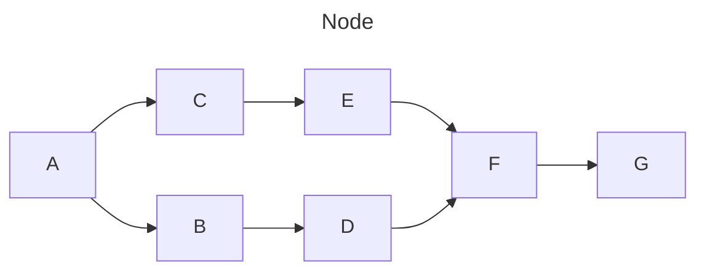

# 画图

https://juejin.cn/post/7038144693867118629

https://coding.net/help/docs/document/markdown.html#%E5%9B%BE%E7%89%87

## 流程图

Markdown 编辑器已支持绘制流程图、时序图和甘特图。通过 [mermaid](https://mermaid.js.org/#/ ) 实现图形的插入

例如

