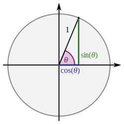

# 几何学

## 概念

### 弧 Arc

在几何学中，弧（Arc）是指圆周上的一部分或一段曲线，它连接圆上的两个点。

### 弧长 Arc Length

弧的长度是连接起点和终点的实际弯曲部分的长度。

### 弧度 radian，rad

弧度（Radian，简写为 rad）是一种用于测量角度的单位，它是国际单位制（SI单位制）中的官方角度单位。弧度的定义如下：
一个弧度定义为半径为 1 的圆的弧长等于半径的长度。

$弧度 = \frac{弧长}{2 \pi r}$

### 角度 degree
角度数是用来测量角的大小的一种单位。角度的度量单位是度（°）。度的定义如下：

1 度（°）等于一个完整的圆周（360度）所分成的等份中的一份。

### 圆周率π
圆周率 π（pi）是一个无理数，它的定义如下：

π 是一个数学常数，代表一个圆的周长与直径之间的比率。

具体来说，π 的定义可以表达为：
$\pi = \frac{周长}{直径}$
​

## 三角函数/Trigonometric functions

### 直角三角形定义

In the following definitions, the **hypotenuse** is the length of the side opposite the right angle, **opposite** represents the side opposite the given angle θ, and **adjacent** represents the side between the angle θ and the right angle.

1. 正弦函数（ Sine ）：通常用符号sin表示,对于一个角度θ，正弦函数的值等于对边与斜边的比值，即 $sin(\theta) = \frac{opposite}{hypotenuse}$
1. 余割函数（ Cosecant ）： 通常用符号csc表示,对于一个角度θ,余割函数的值等于斜边与对边的比值,即 $csc(\theta) = \frac{hypotenuse}{opposite}$

1. 余弦函数（ Cosine ）: 通常用符号cos表示,对于一个角度θ，余弦函数的值等于邻边与斜边的比值,即 $cos(\theta) = \frac{adjacent}{hypotenuse}$
1. 正割函数（ Secant ）：通常用符号sec表示,对于一个角度θ,正割函数的值等于斜边与邻边的比值,即 $sec(\theta) = \frac{hypotenuse}{adjacent}$

1. 正切函数（ Tangent ）： 通常用符号tan表示,对于一个角度θ,正切函数的值等于对边与邻边的比值，即 $tan(\theta) = \frac{opposite}{adjacent}$。
1. 余切函数（ Cotangent ）：通常用符号cot表示,对于一个角度θ,余切函数的值等于邻边与对边的比值,即 $cot(\theta) = \frac{adjacent}{opposite}$

### 平面直角坐标系定义

## 反三角函数/Inverse trigonometric functions
|名称|常用符号|定义|定义域|值域|
|--|--|--|--|--|
|反正弦|$y=arcsin\space x$|$x = sin\space y$|[-1,1]|[$-\frac\pi 2,\frac\pi 2$]|
|反余割|$y=arccsc\space x$|$x = csc\space y$|$(-\infin,-1] \cup [1,+\infin) $|$[-\frac{\pi}{2},0) \cup (0,\frac{\pi}{2}]$|
|反余弦|$y=arccos\space x$|$x = cos\space y$|[-1,1]|[0,$\pi$]|
|反正割|$y=arcsec\space x$|$x = sec\space y$|$(-\infin,-1] \cup [1,+\infin) $|$[0,\frac{\pi}{2}) \cup (\frac{\pi}{2},\pi]$|
|反正切|$y=arctan\space x$|$x = tan\space y$|$\mathbb{R}$|($-\frac\pi 2,\frac\pi 2$)|
|反余切|$y=arccot\space x$|$x = cot\space y$|$\mathbb{R}$|(0,$\pi$)|

