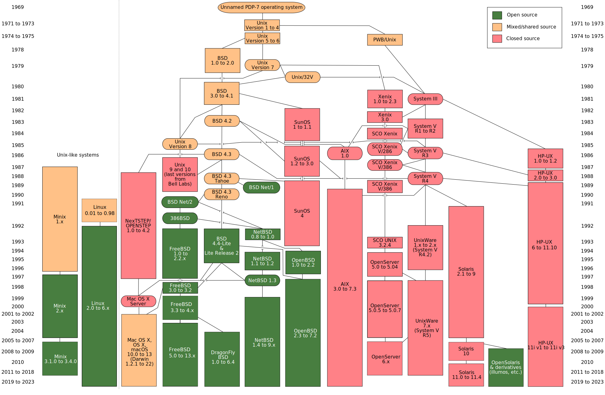

# Operating Systems

https://en.wikipedia.org/wiki/Operating_system



## Process 

### Process States 

- Running: In the running state, a process is running on a processor.
This means it is executing instructions.
- Ready: In the ready state, a process is ready to run but for some
reason the OS has chosen not to run it at this given moment.
- Blocked: In the blocked state, a process has performed some kind
of operation that makes it not ready to run until some other event
takes place. A common example: when a process initiates an I/O
request to a disk, it becomes blocked and thus some other process
can use the processor

## Scheduling

### MLFQ(Multi-Level Feedback Queue)
- Rule 1: If Priority(A) > Priority(B), A runs (B doesn’t).
- Rule 2: If Priority(A) = Priority(B), A & B run in RR.
- Rule 3: When a job enters the system, it is placed at the highest
priority (the topmost queue).
- Rule 4: Once a job uses up its time allotment at a given level (re-
gardless of how many times it has given up the CPU), its priority is
reduced (i.e., it moves down one queue).
- Rule 5: After some time period S, move all the jobs in the system
to the topmost queue.


## 异常控制流


### 名词

**抢占（preempted）**: 暂时挂起

**物理控制流**
**逻辑控制流**
**并发流**
**并发**
**时间片**
**时间分片**
**并行流**
**并行**

**模式位（mode bit）**

### /proc文件系统

/proc文件目录下，将许多内核数据结构的内容输出为一个用户程序可以读的文本文件的层次结构，比如
/proc/cpuinfo, cpu的信息
/proc/\<process-id>/maps, 进程的内存段

/sys文件系统，输出系统总线和设备的额外的低层信息

## 虚拟内存

###  查看操作系统内存页大小

`getconf PAGESIZE`


## 系统级I/O

### /dev/null

/dev/null 是一个特殊的设备文件，在许多类 Unix 操作系统中都存在。它被称为“黑洞”设备，可以用于丢弃数据。当将数据写入 /dev/null 或从中读取数据时，数据会被永久丢弃，不会保存到任何地方。

在类 Unix 操作系统中，一切都是文件，包括硬件设备。/dev/null 就是一个虚拟的文件，用于丢弃数据。例如，如果您希望运行一个命令但不关心其输出，您可以将输出重定向到 /dev/null。同样地，如果您希望将某个文件内容清空，您可以将文件内容重定向到 /dev/null。

例如，以下命令将 stdout（标准输出）和 stderr（标准错误输出）都重定向到 /dev/null，从而抑制了命令的输出和错误信息：

```shell
## 2>&1 表示将 stderr 重定向到 stdout，因此错误信息也会被送到 /dev/null。
command > /dev/null 2>&1
```

### Sockets


```c
/* IP socket address structure IPv4*/
struct sockaddr_in {
    uint16_t sin_family; /* Protocol family (always AF_INET) */
    uint16_t sin_port; /* Port number in network byte order */
    struct in_addr sin_addr; /* IP address in network byte order */
    unsigned char sin_zero[8]; /* Pad to sizeof(struct sockaddr) */
};
/* Generic socket address structure (for connect, bind, and accept) */
struct sockaddr {
    uint16_t sa_family; /* Protocol family */
    char sa_data[14]; /* Address data */
};
/* Internet address.  */
typedef uint32_t in_addr_t;
struct in_addr{
    in_addr_t s_addr;
}
```


#### socket()
```c
/* Create a new socket of type TYPE in domain DOMAIN, using
   protocol PROTOCOL.  If PROTOCOL is zero, one is chosen automatically.
   Returns a file descriptor for the new socket, or -1 for errors.  */
extern int __socket (int __domain, int __type,
		     int __protocol);

// Address families. 
// 一些常用的Address families
#define AF_LOCAL	PF_LOCAL
#define AF_UNIX		PF_UNIX
#define AF_FILE		PF_FILE
#define AF_INET		PF_INET


/**
 * enum sock_type - Socket types
 * @SOCK_STREAM: stream (connection) socket
 * @SOCK_DGRAM: datagram (conn.less) socket
 * @SOCK_RAW: raw socket
 * @SOCK_RDM: reliably-delivered message
 * @SOCK_SEQPACKET: sequential packet socket
 * @SOCK_DCCP: Datagram Congestion Control Protocol socket
 * @SOCK_PACKET: linux specific way of getting packets at the dev level.
 *		  For writing rarp and other similar things on the user level.
 *
 * When adding some new socket type please
 * grep ARCH_HAS_SOCKET_TYPE include/asm-* /socket.h, at least MIPS
 * overrides this enum for binary compat reasons.
 */
enum sock_type {
	SOCK_STREAM	= 1,
	SOCK_DGRAM	= 2,
	SOCK_RAW	= 3,
	SOCK_RDM	= 4,
	SOCK_SEQPACKET	= 5,
	SOCK_DCCP	= 6,
	SOCK_PACKET	= 10,
};

```


```
用户程序: socket(domain, type, protocol)
       ↓ (glibc)
glibc 系统调用封装 (syscall(SYS_socket, ...))
       ↓ (CPU syscall 指令)
Linux 内核系统调用入口
       ↓ (分派)
内核函数 sys_socket(family, type, protocol)
       ↓
创建 socket 等内核处理
       ↓
返回 socket fd 给用户态
```

#### connect()
```c
/* Open a connection on socket FD to peer at ADDR (which LEN bytes long).
   For connectionless socket types, just set the default address to send to
   and the only address from which to accept transmissions.
   Return 0 on success, -1 for errors.

   This function is a cancellation point and therefore not marked with
   __THROW.  */
extern int connect (int __fd, __CONST_SOCKADDR_ARG __addr, socklen_t __len);
```

#### bind()
```c
/* Give the socket FD the local address ADDR (which is LEN bytes long).  */
extern int bind (int __fd, __CONST_SOCKADDR_ARG __addr, socklen_t __len)
     __THROW;
```

#### listen()
```c
/* Prepare to accept connections on socket FD.
   N connection requests will be queued before further requests are refused.
   Returns 0 on success, -1 for errors.  */
extern int listen (int __fd, int __n) __THROW;
```

#### accept()

```c
/* Await a connection on socket FD.
   When a connection arrives, open a new socket to communicate with it,
   set *ADDR (which is *ADDR_LEN bytes long) to the address of the connecting
   peer and *ADDR_LEN to the address's actual length, and return the
   new socket's descriptor, or -1 for errors.

   This function is a cancellation point and therefore not marked with
   __THROW.  */
extern int accept (int __fd, __SOCKADDR_ARG __addr,
		   socklen_t *__restrict __addr_len);


```

1. listening descriptor
    - 一直存在到server的整个生命周期
2. connected descriptor
    - server每次accept一个客户端请求的时候创建


#### getaddrinfo

```c
/* Translate name of a service location and/or a service name to set of
   socket addresses.

   This function is a possible cancellation point and therefore not
   marked with __THROW.  */
extern int getaddrinfo (const char *__restrict __name,
			const char *__restrict __service,
			const struct addrinfo *__restrict __req,
			struct addrinfo **__restrict __pai);


/* Structure to contain information about address of a service provider.  */
struct addrinfo
{
  int ai_flags;			/* Input flags.  */
  int ai_family;		/* Protocol family for socket.  */
  int ai_socktype;		/* Socket type.  */
  int ai_protocol;		/* Protocol for socket.  */
  socklen_t ai_addrlen;		/* Length of socket address.  */
  struct sockaddr *ai_addr;	/* Socket address for socket.  */
  char *ai_canonname;		/* Canonical name for service location.  */
  struct addrinfo *ai_next;	/* Pointer to next in list.  */
};         


/* Structure describing a generic socket address.  */
// 这里定义了一个公共的结构
struct __attribute_struct_may_alias__ sockaddr
  {
    __SOCKADDR_COMMON (sa_);	/* Common data: address family and length.  */
    char sa_data[14];		/* Address data.  */
  };
// 
/* POSIX.1g specifies this type name for the `sa_family' member.  */
typedef unsigned short int sa_family_t;

/* This macro is used to declare the initial common members
   of the data types used for socket addresses, `struct sockaddr',
   `struct sockaddr_in', `struct sockaddr_un', etc.  */

#define	__SOCKADDR_COMMON(sa_prefix) \
  sa_family_t sa_prefix##family

// 根据上面的sockaddr，扩展出了非常多的类型
// 下面这个是IPv4的结构
/* Structure describing an Internet socket address.  */
struct __attribute_struct_may_alias__ sockaddr_in
  {
    __SOCKADDR_COMMON (sin_);
    in_port_t sin_port;			    /* Port number.  */
    struct in_addr sin_addr;		/* Internet address.  */

    /* Pad to size of `struct sockaddr'.  */
    unsigned char sin_zero[sizeof (struct sockaddr)
			   - __SOCKADDR_COMMON_SIZE
			   - sizeof (in_port_t)
			   - sizeof (struct in_addr)];
  };

// 其他的一些结构都是glibc的源码文件 glibc/socket/sa_len.c 中能看到
int __libc_sa_len (sa_family_t af);  // 这个方法里面能看到所有的sockaddr类型
```


#### getnameinfo

```c
/* Translate a socket address to a location and service name.

   This function is a possible cancellation point and therefore not
   marked with __THROW.  */
extern int getnameinfo (const struct sockaddr *__restrict __sa,
			socklen_t __salen, char *__restrict __host,
			socklen_t __hostlen, char *__restrict __serv,
			socklen_t __servlen, int __flags);
```

## Tools
[操作系统性能测试工具LMbench](http://lmbench.sourceforge.net/ )