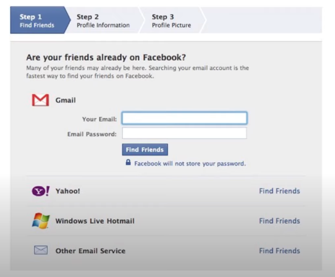

# OAuth

[官网](https://oauth.net)
[相关的RFC](https://oauth.net/specs/ )
RFC 6749 是最开始奠定核心框架的RFC

## 背景

有这么一个场景，就是我的应用程序需要获取用户的邮箱中的联系人，这个时候，原始的方式就是我的系统存储用户手动输入的邮箱账号密码,然后去获取邮箱中的联系人信息.这里面有几个非常严重的问题
1. 账号密码是个人私密信息，提供给第三方应用不合适，（账号密码让人给卖了都不知道）
1. 如果修改了邮箱的账号密码，第三方应用没有及时更新的话就会无法使用

看一个真实的facebook网站截图

按照现在的眼光来看，确实是离了个大谱

这个问题抽象一下，其实就是如何在不访问用户账号密码的情况下，来获取用户的一些数据？

## OAuth2.0

