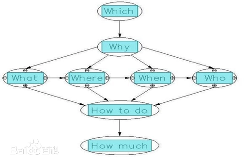
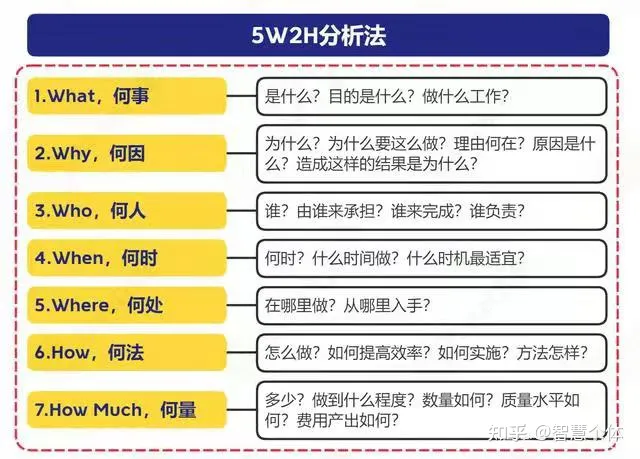

# 学习方法

## 通用思维模型6w2h

此模型并没有一个确定的提出人，

[博客](https://baike.baidu.com/item/6W2H/6417845#:~:text=6W2H%E7%AE%80%E4%BB%8B&text=What%2D%E4%BD%95%E4%BA%8B%EF%BC%9BWhy%2D%E4%BD%95%E6%95%85,%E5%8F%91%E5%B1%95%E6%88%90%E4%BA%866W2H%E6%B3%95%E3%80%82)

6W2H通用决策：是一个以价值为导向的标准化思维流程，是人们在追求理想和目标的过程中，都要经过选择目标 (which)→选择原因（why）→功能如何→(what)→什么场地(where)→什么时间(when)→什么组织(who)→如何提高效率(how to do)→性价比如何(how much)八个方面提出问题并从中选择性价比最高的方法和路径来实现预定目标。
1. 目标(which)——选择对象
公司选择什么样的道路？公司选择什么样的产品？例如:在住宅工业化的过程中，是选择钢结构、木结构还是预制混凝土（PC）结构？ 是做项目型公司还是做产品型公司？
2. 原因(why )——选择理由
为什么要生产这个产品？能不能生产别的？我到底应该生产什么？例如:如果现在做项目型公司不挣钱，能不能做产品型公司？
3. 对象(what)——功能与本质
这个产品的功能如何？它能满足哪些客户和人群的需求？例如:对房地产开发商而言，小户型酒店式公寓的功能与本质是投资需求还是单身白领的过度性住房需求？
4. 场所(where)——什么地点
生产是在哪里干的？为什么偏偏要在这个地方干？换个地方行不行？到底应该在什么地方干？这是选择工作场所应该考虑的。例如:对房地产开发商而言，小户型酒店式公寓在建设在经济开发区是否合适？ 又例如“到有钱的地方去赚钱”不仅适合于房地产公司的开发区域选择，也适合于个人就业地点的选择。
5. 时间和程序(when)——什么时候
时间与节奏的把握是十分重要的，例如制造企业的just-in-time理念、房地产大盘的分期开发、分期开盘理念。
6. 组织或人(who)——责任单位、责任人
这个事情是谁在干？为什么要让他干？如果他是“万金油”，根据老子《道德经》——“知者不博，博者不知”的论断，是不是可以将“博者”换个“知者”？如果按乔布斯法则，一个优秀的人可以顶得上50个平庸的人，那么三个臭皮匠肯定不如一个诸葛亮”。
7. 如何做（how to do）——如何提高效率
如何提高效率？最简单的法则就是采用标准化产品。如果公司的组织比较完备，那么是否还可以采取“帕累托改进？”如果公司的组织还不够完善，是否可以采用“卡尔多-希克斯改进”
8. 价值(how much)——性价比如何？

三十幅共一毂，当其无，有车之用。埏埴以为器，当其无，有器之用。凿户牖以为室，当其无，有室之用。故有之以为利，无之以为用。万物皆有其价值，可以利用，物与物的交换，以价值为基础，有可以换无，无可以换有，一切取决于个人心中的那个性价比。

###  组装适配
根据特定的场景来缩减项目适应。

### 学习一个新的东西
what why where how
3w1h1w

what就是名词解释，定义这是个什么东西、有什么特点、优缺点
why 就是为什么要用这个东西，不用不行吗，有什么独特的地方
where 适用于什么场景
how 这个东西具体事怎么实现的。
which 如果一个主题下有很多种方式，到底使用那种更好呢，各种选择的区别

### 5W2H

### 现实应用
分享一个3W2H思维模型的现实应用例子：
一个人工作能力强，判断指标是什么？
你看他是不是随时随地搞得清楚三个问题：
第一，我的目标是什么？which
第二，我准备怎么干，来达成这个目标？how
第三，我需要找谁、给我提供什么支持？who

## PDCA循环

PDCA (Plan-Do-Check-Act) 循环是一种持续改进的管理方法。它涉及计划、执行、检查和行动四个阶段，用于解决问题、实施改进和管理项目。

## Ishikawa Diagram（鱼骨图）

也称为因果图，它是一种图形化工具，用于识别和分析问题的根本原因。通过将问题分解为多个可能的原因，并将其显示为鱼骨图，团队可以更好地理解问题并制定解决方案。

[博客](https://www.investopedia.com/terms/i/ishikawa-diagram.asp#:~:text=An%20Ishikawa%20diagram%20is%20a,are%20required%20at%20specific%20times.)

## 5 Whys
5 Whys：这是一种问题解决技术，通过连续问 "为什么" 五次来探究一个问题的根本原因。通过不断追问为什么，团队可以深入了解问题，找到隐藏的根本原因。

## SWOT 分析
SWOT 分析（Strengths, Weaknesses, Opportunities, Threats）是一种常用的战略规划工具，用于评估一个项目或组织的内部优势、劣势，以及外部的机会和威胁。

## SMART

SMART 是一个常用的目标设置和管理原则，它是一个缩写，每个字母代表一个特定的要素，有助于确保目标明确、可衡量、可实现和与实际情况相符合。SMART 的每个字母代表以下概念：

1. Specific（具体的）：目标应该是明确具体的，避免模糊性和歧义。清晰地定义目标是取得成功的第一步。
1. Measurable（可衡量的）：目标必须是可衡量的，这样你就可以确定是否达到了目标。明确的度量标准有助于跟踪进度和评估绩效。
1. Achievable（可实现的）：目标应该是现实可行的，并且能够在给定的资源和时间范围内实现。设置过高或不切实际的目标可能会导致失望和挫折。
1. Relevant（相关的）：目标应该与组织的愿景、使命和战略一致，并且对于个人或团队来说是有意义的。确保目标与整体目标一致，有助于增强动机和集中精力。
1. Time-bound（有时限的）：目标应该有明确的截止日期或时间范围，这有助于推动行动并确保进度。时间限制也有助于避免拖延和不必要的延迟。

通过使用 SMART 原则，个人和组织可以更有效地设定和管理目标，提高工作的效率和成果。

## Problem solving

[wiki](https://en.wikipedia.org/wiki/Problem_solving)

## 读源码的方式
1. 自己根据代码的功能设计测试用例，跟着测试用例脑子里面走代码就ok了

