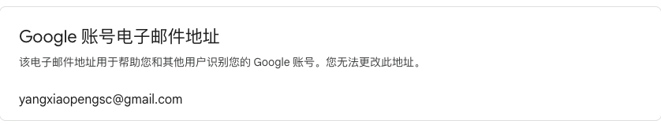

# 第三方登录 Google

## 操作步骤

1. 访问[Google控制台](https://console.cloud.google.com/)
1. 选择一个项目，没有的话新建一个项目
1. 在Quick Services中点击API & Services
1. 左侧菜单栏中选择Oauth consent screen
1. 选择External的User Type，点击Create
1. 需要完善的信息
    1. app name
    1. support email
    1. app logo
    1. app domain
1. 剩下的信息填完后就可以生成了
1. 在左侧菜单栏的Credentials中添加
    - Authorized JavaScript origins
    - Authorized redirect URIs


## Client info

- client id : 870186193875-9qg445hpd10nb57tq7o5udmo2cct88uc.apps.googleusercontent.com
- client secret : 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


## 参考文档
[Integrating Google Sign-In into your web app](https://developers.google.com/identity/sign-in/web/sign-in ) 已经废弃了 - -!
[最新的集成文档](https://developers.google.com/identity/gsi/web/guides/overview )
[Google后台配置文档](https://developers.google.com/identity/gsi/web/guides/get-google-api-clientid)

Google给的建议:
> Key Point: To authenticate without reloading your web page, a common practice is to receive the JWT credential via a JavaScript callback handler, then to submit it to your server via an XmlHttpRequest.

JavaScript API提供的功能: 

With the JavaScript API, you have more flexibility on some scenarios as below.
- Rendering One Tap and the Sign in with Google button at a later moment. For example, after users select Login from the menu.
- Calling the API multiple times. For example, the Sign in with Google button needs to be rendered each time the login dialog is rendered.
- Generating your HTML pages dynamically, making it hard to embed API-calling code within them.
- You load the Google Identity Services JavaScript library at a much later time.
- HTML API code can only be invoked once either on the page onload event or the Google Identity Services JavaScript library onload event, whichever comes later. You should use the JavaScript API if the HTML API behavior doesn't meet your expectation.


## 注意问题

1. 本地调试的时候，访问页面必须用localhost，不然google的登录按钮会有各种各样的问题
    > For local tests or development add both http://localhost and http://localhost:<port_number>
1. 最终得到的结果示例
    ```json
    {
        "clientId": "870186193875-9qg445hpd10nb57tq7o5udmo2cct88uc.apps.googleusercontent.com",
        "client_id": "870186193875-9qg445hpd10nb57tq7o5udmo2cct88uc.apps.googleusercontent.com",
        "credential": "eyJhbGciOiJSUzI1NiIsImtpZCI6ImY1ZjRiZjQ2ZTUyYjMxZDliNjI0OWY3MzA5YWQwMzM4NDAwNjgwY2QiLCJ0eXAiOiJKV1QifQ.eyJpc3MiOiJodHRwczovL2FjY291bnRzLmdvb2dsZS5jb20iLCJhenAiOiI4NzAxODYxOTM4NzUtOXFnNDQ1aHBkMTBuYjU3dHE3bzV1ZG1vMmNjdDg4dWMuYXBwcy5nb29nbGV1c2VyY29udGVudC5jb20iLCJhdWQiOiI4NzAxODYxOTM4NzUtOXFnNDQ1aHBkMTBuYjU3dHE3bzV1ZG1vMmNjdDg4dWMuYXBwcy5nb29nbGV1c2VyY29udGVudC5jb20iLCJzdWIiOiIxMDA1MTg1Njc4NDY0OTk5MDUyNDIiLCJlbWFpbCI6Inlhbmd4aWFvcGVuZ3NjQGdtYWlsLmNvbSIsImVtYWlsX3ZlcmlmaWVkIjp0cnVlLCJuYmYiOjE2OTg4OTU0MzksIm5hbWUiOiJwZW5nIHlhbmciLCJwaWN0dXJlIjoiaHR0cHM6Ly9saDMuZ29vZ2xldXNlcmNvbnRlbnQuY29tL2EvQUNnOG9jTDdFMVZsSzR2VEJwSjg5WWRIWF9QSTJhRFJMTC1mTFY1ejNGM202ZnRTdnc9czk2LWMiLCJnaXZlbl9uYW1lIjoicGVuZyIsImZhbWlseV9uYW1lIjoieWFuZyIsImxvY2FsZSI6InpoLUNOIiwiaWF0IjoxNjk4ODk1NzM5LCJleHAiOjE2OTg4OTkzMzksImp0aSI6ImJiZjY2Y2U3YjY1NDA0MmM3MGZjMDEwMjJhYTY2ZjZmODRiZjdhM2MifQ.PFFhPlnH0Aw2tORX-Rwn6rG0cXbzxxjS70HLLWcp0FLLm6oUJ67wDkKCt0k0jprfK6pVLSPIu95q0juIzU5Cp1ja2G6_hVEwP1gKvmQZmtTIs4W55K2L02alUKaR8IHtIaYxRu2pO49yd_UX1CBWE1ni-wn9LR39GhnOygqMOQ2Rd7AE6JycCM-4y5mSvmh9SXzdFGs3Lp670VxiSsK8dUfmYCMcpP4J8gwWi8IlVF_0VcQU-DrJ_PR12SJyftmfcfsfmpSDKLEO6cSfIzPD9v-aieS8Z3XNZAb3XtWJzgztFYGGwY4hDmvQOYcwZWnu8EBr4YFK4PRrmhzq6TP4uw",
        "select_by": "user"
    }
    ```
    其中的`credential`字段存储的是jwt格式的用户信息,使用[此网址](https://jwt.io/ )解码信息，就可以得到用户的邮箱信息
1. google账号中的邮箱是不能改变的，可以拿这个做唯一标识校验
 


 ## Demo
 - [Demo1](https://blog.poul.top/demo/third-login/third_login_google )
 