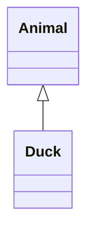

# uml
## what?
对面向对象系统进行可视化、详述、构造和文档化正是统一建模语言(UML)的目的。

## 类关系
https://www.guru99.com/association-aggregation-composition-difference.html
https://blog.csdn.net/hguisu/article/details/7609483

### 依赖（Dependency）
在UML中，依赖关系用带箭头的虚线表示，由依赖的一方指向被依赖的一方。

### 关联（Association）
在 UML 类图中， 用实线连接有关联的对象所对应的类
#### 双向关联

#### 单向关联
单向关联用带箭头的实线表示.
#### 自关联

#### 重数性关联

#### 聚合（Aggregation）
表示的是整体和部分的关系，整体与部分 可以分开.
在 UML 中，聚合关系用带空心菱形的直线表示。 

#### 组合（复合，Composition）
也是整体与部分的关系，但是整体与部分不可以分开.
在 UML 中，组合关系用带实心菱形的直线表示。

### 泛化（Generalization）  
在UML中，泛化关系用带空心三角形的直线来表示。

### 实现（Implementation）
是用来规定接口和实线接口的类或者构建结构的关系，接口是操作的集合，而这些操作就用于规定类或者构建的一种服务。
在 UML 中，类与接口之间的实现关系用带空心三角形的虚线来表示。

## 参考文献

[The Unified Modeling Language Reference Manual(Second Edition) James Rumbaugh,Ivar Jacobson,Grady Booch](https://pdf.poul666.top/web/viewer.html?file=https://file.poul666.top/poul/%E6%96%B0%E5%8A%A0%E5%8D%B71/study/ebook/uml/Rumbaugh--UML_2.0_Reference_CD.pdf)
