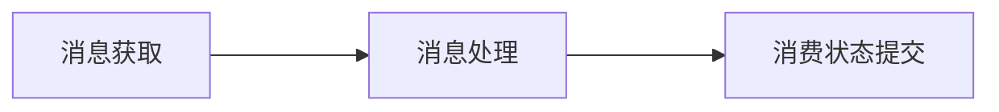

# RocketMQ

## 介绍

[官网](https://rocketmq.apache.org/ )  
[github](https://github.com/apache/rocketmq )


本文基于**5.x**版本来进行讲解操作

## 安装 

### 源码/二进制文件安装
1 下载源码包  

```shell
wget https://dist.apache.org/repos/dist/release/rocketmq/5.1.0/rocketmq-all-5.1.0-source-release.zip
```

2 解压源码包并编译构建二进制可执行文件  

```shell
unzip rocketmq-all-5.1.0-source-release.zip
cd rocketmq-all-5.1.0/
mvn -Prelease-all -DskipTests -Dspotbugs.skip=true clean install -U -T2.0C
cd distribution/target/rocketmq-5.1.0/rocketmq-5.1.0
```

编译的时候各种报错，还是选择[二进制文件](https://dist.apache.org/repos/dist/release/rocketmq/5.1.0/rocketmq-all-5.1.0-bin-release.zip)吧

3 启动NameServer   

这个地方默认启动的时候申请4G的jvm内存，可以在runserver.sh文件中调小一点   
~~~shell
nohup sh bin/mqnamesrv &
~~~

验证namesrv是否启动成功
~~~shell
tail -f ~/logs/rocketmqlogs/namesrv.log
The Name Server boot success...
~~~

4 启动Brocker + Proxy

先启动broker  
由于启动默认会申请8G的jvm内存，需要调整一下，runbrocker.sh文件中的配置  
~~~shell
nohup sh bin/mqbroker -n localhost:9876 --enable-proxy &
~~~

验证broker是否启动成功, 比如, broker的ip是192.168.1.2 然后名字是broker-a
~~~shell
tail -f ~/logs/rocketmqlogs/proxy.log 
The broker[broker-a,192.169.1.2:10911] boot success...
~~~

5 工具测试消息收发 

```shell
export NAMESRV_ADDR=localhost:9876
sh bin/tools.sh org.apache.rocketmq.example.quickstart.Producer
 SendResult [sendStatus=SEND_OK, msgId= ...

sh bin/tools.sh org.apache.rocketmq.example.quickstart.Consumer
 ConsumeMessageThread_%d Receive New Messages: [MessageExt...
```

6 关闭服务器  
```shell
sh bin/mqshutdown broker
The mqbroker(36695) is running...
Send shutdown request to mqbroker with proxy enable OK(36695)


sh bin/mqshutdown namesrv
The mqnamesrv(36664) is running...
Send shutdown request to mqnamesrv(36664) OK
```

### Docker安装


```shell
sudo docker pull apache/rocketmq
```

或者可以组合安装，`rocketmq.yml`

```yml
version: '2'
services:
  namesrv:
    image: apache/rocketmq
    container_name: rmqnamesrv
    hostname: rmqnamesrv
    ports:
      - 9876:9876
    networks:
      - rocketmq-net
    volumes:
      - ./data/namesrv/logs:/home/poul/workspace/soft/docker/rocketmq/logs
    command: sh mqnamesrv
  broker:
    image: apache/rocketmq
    container_name: rmqbroker
    hostname: rmqbroker
    ports:
      - 10909:10909
      - 10911:10911
      - 10912:10912
    volumes:
      - ./data/broker/logs:/home/poul/workspace/soft/docker/rocketmq/logs
      - ./data/broker/store:/home/poul/workspace/soft/docker/rocketmq/store
      - ./data/broker/conf/broker.conf:/home/poul/workspace/soft/docker/rocketmq/conf/broker.conf
    command: sh mqbroker -n namesrv:9876 -c ../conf/broker.conf
    depends_on:
      - namesrv
    links:
      - namesrv
    networks:
      - rocketmq-net
  dashbord:
    image: apacherocketmq/rocketmq-dashboard
    container_name: rmqdashbord
    ports:
      - 18080:8080
    depends_on:
      - namesrv
      - broker
    links:
      - namesrv
      - broker
    networks:
      - rocketmq-net
    environment:
      JAVA_OPTS: -Drocketmq.namesrv.addr=rmqnamesrv:9876


networks:
  rocketmq-net:
    driver: bridge
```

使用命令启动：

使用启动命令查看控制台日志是否报错，并访问dashbord页面是否正常
```shell
sudo docker-compose -f rocketmq.yml up
```
正常的话 使用-d参数，后台启动docker
```shell
sudo docker-compose -f rocketmq.yml up -d
```
完了之后，关闭docker
```shell
sudo docker-compose -f rocketmq.yml down
```


## 安装Dashboard

### 源码安装
1. 下载[源码](https://github.com/apache/rocketmq-dashboard )

2. 编译
```shell
mvn clean package -Dmaven.test.skip=true -T2.0C
```
编译这玩意各种报错，还是用docker版本的吧。。

### docker安装
1. 拉取镜像
```shell
sudo docker pull apacherocketmq/rocketmq-dashboard:latest
```
2. 启动
```shell
sudo docker run -d --rm --name rocketmq-dashboard -e "JAVA_OPTS=-Drocketmq.namesrv.addr=192.168.1.7:9876" -p 18080:8080 -t apacherocketmq/rocketmq-dashboard:latest
```
3. 访问 http://localhost:18080

## 概念

- Topic 主题
- MessageType 消息类型
- MessageQueue 队列
- Message 消息
- Producer 生产者
- ConsumerGroup 消费者分组
- Consumer 消费者
- Subscription 订阅关系

名词定义：
- **服务端** Rocket MQ服务器
- **生产者** 消息的投放服务
- **消费者** 消息的消费服务
- **消息**   生产者向消费者发送的信息载体


## 功能特性


### 普通消息

### 定时/延时消息

### 事务消息

#### 执行流程
1. 生产者将消息发送至服务端
2. 服务端收到消息进行持久化后，向生产者返回**ACK**确认消息已经发送成功，此时消息被标记为“**暂不投递**”，这种状态下的消息即为**半事务消息**。
3. 生产者开始执行本地事务
4. 生产者根据本地事务执行结果向服务端提交二次确认结果（Commit或者是Rollback），服务端收到确认结果后处理逻辑如下：
    - 二次确认结果为Commit:  服务端将半事务消息标记为可投递，并投递给消费者
    - 二次确认结果为Rollback: 服务端将会滚事务，不会将半事务消息投递给消费者
5. 在断网或者是生产者重启的特殊情况下，若服务端在一定时间内没有收到生产者发送的二次结果确认，或者是服务端收到的二次确认结果是Unknown未知状态，经过固定时间后，服务端将对生产者（集群）中的任意实例发起消息**回查**。
6. 生产者收到消息回查后，需要检查对应消息的本地事务执行的最终结果
7. 生产者根据检查到的本地事务的最终状态，再次提交二次确认，执行步骤4

### 顺序消息


#### 生产顺序性
1. 单一生产者
2. 生产者串行发送，也就是说不能多线程并发发送

#### 消费顺序性
1. 1个ConsumerQueue只有一个消费者，且只有一个线程消费
2. **投递顺序性**，消费者需要严格按照“接收---处理---应答”的语义处理消息，避免因异步处理导致消息乱序。
3. **有限重试**， 顺序消息投递仅在重试次数范围内，即如果消费一直重试失败，超过最大重试次数后，将不再重试，跳过这条消息。

**使用限制：**
顺序消息仅支持使用MessageType为FIFO的主题，即顺序消息只能发送至类型为顺序消息的主题中，发送的消息类型必须和主题的类型一致。

### 消息发送重试
生产者连接服务端发送消息的时候，可能会因为网络故障、服务异常等原因导致调用失败。为保证消息的可靠性，生产者SDK中内置了请求重试逻辑，尝试通过重试发送达到最终调用成功的效果。

**发送消息重试的触发条件**：
1. 生产者发送请求调用失败或请求超时
2. 网络异常造成连接失败或请求超时
3. 服务端结点处于重启或下线状态造成连接失败
4. 服务端运行慢造成请求超时
5. 服务端返回失败错误码
  - 系统逻辑错误 因运行逻辑不正确造成的
  - 系统流控错误 因容量超限造成的流控错误

**发送重试具体流程：**
1. 生产者在初始化时设置消息发送的最大重试次数，当出现上述触发条件的场景时，生产者会按照设置的重试次数一只重试发送消息，知道消息发送成功或者是到达最大重试次数重试结束，并在最后一次重试失败后返回调用错误响应
    - 同步发送 调用线程会一只阻塞，知道某次重试成功或最终重试失败，抛出错误码和异常
    - 异步发送 调用线程不会阻塞，但是调用结果会通过异常事件或者成功事件返回

**重试间隔**：
- 除服务端返回系统流程控制错误场景，其他触发条件触发重试后，都会立即重试，没有时间间隔
- 如果服务端返回流控错误触发重试，系统会按照指数退避策略进行延迟重试。指数退避算法通过以下参数控制重试行为
  - INITIAL_BACKOFF 第一次失败后重试前需要等多久 默认值 1s
  - MULTIPLIER 指数退避因子，即退避倍率， 默认值 1.6
  - JITTER 随机抖动因子，默认值 0.2
  - MAX_BACKOFF 等待间隔时间上限， 默认值 120秒
  - MIN_CONNECT_TIMEOUT 最短重试间隔 默认 20秒

算法建议如下：

```c
ConnectWithBackoff()
  current_backoff = INITIAL_BACKOFF
  current_deadline = now() + INITIAL_BACKOFF
  while (TryConnect(Max(current_deadline, now() + MIN_CONNECT_TIMEOUT))!= SUCCESS)
    SleepUntil(current_deadline)
    current_backoff = Min(current_backoff * MULTIPLIER, MAX_BACKOFF)
    current_deadline = now() + current_backoff + UniformRandom(-JITTER * current_backoff, JITTER * current_backoff)
```

**功能约束**
- 链路耗时阻塞评估： 
  生产者发送消息重试的时候需要等待重试结果，这个时候会一只阻塞住，需要合理评估每次调用请求的**超时时间**以及**最大重试次数**，避免影响全链路的效率
- 最终异常兜底：
  生产者不能保证消息一定会发送成功，当到达最大重试次数失败后，会直接返回结果，需要生产者异常捕获，做好冗余保护处理，避免消息发送结果不一致的情况。
- 消息重复问题
  因远程调用的不确定性，当生产者因请求超时触发消息发送重试流程，此时生产者无法感知服务端的处理结果，生产者进行重发消息的时候可能会导致消息重复问题，消费者需要自行处理重复消费问题。


### 消息流控机制

**概念：**
服务端容量或水位过高，服务端会通过快速失败，返回流控错误来避免底层资源承受过高压力

**触发条件**
- 存储压力大 消费者分组的初始消费位点为当前队列的最大消费位点
- 服务端请求队列排队溢出 若消费者消费能力不足，导致队列中有大量堆积消息，当堆积消息超过一定数量后会触发消息流控，减少下游消费系统压力

**流控行为**
当系统触发消息发送流控时，客户端会收到系统限流错误和异常，错误码信息如下：
- reply-code: 530
- reply-text: TOO_MANY_REQUESTS

生产者收到消息流控错误码后，会通过指数退避策略进行消息重发

**处理建议**
- 避免触发消息流控： 触发限流的根本原因是系统容量或水位过高，可以利用可观测性功能监控系统水位容量等，保证系统资源充足，避免触发流控机制。
- 突发消息流控处理： 如果因为突发原因触发消息流控，且生产者内置的消息重发机制失败，则建议业务方将请求调用临时替换到其他系统进行应急处理

### 消费者分类
- PushConsumer
- SimpleConsumer
- PullConsumer

消费者处理消息时主要经历以下几个阶段




#### PushConsumer

PushConsumer是一种高度封装的消费者类型，消费消息仅通过消费监听器处理业务并返回消费结果。消息的获取、消费状态提交、消费重试都是通过SDK完成的。

使用方式：

```java
// 消费示例：使用PushConsumer消费普通消息。
ClientServiceProvider provider = ClientServiceProvider.loadService();
String topic = "YourTopic";
FilterExpression filterExpression = new FilterExpression("YourFilterTag", FilterExpressionType.TAG);
PushConsumer pushConsumer = provider.newPushConsumerBuilder()
    // 设置消费者分组。
    .setConsumerGroup("YourConsumerGroup")
    // 设置接入点。
    .setClientConfiguration(ClientConfiguration.newBuilder().setEndpoints("YourEndpoint").build())
    // 设置预绑定的订阅关系。
    .setSubscriptionExpressions(Collections.singletonMap(topic, filterExpression))
    // 设置消费监听器。
    .setMessageListener(new MessageListener() {
        @Override
        public ConsumeResult consume(MessageView messageView) {
            // 消费消息并返回处理结果。
            return ConsumeResult.SUCCESS;
        }
    })
    .build();
```

PushConsumer的消费监听器执行结果分为以下三种情况
- 返回消费成功， `ConsumeResult.SUCCESS` 表示该消息处理成功，服务端按照消费结果更新消费速度
- 返回消费失败， `ConsumeResult.FAILURE` 表示该消息处理失败，需要根据消费重试逻辑判断是否进行重试消费
- 出现非预期失败： 例如抛出异常等行为，该结果按照消费失败处理，需要根据消费重试逻辑判断是否进行重试消费

PushConsumer消费消息时，若消息处理逻辑出现预期之外的阻塞导致消息处理一直无法成功，SDK会按照消费超时处理强制提交消费失败结果，并按照消费重试逻辑判断是否进行重试消费

不允许使用以下方式处理消息，否则服务端无法保证消息的可靠性
- 错误方式一： 消息未处理完，提前返回消费成功结果。此时如果消息消费失败，服务端是无法感知的，因此不会进行消息重试
- 错误方式二： 在消息监听器内部再次分发到自定的线程中，消费监听器提前返回消费成功结果。此时如果消息消费失败，也是一样无法进行消息重试

**使用场景：**
- 消息处理时间可预估： 如果不能确定消息处理耗时，经常有预料之外的长时间耗时消息，则会频繁的触发消息重试机制，造成大量的重复消息
- 无异步化、高级定制场景： PushConsumer限制了消费逻辑的线程模型，该模型开发简单，但是不允许异步化和自定义处理流程

#### SimpleConsumer
SimpleConsumer是一种原子性的消费者类型，消息获取、消息处理和消费状态提交都是由消费者业务逻辑主动发起的。

**使用方式：**

```java
// 消费示例：使用 SimpleConsumer 消费普通消息，主动获取消息处理并提交。 
ClientServiceProvider provider = ClientServiceProvider.loadService();
String topic = "YourTopic";
FilterExpression filterExpression = new FilterExpression("YourFilterTag", FilterExpressionType.TAG);
SimpleConsumer simpleConsumer = provider.newSimpleConsumerBuilder()
        // 设置消费者分组。
        .setConsumerGroup("YourConsumerGroup")
        // 设置接入点。
        .setClientConfiguration(ClientConfiguration.newBuilder().setEndpoints("YourEndpoint").build())
        // 设置预绑定的订阅关系。
        .setSubscriptionExpressions(Collections.singletonMap(topic, filterExpression))
        // 设置从服务端接受消息的最大等待时间
        .setAwaitDuration(Duration.ofSeconds(1))
        .build();
try {
    // SimpleConsumer 需要主动获取消息，并处理。
    List<MessageView> messageViewList = simpleConsumer.receive(10, Duration.ofSeconds(30));
    messageViewList.forEach(messageView -> {
        System.out.println(messageView);
        // 消费处理完成后，需要主动调用 ACK 提交消费结果。
        try {
            simpleConsumer.ack(messageView);
        } catch (ClientException e) {
            logger.error("Failed to ack message, messageId={}", messageView.getMessageId(), e);
        }
    });
} catch (ClientException e) {
    // 如果遇到系统流控等原因造成拉取失败，需要重新发起获取消息请求。
    logger.error("Failed to receive message", e);
}
```

**可靠性重试**
SimpleConsumer消费者类型中，消费者SDK和服务端通过ReceiveMessage和AckMessage接口通信，客户端SDK如果处理消息成功则调用AckMessage接口，如果处理失败则不需要回复ACK响应，即可在定义的**消费不可见时间**到达后触发消费重试流程

**适用场景**
- 消息处理时长不可控，
- 需要异步化，批量消费等高级定制场景
- 需要自定义消费速率

#### PullConsumer


#### 使用建议
PushConsumer合理控制消费耗时，避免无限阻塞

对于PushConsumer消费类型，需要严格控制消息的消费耗时，尽量避免出现消息处理超时导致消息重复。如果业务经常会出现一些预期外的长时间耗时的消息，建议使用SimpleConsumer，并设置好消费不可见时间。


### 消息过滤

**定义：**
过滤的含义指的是将符合条件的消息投递给消费者，而不是过滤掉

**关键实现流程：**
- 生产者： 生产者发送的消息中携带一些标签或属性
- 消费者： 消费者在初始化的时候向服务端声明自己关心的消息的标签或属性
- 服务端： 消费者获取消息的时候，会触发服务端的动态计算，服务端根据消费者上报的过滤条件的表达式进行匹配，并将符合条件的消息投递给消费者


#### Tag标签过滤

- tag由生产者设置，一个消息最多设置一个tag
- tag使用可见字符，建议长度不超过128字符


tag标签过滤为精准匹配，过滤规则设置如下：

- 单个匹配
- 多tag匹配 Tag1,Tag2,Tag3
- 全部匹配 使用星号（*）作为全匹配表达式

**使用示例**：

- 发送消息，设置Tag标签。

```java
Message message = messageBuilder.setTopic("topic")
//设置消息索引键，可根据关键字精确查找某条消息。
.setKeys("messageKey")
//设置消息Tag，用于消费端根据指定Tag过滤消息。
//该示例表示消息的Tag设置为"TagA"。
.setTag("TagA")
//消息体。
.setBody("messageBody".getBytes())
.build();
```

- 订阅消息，匹配单个Tag标签。
  
```java
String topic = "Your Topic";
//只订阅消息标签为"TagA"的消息。
FilterExpression filterExpression = new FilterExpression("TagA", FilterExpressionType.TAG);
pushConsumer.subscribe(topic, filterExpression);
```

- 订阅消息，匹配多个Tag标签。
  
```java
String topic = "Your Topic";
//只订阅消息标签为"TagA"、"TagB"或"TagC"的消息。
FilterExpression filterExpression = new FilterExpression("TagA||TagB||TagC", FilterExpressionType.TAG);
pushConsumer.subscribe(topic, filterExpression);
```

- 订阅消息，匹配Topic中的所有消息，不进行过滤。
  
```java
String topic = "Your Topic";
//使用Tag标签过滤消息，订阅所有消息。
FilterExpression filterExpression = new FilterExpression("*", FilterExpressionType.TAG);
pushConsumer.subscribe(topic, filterExpression);
```

#### SQL过滤
生产者为消息设置的属性（Key）及属性值（Value）进行匹配。生产者在发送消息时可设置多个属性，消费者订阅时可设置SQL语法的过滤表达式过滤多个属性。


生产者发送消息时可以自定义消息属性，每个属性都是一个自定义的键值对（Key-Value）。
每条消息支持设置多个属性。

**SQL属性过滤规则**:
SQL属性过滤使用SQL92语法作为过滤规则表达式，语法规范如下

|语法|说明|示例|
|--|--|--|
|IS NULL|判断属性不存在。|	`a IS NULL` ：属性a不存在。|
|IS NOT NULL|判断属性存在。|`a IS NOT NULL`：属性a存在。|
|> >= \< \<=|用于比较数字，不能用于比较字符串，否则消费者客户端启动时会报错。 说明 可转化为数字的字符串也被认为是数字。|`a IS NOT NULL AND a > 100`：属性a存在且属性a的值大于100。` a IS NOT NULL AND a > 'abc'`：错误示例，abc为字符串，不能用于比较大小。|
|BETWEEN xxx AND xxx|用于比较数字，不能用于比较字符串，否则消费者客户端启动时会报错。等价于>= xxx AND \<= xxx。表示属性值在两个数字之间。|`a IS NOT NULL AND (a BETWEEN 10 AND 100)`：属性a存在且属性a的值大于等于10且小于等于100。|
|NOT BETWEEN xxx AND xxx|用于比较数字，不能用于比较字符串，否则消费者客户端启动会报错。等价于\< xxx OR > xxx，表示属性值在两个值的区间之外。|`a IS NOT NULL AND (a NOT BETWEEN 10 AND 100)`：属性a存在且属性a的值小于10或大于100。|
|IN (xxx, xxx)|	表示属性的值在某个集合内。集合的元素只能是字符串。|`a IS NOT NULL AND (a IN ('abc', 'def'))`：属性a存在且属性a的值为abc或def。|
|= \<>|等于和不等于。可用于比较数字和字符串。|`a IS NOT NULL AND (a = 'abc' OR a<>'def')`：属性a存在且属性a的值为abc或a的值不为def。|
|AND OR|逻辑与、逻辑或。可用于组合任意简单的逻辑判断，需要将每个逻辑判断内容放入括号内。|`a IS NOT NULL AND (a > 100) OR (b IS NULL)`：属性a存在且属性a的值大于100或属性b不存在。|


由于SQL属性过滤是生产者定义消息属性，消费者设置SQL过滤条件，因此过滤条件的计算结果具有不确定性，服务端的处理方式如下：

- 异常情况处理：如果过滤条件的表达式计算抛异常，消息默认被过滤，不会被投递给消费者。例如比较数字和非数字类型的值。
- 空值情况处理：如果过滤条件的表达式计算值为null或不是布尔类型（true和false），则消息默认被过滤，不会被投递给消费者。例如发送消息时未定义某个属性，在订阅时过滤条件中直接使用该属性，则过滤条件的表达式计算结果为null。
- 数值类型不符处理：如果消息自定义属性为浮点型，但过滤条件中使用整数进行判断，则消息默认被过滤，不会被投递给消费者。

**使用示例**

- 发送消息，同时设置消息Tag标签和自定义属性。
  
```java
Message message = messageBuilder.setTopic("topic")
//设置消息索引键，可根据关键字精确查找某条消息。
.setKeys("messageKey")
//设置消息Tag，用于消费端根据指定Tag过滤消息。
//该示例表示消息的Tag设置为"messageTag"。
.setTag("messageTag")
//消息也可以设置自定义的分类属性，例如环境标签、地域、逻辑分支。
//该示例表示为消息自定义一个属性，该属性为地域，属性值为杭州。
.addProperty("Region", "Hangzhou")
//消息体。
.setBody("messageBody".getBytes())
.build();
```

- 订阅消息，根据单个自定义属性匹配消息。
  
```java
String topic = "topic";
//只订阅地域属性为杭州的消息。
FilterExpression filterExpression = new FilterExpression("Region IS NOT NULL AND Region='Hangzhou'", FilterExpressionType.SQL92);
simpleConsumer.subscribe(topic, filterExpression);
```

- 订阅消息，同时根据多个自定义属性匹配消息。
  
```java
String topic = "topic";
//只订阅地域属性为杭州且价格属性大于30的消息。
FilterExpression filterExpression = new FilterExpression("Region IS NOT NULL AND price IS NOT NULL AND Region = 'Hangzhou' AND price > 30", FilterExpressionType.SQL92);
simpleConsumer.subscribe(topic, filterExpression);
```

- 订阅消息，匹配Topic中的所有消息，不进行过滤。
  
```java
String topic = "topic";
//订阅所有消息。
FilterExpression filterExpression = new FilterExpression("True", FilterExpressionType.SQL92);
simpleConsumer.subscribe(topic, filterExpression);
```

**合理划分主题和Tag标签**
从消息的过滤机制和主题的原理机制可以看出，业务消息的拆分可以基于主题进行筛选，也可以基于主题内消息的Tag标签及属性进行筛选。关于拆分方式的选择，应遵循以下原则：
- 消息类型是否一致：不同类型的消息，如顺序消息和普通消息需要使用不同的主题进行拆分，无法通过Tag标签进行分类。
- 业务域是否相同：不同业务域和部门的消息应该拆分不同的主题。例如物流消息和支付消息应该使用两个不同的主题；同样是一个主题内的物流消息，普通物流消息和加急物流消息则可以通过不同的Tag进行区分。
- 消息量级和重要性是否一致：如果消息的量级规模存在巨大差异，或者说消息的链路重要程度存在差异，则应该使用不同的主题进行隔离拆分。

### 消费者负载均衡

- **消费组间广播消费** ：每个消费者分组只初始化唯一一个消费者，每个消费者可消费到消费者分组内所有的消息，各消费者分组都订阅相同的消息，以此实现单客户端级别的广播一对多推送效果。

  该方式一般可用于网关推送、配置推送等场景。

- **消费组内共享消费** ：每个消费者分组下初始化了多个消费者，这些消费者共同分担消费者分组内的所有消息，实现消费者分组内流量的水平拆分和均衡负载。
  
  该方式一般可用于微服务解耦场景。


#### 消息粒度负载均衡
对于PushConsumer和SimpleConsumer类型的消费者，默认且仅使用消息粒度负载均衡策略。
> 上述说明是指5.0 SDK下，PushConsumer默认使用消息粒度负载均衡，对于3.x/4.x等Remoting协议SDK 仍然使用了队列粒度负载均衡。业务集成如无特殊需求，建议使用新版本机制。

**策略原理**
消息粒度负载均衡策略中，同一消费者分组内的多个消费者将按照消息粒度平均分摊主题中的所有消息，即同一个队列中的消息，可被平均分配给多个消费者共同消费。


**顺序消息负载机制**
在顺序消息中，消息的顺序性指的是同一消息组内的多个消息之间的先后顺序。因此，顺序消息场景下，消息粒度负载均衡策略还需要保证同一消息组内的消息，按照服务端存储的先后顺序进行消费。不同消费者处理同一个消息组内的消息时，会严格按照先后顺序锁定消息状态，确保同一消息组的消息串行消费。


#### 队列粒度负载均衡
对于历史版本（服务端4.x/3.x版本）的消费者，包括PullConsumer、DefaultPushConsumer、DefaultPullConsumer、LitePullConsumer等，默认且仅能使用队列粒度负载均衡策略。

**策略原理**
队列粒度负载均衡策略中，同一消费者分组内的多个消费者将按照队列粒度消费消息，即每个队列仅被一个消费者消费。


**策略特点**
相对于消息粒度负载均衡策略，队列粒度负载均衡策略分配粒度较大，不够灵活。但该策略在流式处理场景下有天然优势，能够保证同一队列的消息被相同的消费者处理，对于批量处理、聚合处理更友好。

**适用场景**
队列粒度负载均衡策略适用于流式计算、数据聚合等需要明确对消息进行聚合、批处理的场景。

**针对消费逻辑做消息幂等**
无论是消息粒度负载均衡策略还是队列粒度负载均衡策略，在消费者上线或下线、服务端扩缩容等场景下，都会触发短暂的重新负载均衡动作。此时可能会存在短暂的负载不一致情况，出现少量消息重复的现象。因此，需要在下游消费逻辑中做好消息幂等去重处理。

### 消费进度管理
任意一个消息队列在逻辑上都是无限存储，即消息位点会从0到Long.MAX无限增加。通过主题、队列和位点就可以定位任意一条消息的位置，具体关系如下图所示：


### 消费重试

#### PushConsumer消费重试策略


#### SimpleConsumer消费重试策略


### 消息存储和清理机制

TODO//

## EOF